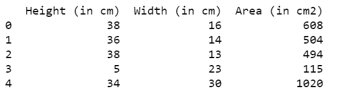
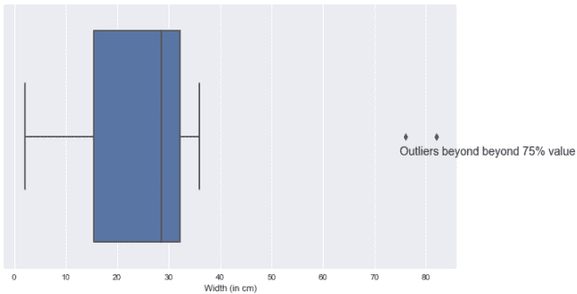
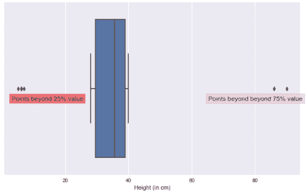

# 如何用 Python 在 boxplot 上显示文本？

> 原文:[https://www . geesforgeks . org/如何显示 python 中的 boxplot 上的文本/](https://www.geeksforgeeks.org/how-to-display-text-on-boxplot-in-python/)

箱线图是一种重要的图形图，可用于获得数字形式的数据汇总。该图可以为我们提供有关统计测量的信息，例如数值数据的百分位数、中位数、最小值和最大值。在方框图中，穿过方框中心的线代表中间值。在本文中，我们将学习如何在 boxplot 中添加绘图并在 boxplot 上显示文本。

首先，为了创建 boxplot，我们将使用 seaborn 库，为了在 boxplot 上显示文本，我们将使用 [matplotlib.pyplot](https://www.geeksforgeeks.org/pyplot-in-matplotlib/) 类中可用的 text()方法。text()方法使我们能够在绘图上编写字符串并向其中添加自定义内容。

让我们先画一个简单的方框图，并在上面添加一些文字。

## 计算机编程语言

```py
# import modules
import numpy as np
import pandas as pd
import seaborn as sns
import matplotlib.pyplot as plt
plt.style.use('seaborn')

# Reading the dataset
data = pd.read_csv('Dataset.csv')
print("The shape of the dataframe is: ",data.shape)
```

**输出:**

```py
The shape of the dataframe is:  (20, 3)
```

打印数据集中的前五行:

## 计算机编程语言

```py
# display data
print(data.head())
```

**输出:**



## 计算机编程语言

```py
# depict box plot visualization
plt.figure(figsize=(10, 6))
sns.boxplot(data['Width (in cm)'])
plt.text(75, 0.07, 'Outliers beyond beyond 75% value', fontsize=14)
plt.show()
```

**输出:**



从上面写的代码中我们可以观察到， **plt.text()** 方法被用来显示我们想要的文本。它需要三个强制的位置参数:

> **语法:** plt.text(x，y，text)
> 
> **参数:**
> 
> *   **x 坐标:**表示文本在 x 轴上的位置
> *   **y 坐标:**表示文本在 y 轴上的位置
> *   **文本:**表示我们要插入的字符串。

为了使我们的方框图看起来更吸引人，我们可以传递许多其他可选参数来格式化文本，这在下一个图中已经讨论过了。

## 计算机编程语言

```py
# add text
plt.figure(figsize=(10, 6))
sns.boxplot(data['Height (in cm)'])

plt.text(3, 0.07,
         'Points beyond 25% value',
         bbox=dict(facecolor='red',
                   alpha=0.5),
         fontsize=12)

plt.text(95, 0.07,
         'Points beyond beyond 75% value',
         bbox=dict(facecolor='pink',
                   alpha=0.5),
         horizontalalignment='right',
         fontsize=12)

plt.show()
```

**输出:**



从图中可以看出，我们在文本周围添加了一个漂亮的边界框，还为文本添加了颜色，这可以通过在 plt.text()方法中传递可选参数来实现，例如:

*   **bbox:** 用于在文本周围创建一个边界框，它本身接受一个字典，用于为框添加颜色并设置颜色的不透明度。
*   **fontsize:** 用于设置我们字体的大小。
*   **水平对齐或 ha:** 设置文本的水平对齐。
*   **垂直对齐或 va:** 设置文本的垂直对齐。

从该方法的官方文档中还可以看到许多其他方法。