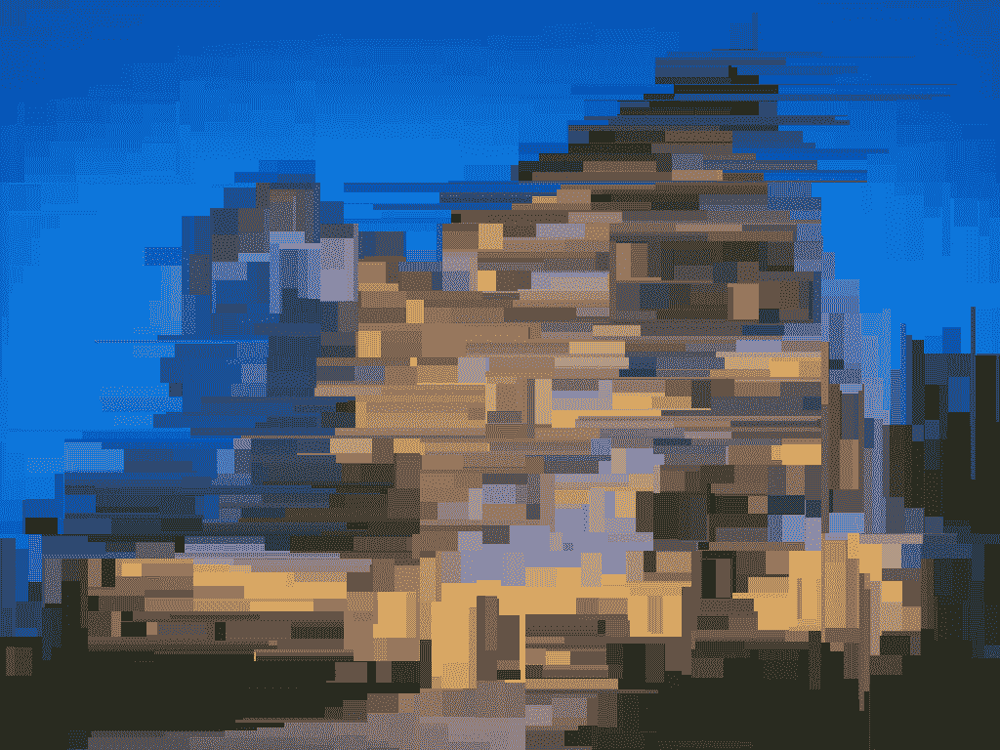
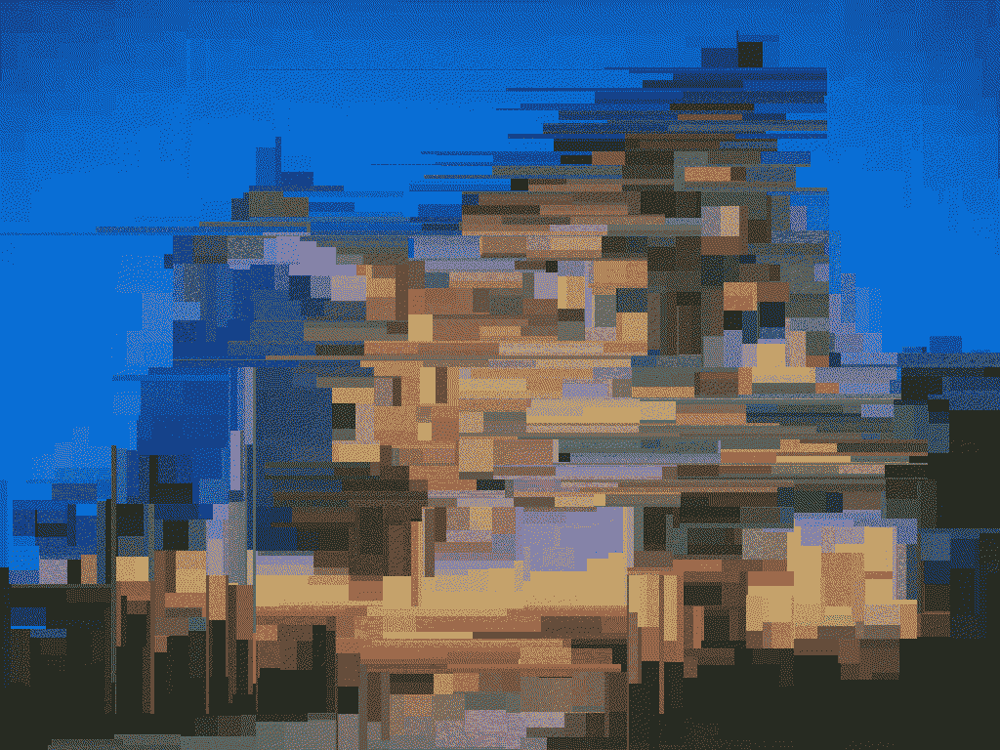

# 如何使用 Python 中的 Block_Distortion 模块对图像进行扭曲？

> 原文:[https://www . geeksforgeeks . org/如何使用 python 中的 block _ 扭曲模块扭曲图像/](https://www.geeksforgeeks.org/how-to-distort-image-using-block_distortion-module-in-python/)

在本文中，我们将讨论如何使用 Python 对图像执行块失真。我们将使用一个名为 block _ distoriton 的模块。让我们看一下这个模块的简介。

### 块失真模块

*   它对图像应用块失真效果。
*   它可以选择制作静态和动态图像。gif)版本的图像。
*   可以控制失真量

### 装置

要安装此模块，请在终端中键入以下命令。

> pip 安装块 _ 失真

### 扭曲**静止图像**

**扭曲 _ 图像()**功能用于扭曲图像。

**语法:**

> 扭曲图像(图像，分割=2000)
> 
> **参数:**
> **拆分=** 要执行的拆分[扭曲]数量，默认为 2000。分割越多，图像越平滑。

**使用的图像:**


## 蟒蛇 3

```
from skimage import img_as_ubyte
from skimage.io import imread, imsave
from block_distortion import distort_image

# read image
input_image = imread('hotel.jpeg')

# distort the read image
distorted = distort_image(input_image)

# save to required path the converted binary image
imsave("./block-hotel.png", img_as_ubyte(distorted))
```

**输出:**



### **扭曲 GIF 图像**

animate_image()方法用于执行所需的 gif 变形。

**语法:**

> animate_image(拆分=2000，帧=100)
> 
> **参数:**
> **分割** =要执行的分割[扭曲]数量，默认为 2000。分割越多，图像越平滑。
> **帧数** =为 gif 图像创建的帧数。默认为 100。
> 
> write_frames_to_gif(路径=curr，动画图像，持续时间=100)
> 
> **路径**:保存文件的位置。
> **持续时间**:gif 中每一帧的持续时间。(单位:米/秒)默认为 100。

## 蟒蛇 3

```
from skimage.io import imread
from block_distortion import animate_image, write_frames_to_gif

# read the image
input_image = imread("hotel.jpeg")

# convert to .gif after block distortion
frames = animate_image(input_image)

# write gif to output path
write_frames_to_gif("./block-anim-hotel.gif", frames, duration=100)
```

**输出:**

