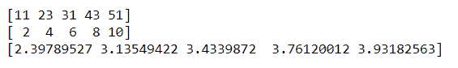
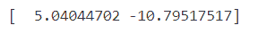

# 如何用 Python 做指数和对数曲线拟合？

> 原文:[https://www . geeksforgeeks . org/如何在 python 中进行指数和对数曲线拟合/](https://www.geeksforgeeks.org/how-to-do-exponential-and-logarithmic-curve-fitting-in-python/)

在本文中，我们将学习如何在 Python 中进行指数和对数曲线拟合。首先我们想到的问题是什么是曲线拟合？

**曲线拟合**是构建曲线或数学函数的过程，对一系列数据点具有最佳拟合，可能会受到约束。

*   **对数曲线拟合:**对数曲线是对数函数的图。
*   **指数** **曲线拟合:**指数曲线是指数函数的图。

让我们考虑两个方程

> **y = alog(x) + b** 其中 **a，b** 是对数方程的系数。
> 
> **y = e <sup>(ax)*e(b)</sup>** 其中 **a，b** 是指数方程的系数。

我们将在上述方程上拟合两条曲线，并为其找到最佳拟合曲线。对于 Python 中的曲线拟合，我们将使用一些库函数

*   num py
*   [matplotlib.pyplot](https://www.geeksforgeeks.org/pyplot-in-matplotlib/)

我们还将使用 numpy.polyfit()方法来拟合曲线。这个函数采用三个参数 x，y，多项式次数(n)返回 n 次多项式的系数。

> **语法:** numpy.polyfit(x，y，deg)
> 
> **参数:**
> 
> *   **x** - > x 坐标
> *   **y** - > y 坐标
> *   **度** - >次拟合多项式。所以，如果 deg 为 1，我们得到线性多项式的系数，或者如果它为 2，我们得到二次多项式的系数。

### 对数曲线拟合

为了进行对数曲线拟合，我们必须遵循下面解释的一些步骤。

#### 导入库

## 计算机编程语言

```py
import numpy as np

# It is for ploting the curve
import matplotlib.pyplot as plt
```

#### 创建/加载数据

由于我们已经导入了所需的库，我们必须创建两个名为 x 和 y 的数组。在创建这两个数组后，我们必须借助 numpy.log()方法记录 x 和 y 中的值。

## 蟒蛇 3

```py
# Points on X-axis
x_data = np.array([11, 23, 31, 43, 51]) 

# Points on Y-axis
y_data = np.array([2, 4, 6, 8, 10])     

print(x_data)
print(y_data)

# Taking log of x values
xlog_data = np.log(x_data)             

print(xlog_data)
```

**输出:**



#### 数据拟合

之后，得到 x 和 y 数组的对数值，借助 numpy.polyfit()求出方程的系数。由于我们采用线性方程，因此在 polyfit 方法中，我们将传递 1 度参数。

## 蟒蛇 3

```py
# Given log values of x , y as input
curve = np.polyfit(log_x_data, y_data, 1)

print(curve)
```

**输出:**



#### 获取输出

所以我们得到系数为[5.04，-10.79]，这样我们就可以得到曲线的方程，它是(y= a*log(x)+y，其中 a，b 是系数)

```py
y = 5.04*log(x) - 10.79
```

## 蟒蛇 3

```py
y = 5.04 * log_x_data - 10.79  

print(y)
```