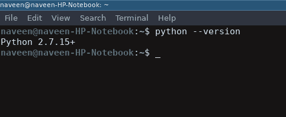
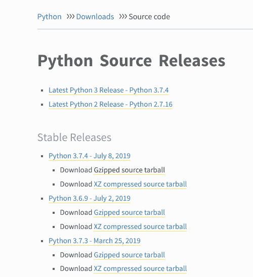

# 如何在 Linux 上下载安装 Python 最新版本？

> 原文:[https://www . geeksforgeeks . org/如何下载和安装 python-最新版 linux/](https://www.geeksforgeeks.org/how-to-download-and-install-python-latest-version-on-linux/)

Python 是一种广泛使用的通用高级编程语言。本文将作为如何在 Linux 操作系统上下载并安装 Python 最新版本的完整教程。
在包括以下操作系统在内的每个 Linux 系统上，

*   人的本质
*   Linux 作为
*   一种自由操作系统
*   openSUSE
*   CentOS
*   一种男式软呢帽
*   我最喜欢的一个，Arch Linux。

你会发现 Python 已经安装好了。您可以从终端使用以下命令进行检查

```py
$ python --version
```

要检查 python 2.x.x 的最新版本:

```py
$ python2 --version
```

要检查最新版本的 python 3.x.x:

```py
$ python3 --version
```


明明不会是最新版本的 python。可以有多种方法在 linux 基础系统上安装 python，这完全取决于您的 linux 系统。
对于几乎每一个 Linux 系统，下面的命令肯定会起作用。

```py
$ sudo add-apt-repository ppa:deadsnakes/ppa
$ sudo apt-get update
$ sudo apt-get install python3.7

```

#### 在 Linux 上下载并安装 Python 最新版本

要从 Python 源代码安装最新版本，请执行以下步骤

##### 从 python.org 下载 Python 最新版本

*   首先，打开浏览器，打开
    [【https://www.python.org/downloads/source/】](https://www.python.org/downloads/source/)
    
*   Underneath the **Stable Releases** find **Download Gzipped source tarball** (latest stable release as of now is Python 3.7.4).

    您可以在一个命令中完成上述所有步骤

    ```py
    $ wget https://www.python.org/ftp/python/3.7.4/Python-3.7.4.tgz
    ```

    ##### 在 Linux 上安装 Python 3.7.4 最新版本

    要在 Linux 上成功安装 Python，请输入以下命令获取先决条件和其他源文件

    ```py
    $ sudo apt-get update
    $ sudo apt-get upgrade
    $ sudo apt-get install -y make build-essential libssl-dev zlib1g-dev libbz2-dev libreadline-dev libsqlite3-dev wget curl llvm libncurses5-dev  libncursesw5-dev xz-utils tk-dev

    ```

    现在我们都准备好打开从 python 官网‘
    下载的文件，使用终端
    中的 cd 下载移动到下载目录，然后输入以下命令

    ```py
    $ tar xvf Python-3.6.5.tgz
    $ cd Python-3.6.5
    $ ./configure --enable-optimizations --with-ensurepip=install
    $ make -j 8
    $ sudo make altinstall
    ```

    宾果游戏..！！最新版本的 Python 语言安装在您的 Linux 系统上。您可以使用以下命令进行确认。

    ```py
    python --version
    ```

    #### 如何在 Linux 中将 Python 3 设置为默认版本？

    人们可以在他们的 Linux 系统中使用上面提到的各种技术轻松安装 python。但是怎么设置为默认呢？这样每当你在终端的任何地方输入`Python`时，它总是执行`python3`。下面是一个简单的命令，您可以通过它将 Python3 设置为默认版本。
    打开终端进入，

    ```py
    sudo alias python = python3
    ```

    现在执行的任何代码都会自动将 python3 作为默认版本。