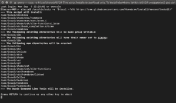
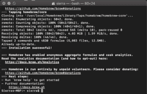
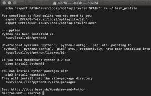
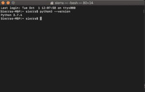

# 如何在 macOS / Mac OS X 上下载安装 Python 最新版

> 原文:[https://www . geesforgeks . org/如何下载和安装-python-最新版本-on-macos-mac-os-x/](https://www.geeksforgeeks.org/how-to-download-and-install-python-latest-version-on-macos-mac-os-x/)

Python 是一种广泛使用的通用高级编程语言。本文将作为如何在 macOS / Mac OS X 上下载并安装 Python 最新版本的完整教程。和 Linux 一样，macOS 也附带了预装在系统上的 Python。它可能是 Python 版本 2 或一些类似的过时版本。为了更新到最新版本，我们将使用自制软件包管理器。在 macOS 上安装 Python 是最好也是最方便的方法之一。
想了解更多关于家酿包装经理的信息，请访问。

*   #### 下载并安装自制软件包管理器

    如果您的系统上没有安装自制程序，请按照下面的步骤
    从应用程序- >实用程序中打开 macOS 的终端应用程序。Bash 终端将打开，您可以在其中输入命令
    在 macOS 终端中输入以下命令

    ```
    /usr/bin/ruby -e "$(curl -fsSL https://raw.githubusercontent.com/Homebrew/install/master/install)"

    ```

    

    如果出现提示，请输入系统密码。这将在您的操作系统上安装自制软件包管理器。
    看到“安装成功”的消息后。您已经准备好在您的 macOS 上安装 python 版本 3 了。

    

*   #### 在 macOS / macOS X 上安装 Python 最新版本

    要从应用程序->实用程序
    安装 python 简单的打开终端应用程序，并输入以下命令

    ```
    brew install python3
    ```

    命令处理完成后，Python 的第 3 版将安装在你的 mac 上。

    

    要验证安装，请在终端应用程序中输入以下命令

    ```
    python
    ```

    ```
    pip3
    ```

    

    宾果游戏..！！Python 安装在您的计算机上。您可以在这里探索更多关于 python 的知识