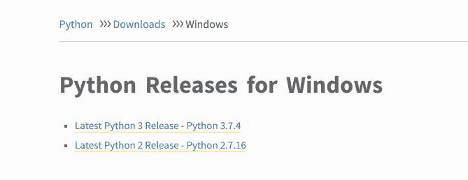
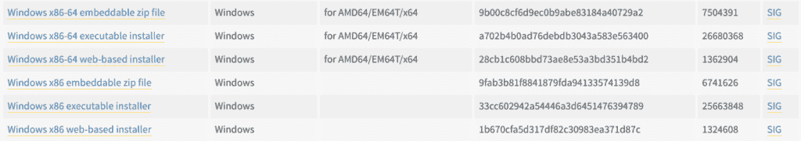
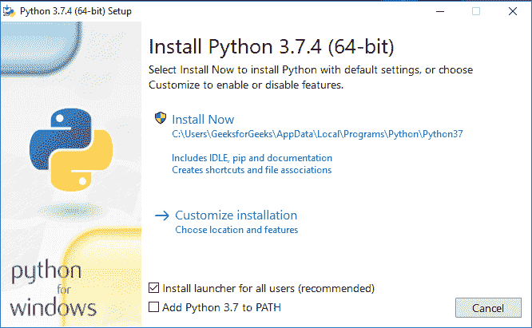
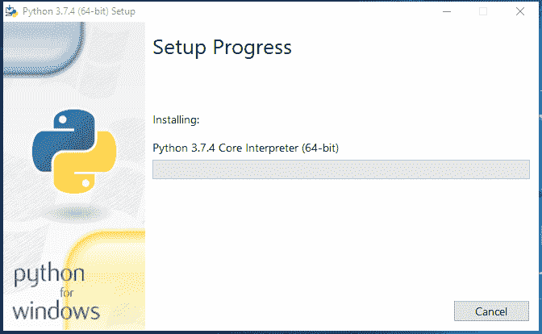
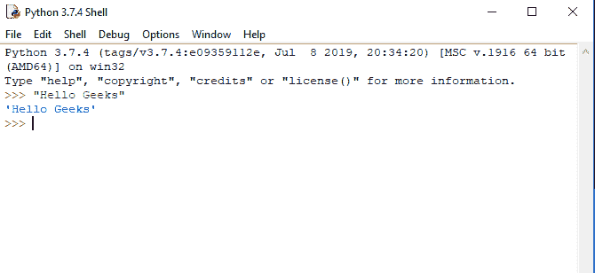

# 如何在 Windows 上下载安装 Python 最新版本

> 原文:[https://www . geesforgeks . org/如何下载和安装 python-最新版本-在 windows 上/](https://www.geeksforgeeks.org/how-to-download-and-install-python-latest-version-on-windows/)

Python 是一种广泛使用的通用高级编程语言。本文将作为如何在 Windows 操作系统上**下载并安装 Python 最新版本的完整教程。由于 windows 没有预装 Python，所以需要显式安装。在 windows 中，没有安装 Python 的通用库，因此需要像其他任何 GUI 应用程序一样下载。这里我们将定义如何在 Windows 上安装 Python 的分步教程。**

### 从 python.org 下载 Python 最新版本

*   First and foremost step is to open a browser and open [https://www.python.org/downloads/windows/](https://www.python.org/downloads/windows/)

    

*   在**视窗 Python 版本**下找到**最新 Python 3 版本–Python 3.7.4**(目前最新的稳定版本是 Python 3 . 7 . 4)。
*   On this page move to **Files** and click on **Windows x86-64 executable installer** for 64-bit or **Windows x86 executable installer** for 32-bit.

    

### 在 Windows 上安装 Python 3.7.4 最新版本

*   从下载文件夹
    运行 Python 安装程序
*   确保标记**将 Python 3.7 添加到路径**中，否则您将不得不显式执行。
    将开始在 windows 上安装 python。
    
*   安装完成后，点击**关闭**。
    答对了..！！Python 已安装。现在进入窗口，输入 IDLE。
    
    这是 Python 解释器。我们打印了 Hello 极客，Python 工作很顺利。