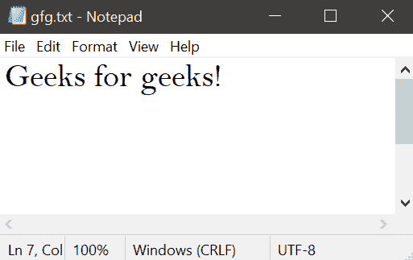

# 如何使用 Python 在 FTP 服务器中下载和上传文件？

> 原文:[https://www . geeksforgeeks . org/如何使用 python 下载和上传 ftp 服务器中的文件/](https://www.geeksforgeeks.org/how-to-download-and-upload-files-in-ftp-server-using-python/)

**先决条件:**[**FTP**](https://www.geeksforgeeks.org/file-transfer-protocol-ftp-in-application-layer/)**[**ftplib**](https://docs.python.org/3/library/ftplib.html)**

**在这里，我们将学习如何使用 Python 在文件传输协议服务器中下载和上传文件。在开始之前，我们先来了解一下什么是 **FTP** 。**

## ****文件传输协议****

**文件传输协议是在本地和远程文件系统之间移动文件的应用层协议。它运行在 TCP 之上，就像 HTTP 一样。为了传输文件，FTP 并行使用两个 TCP 连接:控制连接和数据连接。**

**对于文件的上传和下载，我们将使用 Python 中的 *ftplib* 模块。它是 Python 中的内置模块。**

## ****什么是 ftplib mdoule？****

**本模块定义了文件传输协议类和一些相关的项目。FTP 类实现了 FTP 协议的客户端。您可以使用它来编写执行各种自动化 FTP 作业的 Python 程序，例如镜像其他 FTP 服务器。**

**我们将使用一个测试 **FTP** 服务器，它被称为 [**DLPTEST**](https://dlptest.com/ftp-test/) ，我们将使用下面的文本文件进行所有操作:**

****

****我们来了解一下分步实施:****

*   **输入所需信息，信息将可用 [**点击此处**](https://dlptest.com/ftp-test/) 。**

## **蟒蛇 3**

```py
# Import Module
import ftplib

# Fill Required Information
HOSTNAME = "ftp.dlptest.com"
USERNAME = "dlpuser@dlptest.com"
PASSWORD = "eUj8GeW55SvYaswqUyDSm5v6N"
```

****注意:**密码会不时更改，确保你访问他们的网站获取正确的凭据。**

*   **连接到服务器**

## **蟒蛇 3**

```py
# Connect FTP Server
ftp_server = ftplib.FTP(HOSTNAME, USERNAME, PASSWORD)

# force UTF-8 encoding
ftp_server.encoding = "utf-8"
```