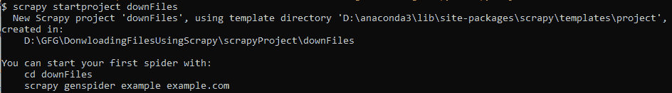
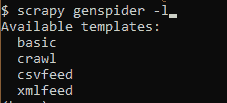
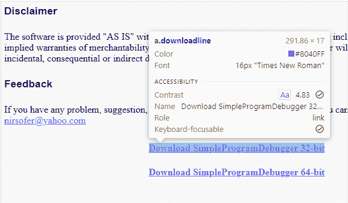
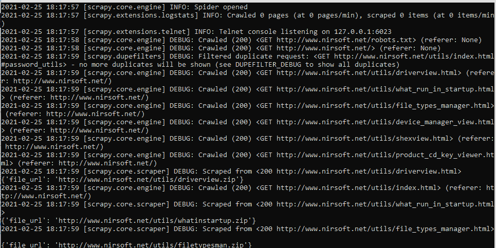
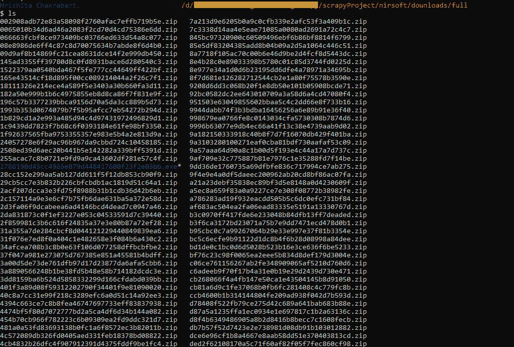
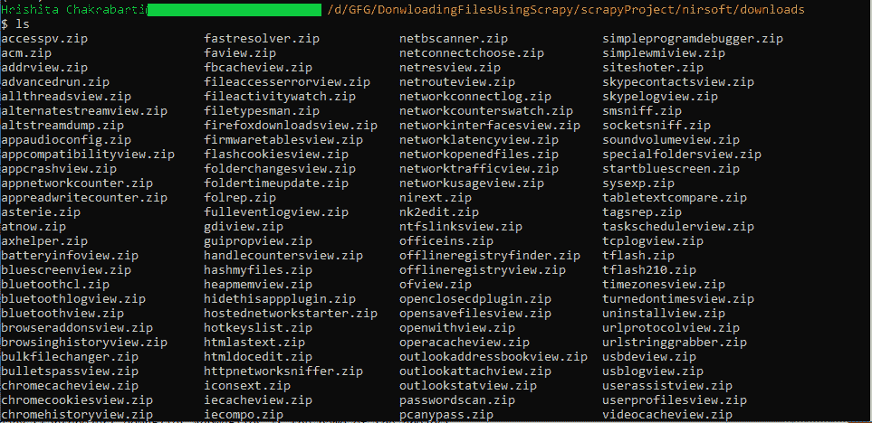

# 如何用 Scrapy 下载文件？

> 原文:[https://www . geesforgeks . org/how-to-down-files-with-scrapy/](https://www.geeksforgeeks.org/how-to-download-files-with-scrapy/)

Scrapy 是一个快速的高级网页抓取和网页抓取框架，用于抓取网站并从其页面中提取结构化数据。它可以用于广泛的目的，从数据挖掘到监控和自动化测试。在本教程中，我们将探索如何使用杂乱的爬行蜘蛛下载文件。

对于初学者来说，[网页抓取](https://www.geeksforgeeks.org/what-is-a-webcrawler-and-where-is-it-used/)是在万维网上遍历以下载与特定主题相关的信息的方法。需要记住的一点是，并不是所有的网站都允许你抓取他们的页面，所以在尝试抓取页面之前参考他们的 [robots.txt](https://www.geeksforgeeks.org/robots-txt-file/) 文件总是一个好的做法。

**步骤 1:** 安装软件包:

在我们开始编码之前，我们需要安装 Scrapy 包

```
pip install scrapy
```

**步骤 2:** 创建项目

```
# scrapyProject is the name we chose for 
# the folder that will contain the project
mkdir scrapyProject
cd scrapyProject

# downFiles is the name of the project
scrapy startproject downFiles
```

在您的终端中运行上述代码后，输出如下:



关于开始一个新项目的输出

**第三步:**选择蜘蛛模板

Scrapy 附带了 4 个蜘蛛模板，即:

1.  基本:通用
2.  爬网:用于爬网或以下链接(下载文件时首选)
3.  csvfeeed:用于解析 CSV 文件
4.  xmlfeed:用于解析 XML 文件

在本教程中，我们将使用爬行蜘蛛模板，并在此基础上进一步构建。

**查看 scrapy 中可用的蜘蛛模板:**

```
scrapy genspider -l
```



scrapy 中 4 个可用的蜘蛛模板

在我们开始构建 spider 的基本结构之前，请确保您在步骤 2 中创建的项目目录(包含 spider.cfg 文件的目录)中工作

**要更改您的目录** *:*

```
# the project name we had decided was 
# downFiles in step2
cd downFiles 
```

**创建爬行蜘蛛的基本结构:**

> scrapy genspider-t crawl NIR soft www.nirsoft.net # NIR soft 是蜘蛛的名字，www.nirsoft.com 是我们将要爬行的网站(域名)

将使用以下内容创建一个名为 spider 的新 python 文件:

**该文件将位于**

> …\剪贴簿项目\下文件\下文件\蜘蛛\nirsoft.py

在哪里

*   项目是包含项目的目录名
*   向下文件是项目名称
*   nirsoft.py 是新创造的“空”蜘蛛

**代码:**

## 蟒蛇 3

```
import scrapy
from scrapy.linkextractors import LinkExtractor
from scrapy.spiders import CrawlSpider, Rule

class NirsoftSpider(CrawlSpider):
    name = 'nirsoft'
    allowed_domains = ['www.nirsoft.net']
    start_urls = ['http://www.nirsoft.net/']

    rules = (
        Rule(LinkExtractor(allow=r'Items/'),
             callback='parse_item', follow=True),
    )

    def parse_item(self, response):
        item = {}
        return item
```

这是一个“空”爬虫。执行时不会产生任何结果。为了提取信息，我们需要告诉蜘蛛它需要抓取哪些链接。

**注意:**这是 Scrapy 区别于其他流行的网络爬行包(如 Selenium)的地方，Selenium 如果没有指定，会抓取所有数据(即使没有必要)。这个特性使 Scrapy 比 Selenium 更快。

**步骤 4:** 定义链接提取的规则

## 蟒蛇 3

```
rules = (
    Rule(LinkExtractor(allow = r'Items/'),
         callback = 'parse_item',
         follow = True),
)
```

上面这段代码是用来处理蜘蛛将要抓取的链接的。几个命令可以用来制定规则，但在本教程中，我们将只使用少数几个常见的命令。我们将尝试下载一些由[nirsoft.net](https://nirsoft.net)提供的工具。所有的工具，或者更确切地说，实用程序都在它们的实用程序下，所以所有相关的链接都遵循给定的模式:

```
https://www.nirsoft.net/utils/...
```

> **示例:**
> 
> https://www.nirsoft.net/utils/simple_program_debugger.html
> 
> https://www.nirsoft.net/utils/web_browser_password.html
> 
> https://www.nirsoft.net/utils/browsing_history_view.html

**那么上面的代码段将被编辑如下:**

## 蟒蛇 3

```
rules = (
    Rule(LinkExtractor(allow=r'utils/'),
         callback='parse_item', follow = True),
)
```

**步骤 4:** 解析抓取的页面

现在我们已经设置了哪些链接将被抓取，接下来我们需要定义蜘蛛应该准确抓取什么。为此，我们将不得不检查有问题的页面。前往以上任何一个示例，并打开检查元素模式(Windows 为 ctrl+shift+c，MacOS 为 cmd+shift+c)



a.downloadline 显示所有的下载链接都是类名“downloadline”下的锚标签

*   正如我们所看到的，下载链接都是一个锚标签(a)，类名为“downloadline”(a . downloadline)
*   所以现在我们将在 CSS 选择器中使用它，并提取锚标签的 href 属性
*   为了让爬虫高效工作，我们还需要将相对链接转换为绝对链接。幸运的是，最新版本的 Scrapy 使我们能够用一个简单的方法做到这一点:urljoin()

因此 parse_item()方法将如下所示:

## 蟒蛇 3

```
def parse_item(self, response):
    file_url = response.css('.downloadline::attr(href)').get()
    file_url = response.urljoin(file_url)
    yield {'file_url': file_url}
```

如果我们在这种状态下运行爬虫，我们将获得 nirsoft 中所有可用实用程序的链接。

```
scrapy crawl nirsoft
```

对于初学者:我建议现在不要运行上面的命令，因为你的命令提示符会被大量的网址淹没，这些网址滚动太快，你的眼睛无法感知任何东西。



在几秒钟的时间内，我们的命令行将被所有抓取的网址淹没

相反，让我们继续下一步

**第五步:**下载文件

最后，我们都在等待的时刻，下载文件。然而，在此之前，我们需要编辑最初创建蜘蛛时创建的项目类。该文件可以在以下位置找到:

```
...\scrapyProject\downFiles\downFiles\items.py
```

在哪里

*   项目是包含项目的目录名
*   向下文件是项目名称
*   items.py 是所讨论的项目的类别

必须按如下方式编辑项目类:

## 蟒蛇 3

```
class DownfilesItem(scrapy.Item):

    # define the fields for your item here like:
    file_urls = scrapy.Field()
    files = scrapy.Field
```

现在我们更新 spider 脚本，以利用我们定义的数据字段

## 蟒蛇 3

```
def parse_item(self, response):
    file_url = response.css('.downloadline::attr(href)').get()
    file_url = response.urljoin(file_url)
    item = DownfilesItem()
    item['file_urls'] = [file_url]
    yield item
```

您还必须将之前定义的项目类导入到 spider 脚本中，因此 spider 脚本的导入部分如下所示，

## 蟒蛇 3

```
import scrapy
from scrapy.linkextractors import LinkExtractor
from scrapy.spiders import CrawlSpider, Rule
from downFiles.items import DownfilesItem
```

最后，要启用文件下载，我们需要对项目目录中的 **settings.py** 文件进行两个小的更改:

1.启用文件下载:

```
ITEM_PIPELINES = {
  'scrapy.pipelines.files.FilesPipeline': 1,
}
```

2.在“设置”中指定下载的目标文件夹。复制:

```
FILES_STORE = r"D:\scrapyProject\nirsoft\downloads"
```

*注意:文件夹目的地应为<u>实际目的地</u>*

*我们使用原始字符串来避免由于 Windows 位置字符串*中的反斜杠而导致的任何错误

如果我们逃跑

```
scrapy crawl nirsoft
```

我们将能够找到所有下载到指定目标文件夹的文件，因此我们完成了！

## 限制要下载的文件类型

因为我们的目标是下载实用程序的安装文件，所以最好将爬虫程序限制为只下载。拉上拉链。exe 文件，剩下的就不用了。这也将减少爬网时间，从而使脚本更加高效。

为此，我们需要编辑我们的 parse_items()函数，如下所示:

## 蟒蛇 3

```
def parse_item(self, response):
    file_url = response.css('.downloadline::attr(href)').get()
    file_url = response.urljoin(file_url)
    file_extension = file_url.split('.')[-1]
    if file_extension not in ('zip', 'exe', 'msi'):
        return
    item = DownfilesItem()
    item['file_urls'] = [file_url]
    item['original_file_name'] = file_url.split('/')[-1]
    yield item
```

我们还需要将新的数据字段“original_file_name”添加到我们的 items 类定义中:

## 蟒蛇 3

```
class DownfilesItem(scrapy.Item):
    # define the fields for your item here like:
    file_urls = scrapy.Field()
    original_file_name = scrapy.Field()
    files = scrapy.Field
```

保存所有更改并运行，

```
scrapy crawl nirsoft
```

我们会找到所有的。拉上拉链。exe 文件下载到指定的目标文件夹。然而，我们还有一个问题:



[SHA1 哈希代码](https://www.geeksforgeeks.org/sha-1-hash-in-java/)是不可读的，所以最好是用它们的原始(可读)名称保存文件，这将引导我们进入下一部分

## 创建自定义管道

最初，我们使用了 Scrapy 的默认管道来下载文件，然而，问题是这些文件是用它们的 SHA1 哈希代码而不是人类可读的文件名保存的。因此，我们需要创建一个自定义管道，保存原始文件名，然后在下载文件时使用该名称。

就像我们的 items 类(items.py)一样，我们也有一个 pipeline 类(pipelines.py)，其中有一个在我们创建项目时为我们的项目生成的类，我们将使用这个类来创建我们的定制管道

## 蟒蛇 3

```
from scrapy.pipelines.files import FilesPipeline

class DownfilesPipeline(FilesPipeline):
    def file_path(self, request, response=None, info=None):
        file_name: str = request.url.split("/")[-1]
        return file_name
```

我们导入了由 Scrapy 提供的默认文件管道，然后重写了 file_path 函数，这样它就可以使用文件名而不是使用哈希代码作为文件名。

我们注释掉了 process_item 函数，这样它就不会覆盖文件管道中的默认 process_item 函数。

接下来，我们更新我们的 settings.py 文件以使用我们的自定义管道，而不是默认管道。

```
ITEM_PIPELINES = {
  'downFiles.pipelines.DownfilesPipeline': 1,
}
```

最后，我们跑

```
scrapy crawl nirsoft
```

我们有我们的结果:



由于自定义管道，下载的文件可读性更强