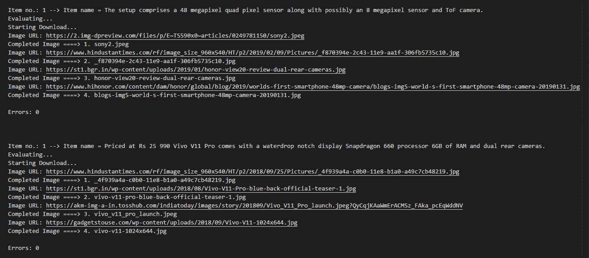

# 如何使用 Python 下载谷歌图片

> 原文:[https://www . geeksforgeeks . org/如何下载-Google-images-使用-python/](https://www.geeksforgeeks.org/how-to-download-google-images-using-python/)

Python 是一种多用途语言，广泛用于脚本编写。我们可以编写 Python 脚本来自动化日常事务。假设我们想要下载带有多个搜索查询的谷歌图片。我们可以自动化这个过程，而不是手工操作。

**如何安装需要的模块:**

```
pip install google_images_download
```

让我们看看如何使用`**google_images_download**` 模块编写 Python 脚本来下载 Python 中的谷歌图片。

下面是 Python 代码:

```
# importing google_images_download module
from google_images_download import google_images_download 

# creating object
response = google_images_download.googleimagesdownload() 

search_queries = 
[

'The smartphone also features an in display fingerprint sensor.',
'The pop up selfie camera is placed aligning with the rear cameras.',
'''In terms of storage Vivo V15 Pro could offer
   up to 6GB of RAM and 128GB of onboard storage.''',
'The smartphone could be fuelled by a 3 700mAh battery.',
]

def downloadimages(query):
    # keywords is the search query
    # format is the image file format
    # limit is the number of images to be downloaded
    # print urs is to print the image file url
    # size is the image size which can
    # be specified manually ("large, medium, icon")
    # aspect ratio denotes the height width ratio
    # of images to download. ("tall, square, wide, panoramic")
    arguments = {"keywords": query,
                 "format": "jpg",
                 "limit":4,
                 "print_urls":True,
                 "size": "medium",
                 "aspect_ratio":"panoramic"}
    try:
        response.download(arguments)

    # Handling File NotFound Error    
    except FileNotFoundError: 
        arguments = {"keywords": query,
                     "format": "jpg",
                     "limit":4,
                     "print_urls":True, 
                     "size": "medium"}

        # Providing arguments for the searched query
        try:
            # Downloading the photos based
            # on the given arguments
            response.download(arguments) 
        except:
            pass

# Driver Code
for query in search_queries:
    downloadimages(query) 
    print() 
```

**输出:**



**注意:**由于下载错误，部分图片无法打开。一个单独的“下载”文件夹将创建所有的图像。