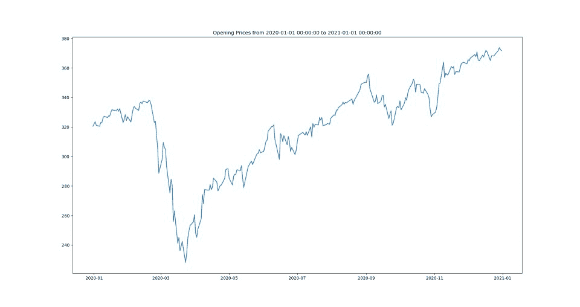
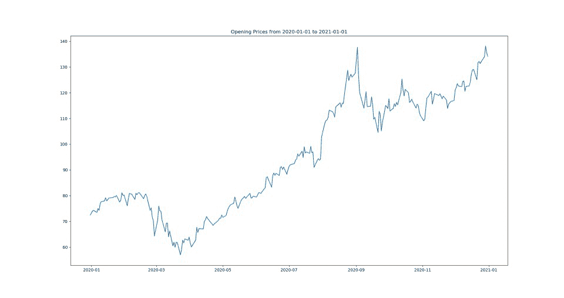
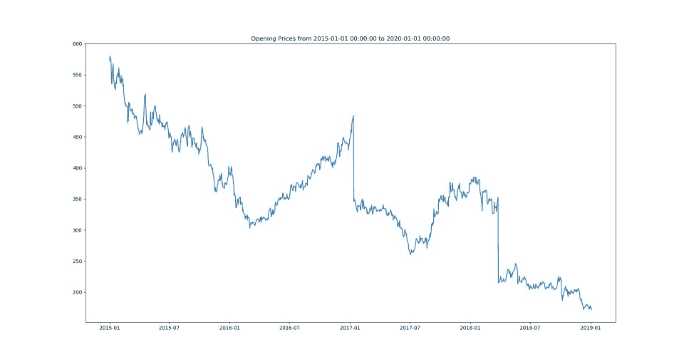

# 如何用 Python 下载历史股价？

> 原文:[https://www . geesforgeks . org/如何下载-历史股价-python/](https://www.geeksforgeeks.org/how-to-download-historical-stock-prices-in-python/)

**股价**指该股股票的当前价格。股票价格广泛应用于[机器学习](https://www.geeksforgeeks.org/machine-learning/)领域，用于[回归问题](https://www.geeksforgeeks.org/regression-classification-supervised-machine-learning/)的演示。股票预测是机器学习的一个应用，我们通过查看特定公司过去的数据来预测其股票。现在构建类似这样的东西，第一步是获取我们的历史股票数据。

我们可以使用 [Python](https://www.geeksforgeeks.org/python-programming-language/) 中作为库支持提供的应用编程接口来获取历史股票数据。下面提到了一些应用编程接口:

*   雅虎金融
*   熊猫数据读取器
*   什么时候

**进场:**

每种方法都使用不同的 python 模块，但它们具有类似的过程结构，包括以下步骤:

**1。**导入所需库

*   我们正在使用[日期时间](https://www.geeksforgeeks.org/python-datetime-module-with-examples/)模块来获取所需股票数据的起止日期。
*   我们正在使用 [matplotlib](https://www.geeksforgeeks.org/python-introduction-matplotlib/) 模块以图形格式显示提取的数据。

**2。**初始化该时间段内获取股票数据的开始和结束日期。

**3。**使用每个模块中提供的专用功能获取数据。

**4。**使用 matplotlib 库显示数据。我们使用[绘图()](https://www.geeksforgeeks.org/matplotlib-pyplot-plot-function-in-python/)功能以图形格式绘制数据。

### **方法一:使用雅虎财经**

我们可以使用 yfinance 模块中提供的 **yfinance.download()** 函数来获取股票，该模块是雅虎财务 API 的一个模块。我们可以使用以下命令下载该模块。

```
pip install yfinance
```

我们需要在 yfinance.download()函数中提供 3 个必需的参数，它们是

*   股票代码
*   开始日期
*   结束日期

**下面是实现。**

## 蟒蛇 3

```
# import modules
from datetime import datetime
import yfinance as yf
import matplotlib.pyplot as plt

# initialize parameters
start_date = datetime(2020, 1, 1)
end_date = datetime(2021, 1, 1)

# get the data
data = yf.download('SPY', start = start_date,
                   end = end_date)

# display
plt.figure(figsize = (20,10))
plt.title('Opening Prices from {} to {}'.format(start_date,
                                                end_date))
plt.plot(data['Open'])
plt.show()
```

**输出:**



### **方法二:使用熊猫数据阅读器**

获取历史股票数据的另一种方法是使用 [pandas_datareader](https://www.geeksforgeeks.org/python-stock-data-visualisation/) 库。它还使用雅虎的财务应用编程接口加载数据。我们可以使用以下命令下载该模块。

```
pip install pandas_datareader
```

它还要求在数据中加载类似的三个字段，它们是

*   股票代码
*   开始日期
*   结束日期

**下面是实现:**

## 蟒蛇 3

```
# import modules
from pandas_datareader import data as pdr
import matplotlib.pyplot as plt

# initializing Parameters
start = "2020-01-01"
end = "2021-01-01"
symbols = ["AAPL"]

# Getting the data
data = pdr.get_data_yahoo(symbols, start, end)

# Display
plt.figure(figsize = (20,10))
plt.title('Opening Prices from {} to {}'.format(start, end))
plt.plot(data['Open'])
plt.show()
```

**输出:**



### **方法 3:使用 Quandl**

Quandl 拥有数百个免费和付费数据源，涵盖股票、固定收入、大宗商品、汇率等。为了获得访问权限，我们需要在 [Quandl](https://www.quandl.com/tools/api) 上创建一个账户，并获得一个 API Key 来免费访问数据。之后，我们需要使用以下命令下载 python 的 API 支持 quandl 库。

```
pip install quandl
```

我们将使用 **quandl.get()** 函数来获取数据。加载数据需要四个字段

*   标志
*   开始日期
*   结束日期
*   身份验证令牌

**下面是实现:**

## 蟒蛇 3

```
# import modules
import quandl
from datetime import datetime
import matplotlib.pyplot as plt

# initialize parameters
start = datetime(2015, 1, 1)
end = datetime(2020, 1, 1)

# get the data
df = quandl.get('NSE/OIL', start_date = start,
                end_date = end, 
                authtoken = 'enter_your_api_key')

# display
plt.figure(figsize=(20,10))
plt.title('Opening Prices from {} to {}'.format(start, end))
plt.plot(df['Open'])
plt.show()
```

**输出:**

