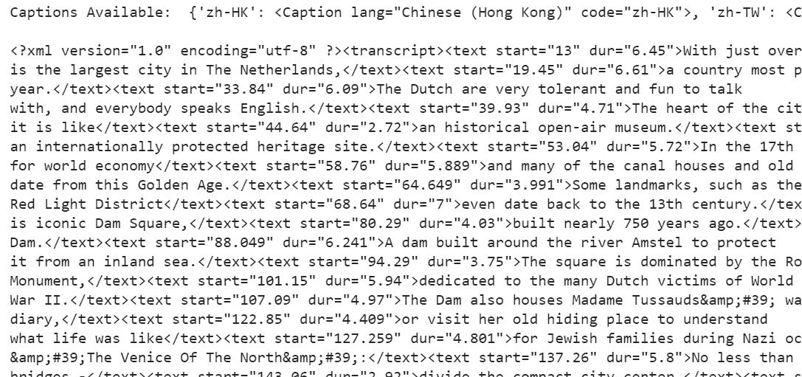

# 如何使用 Python 中的 Pytube 下载 XML 格式的公共 YouTube 字幕？

> 原文:[https://www . geesforgeks . org/how-download-public-YouTube-titles-in-XML-using-pytube-in-python/](https://www.geeksforgeeks.org/how-to-download-public-youtube-captions-in-xml-using-pytube-in-python/)

**先决条件** : [皮图](https://www.geeksforgeeks.org/pytube-python-library-download-youtube-videos/)

Pytube 是一个无依赖的轻量级 Python 库，用于下载 YouTube 视频**。**从 YouTube 获取元数据有各种 API。在本文中，我们将看到如何使用 Python 下载 XML 格式的公共 YouTube 标题。

**开始之前我们需要安装这个模块:**

```
pip install pytube
```

**进场:**

*   从 pytube 导入 YouTube 导入 pytube : **。**
*   使用 **YouTube()函数**实例化对象，该函数将 YouTube 视频链接作为参数。
*   例如，下面代码中的实例是**‘src’**，它有一个标题属性来获取特定视频的语言列表及其各自的语言代码。
*   要获得特定语言的标题，我们使用**get _ by _ language _ code(' en ')**en 代表英语，如下代码所示。
*   默认情况下，标题仅以 XML 格式下载。
*   要将其显式转换为字符串数据类型，我们需要使用“**generate _ SRT _ titles()**”对其进行类型转换，如下代码所示。

**下面是实现:**

## 蟒蛇 3

```
from pytube import YouTube

link = 'https://www.youtube.com/watch?v=wjTn_EkgQRg&index=1&list=PLgJ7b1NurjD2oN5ZXbKbPjuI04d_S0V1K'
src = YouTube(link)

# prints all available captions in various languages.
print('Captions Available: ', src.captions)
print()

# Getting only English captions by specifying 'en' as parameter
en_caption = src.captions.get_by_language_code('en')
print(en_caption.xml_captions)

# Instead of Captions in XML format we are converting it to string format.
en_caption_convert_to_srt = (en_caption.generate_srt_captions())
print(en_caption_convert_to_srt)
```

**输出:**



XML 标题