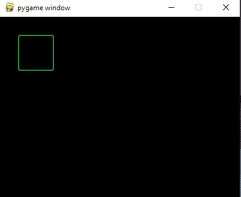
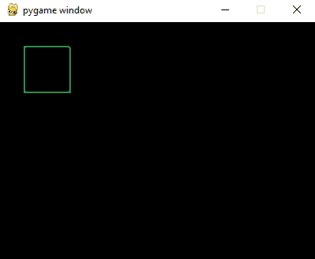

# 如何在 PyGame 中绘制圆角矩形？

> 原文:[https://www . geeksforgeeks . org/如何在 pygame 中绘制圆角矩形/](https://www.geeksforgeeks.org/how-to-draw-a-rectangle-with-rounded-corner-in-pygame/)

**Pygame** 是一个专为开发视频游戏而设计的 Python 库。Pygame 在优秀的 SDL 图书馆的基础上增加了功能。这允许你用 python 语言创建功能齐全的游戏和多媒体程序。在本文中，我们将看到如何在 Pygame 中绘制圆角矩形。

### **使用的功能:**

*   **pygame . display . set _ mode():**此功能用于初始化一个曲面进行显示。该函数将显示屏的大小作为参数。
*   **pygame.display.flip():** 此功能用于更新屏幕整个显示面的内容。
*   **pygame.draw.rect():** 这个函数用来画一个矩形。它以 surface、color 和 pygame Rect 对象作为输入参数，并在表面上绘制一个矩形。

**语法:**

> rect(表面，颜色，rect，宽度=0，border_radius=0，border_top_left_radius=-1，border_top_right_radius=-1，border_bottom_left_radius=-1，border_bottom_right_radius=-1)

border_radius 参数仅添加到 PyGame 版本 2.0.0.dev8 中。

**接近**

*   导入模块
*   初始化 Pygame
*   画一个圆角矩形
*   显示形状

**示例 1:** 本示例绘制一个圆角矩形

## 蟒蛇 3

```
# Importing the library
import pygame

# Initializing Pygame
pygame.init()

# Initializing surface
surface = pygame.display.set_mode((400, 300))

# Initialing Color
color = (48, 141, 70)

# Drawing Rectangle
pygame.draw.rect(surface, color, pygame.Rect(30, 30, 60, 60),  2, 3)
pygame.display.flip()
```

**输出:**



不仅如此，根据要求，Pygame 甚至可以只绕一个角。下面给出了使用上述方法的实现。

**示例 2:** 本示例绘制了一个仅右上角为圆形的矩形。

## 蟒蛇 3

```
# Importing the library
import pygame

# Initializing Pygame
pygame.init()

# Initializing surface
surface = pygame.display.set_mode((400, 300))

# Initialing Color
color = (48, 141, 70)

# Drawing Rectangle
pygame.draw.rect(surface, color, pygame.Rect(30, 30, 60, 60),  2, 0, 0, 3)

# Displying Object
pygame.display.flip()
```

**输出:**



**示例 3:** 本示例使用关键字参数绘制右下角圆角的矩形。

## 蟒蛇 3

```
# Importing the library
import pygame

# Initializing Pygame
pygame.init()

# Initializing surface
surface = pygame.display.set_mode((400, 300))

# Initialing Color
color = (48, 141, 70)

# Drawing Rectangle
pygame.draw.rect(surface, color, pygame.Rect(
    30, 30, 60, 60),  2,  border_bottom_right_radius=5)

# Displayig Object
pygame.display.flip()
```

**输出:**

