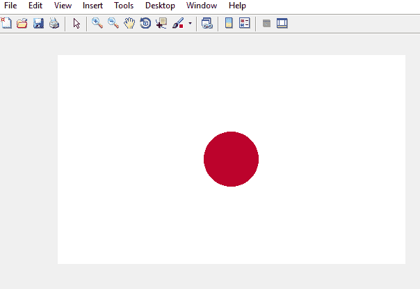

# 如何用 MATLAB 绘制日本国旗

> 原文:[https://www . geesforgeks . org/how-draw-Japan-flag-use-MATLAB/](https://www.geeksforgeeks.org/how-to-draw-japan-flag-using-matlab/)

**先决条件:** [RGB 图像表示](https://www.geeksforgeeks.org/matlab-rgb-image-representation/)

MATLAB，也叫矩阵实验室，是一个数值计算环境，是编程语言的平台。它是由 MathWorks 设计和开发的。MATLAB 是一个框架，允许我们执行矩阵操作、实现算法、绘制函数和数据、创建用户界面以及与用不同编程语言(即 C、C++、python、java 等)编写的程序进行接口..

**如何在 MATLAB 中绘制彩色图像？**
彩色图像可以表示为 3 阶矩阵。第一顺序用于行，第二顺序用于列，第三顺序用于指定相应像素的颜色。这里我们使用的是 RGB 颜色格式，所以三阶会分别取红、绿、蓝三个值。行和列的值取决于图像的大小。

**日本国旗的绘制方式:**

*   制作一个三阶零矩阵，它有维度(300，500，3)，其中 300 表示行的像素数，600 表示行数，3 表示 RGB 格式的颜色编码。
*   首先用白色给整个矩阵上色。红色的 RGB 是(255，255，255)。

    ```
    I(:, :, :)=255;
    ```

*   Apply loop on rows and columns and implement the equation of the circle such that we get a circle in the center of the flag and color it crimson glory using RGB format.
    **Equation of circle:**

    ```
    ((x-h)^2 - (y-k)^2)=r^2
    ```

    其中(h，k)是圆心，(x，y)是 x 轴和 y 轴的坐标，是圆的半径。
    *rgb* 格式为深红荣耀颜色为(188，0，45)。

下面是代码:

```
% create a 2-D matrix and paint it white
I = uint8(zeros(300, 500, 3))+255; 

%the center point 1 through which the circle will pass
circle_center1=150; 

%the center point 2 through which the circle will pass
circle_center2=250;  

radius=6.32;    % radius of the circle
x=i;            % x-axis co-ordinate
y=j;            % y-axis co-ordinate

%loop for rows i.e. for x-axis
 for i = 101:200

     %loop for columns i.e. for y-axis
      for j = 101:300

         %applying the equation of circle to make the circle in the center.
          if round(sqrt((i-circle_center1)^2 + (j-circle_center2)^2)) < radius^2

            % fill the circle with crimson glory
            % color using RGB color representation.
            I(i, j, 1) = 188;
            I(i, j, 2) = 0;
            I(i, j, 3) = 45;

          end        

      end  % end column loop.
 end       % end row loop.

% show the image formed. 
figure, imshow(I);  
```

**输出:**
