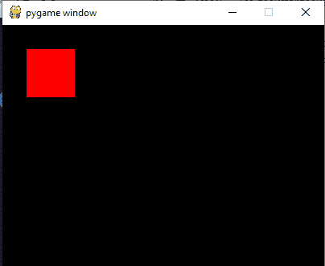
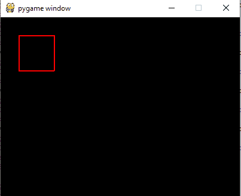

# 如何在 Pygame 中绘制矩形？

> 原文:[https://www . geeksforgeeks . org/如何在 pygame 中绘制矩形/](https://www.geeksforgeeks.org/how-to-draw-rectangle-in-pygame/)

[**Pygame**](https://www.geeksforgeeks.org/introduction-to-pygame/) 是一个专为开发电子游戏而设计的 Python 库。Pygame 在优秀的 SDL 图书馆的基础上增加了功能。这允许你用 python 语言创建功能齐全的游戏和多媒体程序。

**使用的功能:**

*   **pygame . display . set _ mode():**此功能用于初始化一个曲面进行显示。该函数将显示屏的大小作为参数。
*   **pygame.display.flip():** 此功能用于更新屏幕整个显示面的内容。
*   **pygame.draw.rect():** 这个函数用来画一个矩形。它将表面、颜色和 pygame Rect 对象作为输入参数，并在表面上绘制一个矩形。

**示例 1:** 本示例绘制一个用红色填充的矩形。

## 蟒蛇 3

```
# Importing the library
import pygame

# Initializing Pygame
pygame.init()

# Initializing surface
surface = pygame.display.set_mode((400,300))

# Initialing Color
color = (255,0,0)

# Drawing Rectangle
pygame.draw.rect(surface, color, pygame.Rect(30, 30, 60, 60))
pygame.display.flip()
```

**输出:**



**示例 2:** 本示例绘制一个红色边框的矩形，内部没有填充颜色。

## 蟒蛇 3

```
# Importing the library
import pygame

# Initializing Pygame
pygame.init()

# Initializing surface
surface = pygame.display.set_mode((400,300))

# Initialing Color
color = (255,0,0)

# Drawing Rectangle
pygame.draw.rect(surface, color, pygame.Rect(30, 30, 60, 60),  2)
pygame.display.flip()
```

**输出:**

