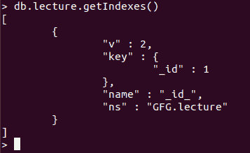
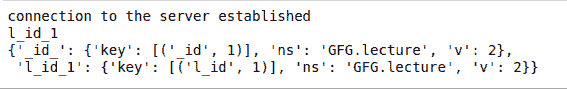
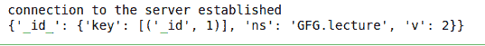

# 如何使用 PyMongo 删除集合中的所有索引？

> 原文:[https://www . geeksforgeeks . org/如何使用-pymongo/](https://www.geeksforgeeks.org/how-to-drop-all-the-indexes-in-a-collection-using-pymongo/) 删除集合中的所有索引

**先决条件:** [MongoDB 和 Python](https://www.geeksforgeeks.org/mongodb-and-python/)

借助 **drop_indexes()** 方法，我们可以删除一个集合中的所有索引。方法中没有传递任何参数。只能删除默认的 index _id。所有非标识索引都将被此方法删除。这意味着我们只能删除已经创建的索引。

**语法:**

```py
db.collection_name.drop_indexes()
```

**使用的样本数据库:**


默认情况下，每个集合都有 _id 索引。所有集合都必须至少有一个索引。如果删除所有索引，将自动生成一个新索引。我们可以通过运行以下命令来查看索引:



现在，假设 mongo 服务器正在运行，我们可以运行以下代码向集合中添加一个名为 new Index 的新索引:

**示例 1:向集合添加索引**

```py
import pprint 
import pymongo 

# connection 
try: 
    client = pymongo.MongoClient() 
    db = client['GFG'] 
    print('connection to the server established') 

except Exception: 
    print('Failed to Connect to server') 

collection = db.lecture 

# creating an index 
resp = collection.create_index("l_id") 

# printing the auto generated name  
# returned by MongoDB 
print(resp) 

# index_information() is analogous  
# to getIndexes 
pprint.pprint(collection.index_information()) 
```

**输出:**



**示例 2:从集合中删除索引**

```py
import pprint 
import pymongo 

try: 
    client = pymongo.MongoClient() 
    db = client['GFG'] 
    print('connection to the server established') 

except Exception: 
    print('Failed to Connect to server') 

collection = db.lecture 

# dropping the index using autogenerated 
# name from MongoDB 
collection.drop_indexes() 

# printing the indexes present on the collection 
pprint.pprint(collection.index_information()) 
```

**输出:**

