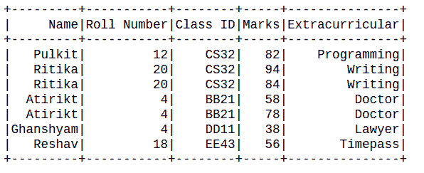
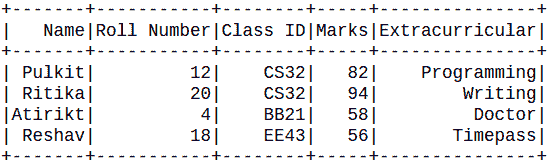
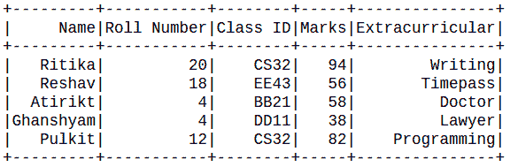

# 如何删除副本并在 PySpark 数据框中保留一个副本

> 原文:[https://www . geeksforgeeks . org/如何删除副本并保留一个在 pyspark-dataframe/](https://www.geeksforgeeks.org/how-to-drop-duplicates-and-keep-one-in-pyspark-dataframe/)

在本文中，我们将讨论如何处理 pyspark 数据帧中的重复值。数据集可能包含重复的行或重复的数据点，这对我们的任务没有用。数据框中这些重复的值称为重复值。

为了处理重复的值，我们可以使用一种策略，在这种策略中，我们保留第一次出现的值，并丢弃其余的值。

**dropduplicates():**Pyspark data frame 提供 drop duplicates()函数，用于删除数据帧内重复出现的数据。

> 语法:*data frame _ name . DropDuplicates(Column _ name)*

该函数将列名作为必须删除重复值的参数。

**创建用于演示的数据框:**

## 蟒蛇 3

```
# importing module
import pyspark

# importing sparksession from pyspark.sql module
from pyspark.sql import SparkSession
from pyspark.sql.types import StructType, StructField,
StringType, IntegerType, FloatType

# Start spark session
spark = SparkSession.builder.appName("Student_Info").getOrCreate()

# Initialize our data
data2 = [("Pulkit", 12, "CS32", 82, "Programming"),
         ("Ritika", 20, "CS32", 94, "Writing"),
         ("Ritika", 20, "CS32", 84, "Writing"),
         ("Atirikt", 4, "BB21", 58, "Doctor"),
         ("Atirikt", 4, "BB21", 78, "Doctor"),
         ("Ghanshyam", 4, "DD11", 38, "Lawyer"),
         ("Reshav", 18, "EE43", 56, "Timepass")
         ]

# Define schema
schema = StructType([
    StructField("Name", StringType(), True),
    StructField("Roll Number", IntegerType(), True),
    StructField("Class ID", StringType(), True),
    StructField("Marks", IntegerType(), True),
    StructField("Extracurricular", StringType(), True)
])

# read the dataframe
df = spark.createDataFrame(data=data2, schema=schema)
df.show()
```

**输出:**



**示例 1:** 此示例说明了 dropDuplicates()函数在单个列参数上的工作。数据集是定制的，因此我们已经定义了模式，并使用 spark.createDataFrame()函数创建了数据框架。

## 蟒蛇 3

```
# drop duplicates
df.dropDuplicates(['Roll Number']).show()

# stop Session
spark.stop()
```

**输出:**



从上面的观察可以清楚地看出，具有重复卷号的行已被删除，只有第一个出现的行保留在数据框中。

**示例 2:** 此示例说明了 dropDuplicates()函数在多个列参数上的工作。数据集是定制的，因此我们已经定义了模式，并使用 spark.createDataFrame()函数创建了数据帧。

## 蟒蛇 3

```
# drop duplicates
df.dropDuplicates(['Roll Number',"Name"]).show()

# stop the session
spark.stop()
```

**输出:**



从上面的观察，很明显，具有重复卷号和名称的数据点被移除，并且只有第一个出现保留在数据帧中。

**注意:**仅删除了将两个参数都作为副本的数据。在上面的示例中，“Ghanshyam”的列名有一个辊号重复值，但该名称是唯一的，因此它没有从数据框中删除。因此，该函数考虑所有参数，而不仅仅是其中一个。