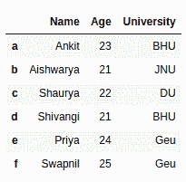
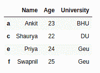
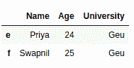
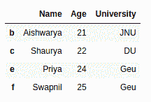

# 如何根据列值的条件删除数据框中的行？

> 原文:[https://www . geesforgeks . org/如何按列值按条件删除数据框中的行/](https://www.geeksforgeeks.org/how-to-drop-rows-in-dataframe-by-conditions-on-column-values/)

在本文中，我们将看到几个示例，说明如何根据应用于列的特定条件从 dataframe 中删除行。

熊猫为数据分析师提供了一种使用`dataframe.drop()`方法删除和过滤数据帧的方法。我们可以使用此方法删除不满足给定条件的行。

让我们创建一个熊猫数据框。

```
# import pandas library
import pandas as pd

# dictionary with list object in values
details = {
    'Name' : ['Ankit', 'Aishwarya', 'Shaurya',
              'Shivangi', 'Priya', 'Swapnil'],
    'Age' : [23, 21, 22, 21, 24, 25],
    'University' : ['BHU', 'JNU', 'DU', 'BHU', 
                    'Geu', 'Geu'],
}

# creating a Dataframe object 
df = pd.DataFrame(details, columns = ['Name', 'Age',
                                      'University'],
                  index = ['a', 'b', 'c', 'd', 'e',
                           'f'])

df
```

**输出:**



**示例 1:基于列上的条件删除行。**

```
# import pandas library
import pandas as pd

# dictionary with list object in values
details = {
    'Name' : ['Ankit', 'Aishwarya', 'Shaurya',
              'Shivangi', 'Priya', 'Swapnil'],
    'Age' : [23, 21, 22, 21, 24, 25],
    'University' : ['BHU', 'JNU', 'DU', 'BHU', 
                    'Geu', 'Geu'],
}

# creating a Dataframe object 
df = pd.DataFrame(details, columns = ['Name', 'Age',
                                      'University'],
                  index = ['a', 'b', 'c', 'd', 'e', 'f'])

# get names of indexes for which
# column Age has value 21
index_names = df[ df['Age'] == 21 ].index

# drop these row indexes
# from dataFrame
df.drop(index_names, inplace = True)

df
```

**输出:**



**示例 2:基于一列上的多个条件删除行。**

```
# import pandas library
import pandas as pd

# dictionary with list object in values
details = {
    'Name' : ['Ankit', 'Aishwarya', 'Shaurya', 
              'Shivangi', 'Priya', 'Swapnil'],
    'Age' : [23, 21, 22, 21, 24, 25],
    'University' : ['BHU', 'JNU', 'DU', 'BHU',
                    'Geu', 'Geu'],
}

# creating a Dataframe object 
df = pd.DataFrame(details, columns = ['Name', 'Age',
                                      'University'],
                  index = ['a', 'b', 'c', 'd', 'e', 'f'])

# get names of indexes for which column Age has value >= 21
# and <= 23
index_names = df[ (df['Age'] >= 21) & (df['Age'] <= 23)].index

# drop these given row
# indexes from dataFrame
df.drop(index_names, inplace = True)

df
```

**输出:**



**示例 3:基于不同列上的多个条件删除行。**

```
# import pandas library
import pandas as pd

# dictionary with list object in values
details = {
    'Name' : ['Ankit', 'Aishwarya', 'Shaurya',
              'Shivangi', 'Priya', 'Swapnil'],
    'Age' : [23, 21, 22, 21, 24, 25],
    'University' : ['BHU', 'JNU', 'DU', 'BHU', 
                    'Geu', 'Geu'],
}

# creating a Dataframe object 
df = pd.DataFrame(details, columns = ['Name', 'Age',
                                      'University'],
                  index = ['a', 'b', 'c', 'd', 'e', 'f'])

# get names of indexes for which
# column Age has value >= 21
# and column University is BHU
index_names = df[ (df['Age'] >= 21) & (df['University'] == 'BHU')].index

# drop these given row
# indexes from dataFrame
df.drop(index_names, inplace = True)

df
```

**输出:**

