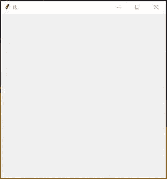
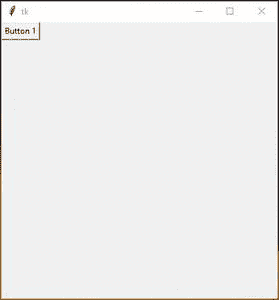

# 如何动态调整 Tkinter 中按钮文字的大小？

> 原文:[https://www . geesforgeks . org/如何动态调整大小-按钮-文本-in-tkinter/](https://www.geeksforgeeks.org/how-to-dynamically-resize-button-text-in-tkinter/)

**先决条件:**[Python GUI–Tkinter](https://www.geeksforgeeks.org/python-gui-tkinter/)、[使用 Tkinter](https://www.geeksforgeeks.org/dynamically-resize-buttons-when-resizing-a-window-using-tkinter/) 调整窗口大小时动态调整按钮大小

在本文中，我们将看到如何使按钮文本大小动态。动态意味着每当按钮大小改变时，按钮文本大小也会改变。在 Tkinter 中没有内置的功能，可以动态改变按钮文本的大小。

**进场:**

*   创建按钮并将粘性设置为所有方向
*   设置绑定，绑定会做什么，每当按钮大小改变时，它会调用我们稍后创建的调整大小函数。
*   在调整大小功能里面，我们会有不同的条件，取决于主窗口的几何/大小。
*   设置行和列配置

**让我们用分步实现来理解:**

**步骤 1:** 创建一个正常的 Tkit 窗口。

## 蟒蛇 3

```
# Import module
from tkinter import *

# Create object
root = Tk()

# Adjust size
root.geometry("400x400")

# Execute tkinter
root.mainloop()
```

**输出:**



**步骤 2:** 在主窗口内创建一个按钮。

## 蟒蛇 3

```
# Import module
from tkinter import *

# Create object
root = Tk()

# Adjust size
root.geometry("400x400")

# Create Buttons
button_1 = Button(root , text = "Button 1")

# Set grid
button_1.grid(row = 0,column = 0)

# Execute tkinter
root.mainloop()
```

**输出:**



**第 3 步:**调整按钮文本大小

在调整大小功能中，“e”值将告诉主窗口的宽度和高度。

## 蟒蛇 3

```
# resize button text size
def resize(e):

    # get window width
    size = e.width/10

    # define text size on different condition

    # if window height is greater
    # than 300 and less than 400 (set font size 40)
    if e.height <= 400 and e.height > 300:
        button_1.config(font = ("Helvetica", 40))

    # if window height is greater than
    # 200 and less than 300 (set font size 30)
    elif e.height < 300 and e.height > 200:
        button_1.config(font = ("Helvetica", 30))

    # if window height is less than 200 (set font size 40)
    elif e.height < 200:
        button_1.config(font = ("Helvetica", 40))
```

**以下是完整实现:**

## 蟒蛇 3

```
# Import module
from tkinter import *

# Create object
root = Tk()

# Adjust size
root.geometry("400x400")

# Specify Grid
Grid.columnconfigure(root, index = 0,
                     weight = 1)

Grid.rowconfigure(root, 0,
                  weight = 1)

# Create Buttons
button_1 = Button(root, text = "Button 1")

# Set grid
button_1.grid(row = 0,
              column = 0, sticky = "NSEW")

# resize button text size
def resize(e):

    # get window width
    size = e.width/10

    # define text size on different condition

    # if window height is greater
    # than 300 and less than 400 (set font size 40)
    if e.height <= 400 and e.height > 300:
        button_1.config(font = ("Helvetica", 40))

    # if window height is greater than
    # 200 and less than 300 (set font size 30)
    elif e.height < 300 and e.height > 200:
        button_1.config(font = ("Helvetica", 30))

    # if window height is less
    # than 200 (set font size 40)
    elif e.height < 200:
        button_1.config(font = ("Helvetica", 40))

# it will call resize function
# when window size will change
root.bind('<Configure>', resize)

# Execute tkinter
root.mainloop()
```

**输出:**

<video class="wp-video-shortcode" id="video-523192-1" width="640" height="360" preload="metadata" controls=""><source type="video/mp4" src="https://media.geeksforgeeks.org/wp-content/uploads/20201127121521/FreeOnlineScreenRecorderProject3.mp4?_=1">[https://media.geeksforgeeks.org/wp-content/uploads/20201127121521/FreeOnlineScreenRecorderProject3.mp4](https://media.geeksforgeeks.org/wp-content/uploads/20201127121521/FreeOnlineScreenRecorderProject3.mp4)</video>