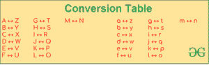

# 如何使用 Python 对消息进行编码和解码？

> 原文:[https://www . geesforgeks . org/如何使用 python 对消息进行编码和解码/](https://www.geeksforgeeks.org/how-to-encode-and-decode-a-message-using-python/)

加密是将普通消息(纯文本)转换为无意义消息(密文)的过程。而解密是将无意义的消息(密文)转换为原始形式(纯文本)的过程。在本文中，我们将提出加密和解密的思想，并起草一个 python 程序。

在本文中，我们将得到一个单行消息作为输入，它按照要求被编码或解码，结果消息作为输出被打印出来。这里，通过替换 A 到 Z、B 到 Y、… Z 到 A 来完成转换。消息中出现的字符、数字、空格和特殊字符的大小写保持不变。



**样品实施例 1:**

**加密**

```py
Input : Hello World
Output : Svool Dliow

```

**说明:**(参考-转换表)

*   h 被 S 取代
*   e 被 v 取代
*   l 被 o 取代
*   w 替换为 D
*   r 被 I 取代

**解密**

```py
Input : Svool Dliow 
Output : Hello World 

```

**说明:**(参考-转换表)

*   s 被 H 取代
*   v 被 e 取代
*   o 被 l 取代
*   d 替换为 W
*   我被 r 取代了

**样品例 2:**

**加密**

```py
Input : GeeksForGeeks
Output : TvvphUliTvvph

```

**说明:**(参考-转换表)

*   g 用 T 代替
*   e 被 v 取代
*   k 被 p 取代
*   s 被 h 取代
*   f 被 U 取代
*   o 被 l 取代
*   r 被 I 取代

**解密**

```py
Input : TvvphUliTvvph 
Output : GeeksForGeeks

```

**说明:**(参考-转换表)

*   t 用 G 代替
*   v 被 e 取代
*   p 被 k 取代
*   h 被 s 取代
*   u 被 F 取代
*   l 被 o 取代
*   我被 r 取代了

下面是实现。

## 蟒蛇 3

```py
# Taking input from user
data = 'Welcome to GeeksForGeeks...'

# conversion Chart
conversion_code = {

    # Uppercase Alphabets
    'A': 'Z', 'B': 'Y', 'C': 'X', 'D': 'W', 'E': 'V', 'F': 'U',
    'G': 'T', 'H': 'S', 'I': 'R', 'J': 'Q', 'K': 'P', 'L': 'O',
    'M': 'N', 'N': 'M', 'O': 'L', 'P': 'K', 'Q': 'J', 'R': 'I',
    'S': 'H', 'T': 'G', 'U': 'F', 'V': 'E', 'W': 'D', 'X': 'C',
    'Y': 'B', 'Z': 'A',

    # Lowercase Alphabets
    'a': 'z', 'b': 'y', 'c': 'x', 'd': 'w', 'e': 'v', 'f': 'u',
    'g': 't', 'h': 's', 'i': 'r', 'j': 'q', 'k': 'p', 'l': 'o',
    'm': 'n', 'n': 'm', 'o': 'l', 'p': 'k', 'q': 'j', 'r': 'i',
    's': 'h', 't': 'g', 'u': 'F', 'v': 'e', 'w': 'd', 'x': 'c',
    'y': 'b', 'z': 'a'
}

# Creating converted output
converted_data = ""

for i in range(0, len(data)):
    if data[i] in conversion_code.keys():
        converted_data += conversion_code[data[i]]
    else:
        converted_data += data[i]

# Printing converted output
print(converted_data)
```

**Output**

```py
Dvoxlnv gl TvvphUliTvvph...

```