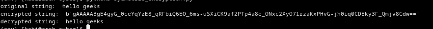
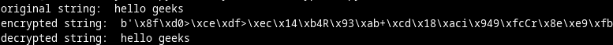

# 如何在 Python 中加密和解密字符串？

> 原文:[https://www . geesforgeks . org/如何在 python 中加密和解密字符串/](https://www.geeksforgeeks.org/how-to-encrypt-and-decrypt-strings-in-python/)

在本文中，我们将学习加密、解密，并用 Python 实现它们。

**加密:**

加密是对数据进行编码的过程。即将纯文本转换为密文。这种转换是用一种称为加密密钥的密钥完成的。

**解密:**

解密是对编码数据进行解码的过程。将密文转换为纯文本。这个过程需要一个我们用来加密的密钥。

我们需要一把加密钥匙。有两种主要类型的密钥用于加密和解密。它们是对称密钥和非对称密钥。

**对称密钥加密:**

在对称密钥加密中，数据使用相同的密钥进行编码和解码。这是最简单的加密方式，但也不太安全。接收者需要密钥来解密，因此需要一种安全的方式来传输密钥。任何有钥匙的人都可以读取中间的数据。

**示例:**

使用以下命令安装 python 加密库。

```
pip install cryptography
```

**步骤:**

*   进口费内特
*   然后生成一个加密密钥，用于加密和解密。
*   将字符串转换为字节字符串，以便对其进行加密。
*   用加密密钥实例化 Fernet 类。
*   然后用 Fernet 实例加密字符串。
*   然后它可以用 Fernet 类实例解密，并且应该用用于加密的相同密钥来实例化。

## 蟒蛇 3

```
from cryptography.fernet import Fernet

# we will be encryting the below string.
message = "hello geeks"

# generate a key for encryptio and decryption
# You can use fernet to generate
# the key or use random key generator
# here I'm using fernet to generate key

key = Fernet.generate_key()

# Instance the Fernet class with the key

fernet = Fernet(key)

# then use the Fernet class instance
# to encrypt the string string must must
# be encoded to byte string before encryption
encMessage = fernet.encrypt(message.encode())

print("original string: ", message)
print("encrypted string: ", encMessage)

# decrypt the encrypted string with the
# Fernet instance of the key,
# that was used for encrypting the string
# encoded byte string is returned by decrypt method,
# so decode it to string with decode methods
decMessage = fernet.decrypt(encMessage).decode()

print("decrypted string: ", decMessage)
```

**输出:**



**非对称密钥加密:**

在非对称密钥加密中，我们使用两个密钥一个公钥和一个私钥。公钥用于加密数据，私钥用于解密数据。根据名称，公钥可以是公共的(可以发送给任何需要发送数据的人)。没有人有你的私钥，所以中间没有人能读取你的数据。

**示例:**

使用以下命令安装 python rsa 库。

```
pip install rsa
```

**步骤:**

*   导入 rsa 库
*   使用 rsa.newkeys()方法生成公钥和私钥。
*   将字符串编码为字节字符串。
*   然后用公钥加密字节串。
*   然后可以用私钥解密加密的字符串。
*   公钥只能用于加密，私钥只能用于解密。

## 蟒蛇 3

```
import rsa

# generate public and private keys with
# rsa.newkeys method,this method accepts
# key length as its parameter
# key length should be atleast 16
publicKey, privateKey = rsa.newkeys(512)

# this is the string that we will be encrypting
message = "hello geeks"

# rsa.encrypt method is used to encrypt
# string with public key string should be
# encode to byte string before encryption
# with encode method
encMessage = rsa.encrypt(message.encode(),
                         publicKey)

print("original string: ", message)
print("encrypted string: ", encMessage)

# the encrypted message can be decrypted
# with ras.decrypt method and private key
# decrypt method returns encoded byte string,
# use decode method to convert it to string
# public key cannot be used for decryption
decMessage = rsa.decrypt(encMessage, privateKey).decode()

print("decrypted string: ", decMessage)
```

**输出:**

