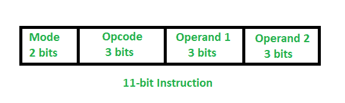

# 如何在 Python 中使用不同的寻址方式执行 11 位指令？

> 原文:[https://www . geesforgeks . org/如何使用 python 中的不同寻址模式执行 11 位指令/](https://www.geeksforgeeks.org/how-to-execute-a-11-digit-instruction-using-different-addressing-modes-in-python/)

这里，我们有一个 11 位指令，它的前 2 位代表寻址模式，后 3 位代表操作码，后 6 位代表两个操作数，每个操作数 3 位。



我们将使用四种不同的寻址模式来执行这个 11 位指令:-

1.  **直接模式:**在该模式下，指令中指定两个操作数的地址。我们可以直接从内存地址接收实际数据。
2.  **间接模式:**在这种模式下，指令中提到的地址都指向操作数的有效地址。
3.  **立即模式:**在该模式下，实际数据在指令本身中提及。
4.  **寄存器模式:**在该模式下，指令包含包含实际数据的寄存器的地址。

我们将以这种方式使用前 2 位来表示四种不同的寻址模式:

```py
For direct mode- 00
For indirect mode- 01
For immediate mode- 10
For register mode- 11

```

接下来的 3 位用于表示操作码，所以我们最多可以使用 8 种不同的操作。我们将定义 6 个操作，另外两个以这种方式保留给将来:

```py
000- Do nothing
001- Addition
010- Subtraction
011- Multiplication
100-Division
101-Transfer operand2 to operand1
110-Reserve for future
111-Reserve for future

```

接下来的 3 位用于操作 1，最后 3 位用于操作 2，因此在立即模式下，操作数的值将在 0 到 7 的范围内。
对于直接、间接和寄存器模式，我们需要定义一个内存数组和一个寄存器数组。因为我们只有 3 位来表示地址，所以这些数组中元素的最大数量是 8。

```py
memory=[2,15,40,25,7,36,64,19]
register=[17,20,43,52,None,None,None,None]

```

这里，存储器包含 8 个数据，寄存器包含 4 个数据。上面讨论的概念将以如下方式工作:

> **输入:** 01001000100
> 
> 这里，从左到右
> 模式-01-间接模式
> 操作码-001-加法
> 操作数 1-000- 0
> 操作数 2–100-4
> 由于是间接模式，所以这些操作数给出了数据有效地址的地址。
> 表示有效地址存在于存储单元 0 和 4 中，即 2 和 7。
> 实际数据存在于存储单元 2 和 7 中，即 40 和 19。
> 所以，结果会是 40 和 19 相加。
> 
> **输出:** 59

**示例:**

## 计算机编程语言

```py
memory=[2,15,40,25,7,36,64,19]
register=[17,20,43,52,None,None,None,None]

#This function execute the instruction and print the result. 
def execute(st):
    mode=st[:2]
    opcode=st[2:5]
    operand1=st[5:8]
    operand2=st[8:]
    print()
    print("Instruction mode:",mode)
    print("Opcode:",opcode)
    print("operand1:",operand1)
    print("operand2:",operand2)

    #For direct mode
    if mode=='00':
        idx1=int(operand1,2)
        idx2=int(operand2,2)
        if opcode=='000':
            print("Do nothing")
        elif opcode=='001':
            print("RESULT")
            print(memory[idx1]+memory[idx2])
        elif opcode=='010':
            print("RESULT")
            print(memory[idx1]-memory[idx2])
        elif opcode=='011':
            print("RESULT")
            print(memory[idx1]*memory[idx2])
        elif opcode=='100':
            print("RESULT")
            print(memory[idx1]/memory[idx2])
        elif opcode=='101':
            print("RESULT")
            print("operand1=:")
            print(int(operand2,2))
        else:
            print("Reserve For Future")

    #For indirect mode
    elif mode=='01':
        idx1=int(operand1,2)
        idx2=int(operand2,2)
        idx1=memory[idx1]
        idx2=memory[idx2]
        if opcode=='000':
            print("Do nothing")
        elif opcode=='001':
            print("RESULT")
            print(memory[idx1]+memory[idx2])
        elif opcode=='010':
            print("RESULT")
            print(memory[idx1]-memory[idx2])
        elif opcode=='011':
            print("RESULT")
            print(memory[idx1]*memory[idx2])
        elif opcode=='100':
            print("RESULT")
            print(memory[idx1]/memory[idx2])
        elif opcode=='101':
            print("RESULT")
            print("operand1=:")
            print(int(operand2,2))
        else:
            print("Reserve For Future")

    #For immediate mode
    elif mode=='10':
        idx1=int(operand1,2)
        idx2=int(operand2,2)
        if opcode=='000':
            print("Do nothing")
        elif opcode=='001':
            print("RESULT")
            print(idx1+idx2)
        elif opcode=='010':
            print("RESULT")
            print(idx1-idx2)
        elif opcode=='011':
            print("RESULT")
            print(idx1*idx2)
        elif opcode=='100':
            print("RESULT")
            print(idx1/idx2)
        elif opcode=='101':
            print("RESULT")
            print("operand1=:")
            print(int(operand2,2))
        else:
            print("Reserve For Future")

    #For register mode
    else:
        idx1=int(operand1,2)
        idx2=int(operand2,2)
        if idx1>3 or idx2>3:
            print("Invalid")
            exit()
        if opcode=='000':
            print("Do nothing")
        elif opcode=='001':
            print("RESULT")
            print(register[idx1]+register[idx2])
        elif opcode=='010':
            print("RESULT")
            print(register[idx1]-register[idx2])
        elif opcode=='011':
            print("RESULT")
            print(register[idx1]*register[idx2])
        elif opcode=='100':
            print("RESULT")
            print(register[idx1]/register[idx2])
        elif opcode=='101':
            print("RESULT")
            print("operand1=:")
            print(int(operand2,2))
        else:
            print("Reserve For Future")

#driver code
st="00001000001"
execute(st);
st="01001000100"
execute(st);
st="10001000001"
execute(st);
st="11001000001"
execute(st);
```

**输出:**

```py
Instruction mode: 00
Opcode: 001
operand1: 000
operand2: 001
RESULT
17

Instruction mode: 01
Opcode: 001
operand1: 000
operand2: 100
RESULT
59

Instruction mode: 10
Opcode: 001
operand1: 000
operand2: 001
RESULT
1

Instruction mode: 11
Opcode: 001
operand1: 000
operand2: 001
RESULT
37

```