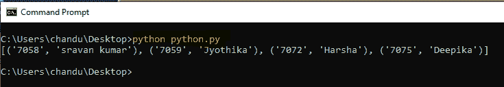
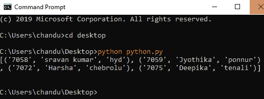

# 如何使用 Python 在 SQLite 中执行脚本？

> 原文:[https://www . geesforgeks . org/如何使用 python 执行 sqlite 中的脚本/](https://www.geeksforgeeks.org/how-to-execute-a-script-in-sqlite-using-python/)

在本文中，我们将看到如何使用 Python 在 SQLite 中执行脚本。这里我们通过 Python 执行创建表并将记录插入表脚本。在 Python 中， **sqlite3** 模块支持 sqlite 数据库，用于存储数据库中的数据。

### **接近**

**第一步:**首先我们需要导入 Python 中的 sqlite3 模块。

> 汇入 sqlite3

**步骤 2:** 通过创建数据库连接到数据库。我们可以通过简单地创建一个名为 geeks_db.db 的数据库来连接到数据库，或者我们可以通过使用**:内存:**在内存中简单地创建一个数据库

> **按名称创建数据库**
> 
> connection _ object = SQLite 3 . connect(" database _ name . db ")
> 
> **内存中的数据库创建:**
> 
> connection _ object = SQLite 3 . connect:memory:)

**步骤 3:** 建立数据库连接后创建光标对象。

> cursor_object =连接 _object.cursor()

**第四步:**编写可以执行的 SQL 查询。

> cursor_object.executescript(“脚本”)

**第五步:**执行光标对象

> cursor _ object(“SQL 语句”)

**第六步:**从数据库中获取表内数据。

> cursor_object.fetchall()

**例 1:**

## 蟒蛇 3

```py
# import sqlite3 module
import sqlite3

# create con object to connect 
# the database geeks_db.db
con = sqlite3.connect("geeks_db.db")

# create the cursor object
cur = con.cursor()

# execute the script by creating the 
# table named geeks_demo and insert the data
cur.executescript("""
    create table geeks_demo(
        geek_id,
        geek_name
    );
   insert into geeks_demo values ( '7058', 'sravan kumar' );
   insert into geeks_demo values ( '7059', 'Jyothika' );
   insert into geeks_demo values ( '7072', 'Harsha' );
   insert into geeks_demo values ( '7075', 'Deepika' );

    """)

# display the data in the table by 
# executing the cursor object
cur.execute("SELECT * from geeks_demo")

# fetch all the data
print(cur.fetchall())
```

**输出:**



**例 2:**

## 蟒蛇 3

```py
# import sqlite3 module
import sqlite3

# create con object to connect 
# the database geeks_db.db
con = sqlite3.connect("geeks_db.db")

# create the cursor object
cur = con.cursor()

# execute the script by creating the table
# named geeks1 and insert the data
cur.executescript("""
    create table geeks1(
        geek_id,
        geek_name,
        address
    );
   insert into geeks1 values ( '7058', 'sravan kumar','hyd' );
   insert into geeks1 values ( '7059', 'Jyothika' ,'ponnur' );
   insert into geeks1 values ( '7072', 'Harsha','chebrolu'  );
   insert into geeks1 values ( '7075', 'Deepika','tenali'  );

    """)

# display the data in the table by 
# executing the cursor object
cur.execute("SELECT * from geeks1")

# fetch all the data
print(cur.fetchall())
```

**输出:**

