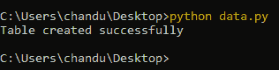
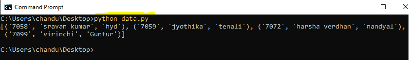

# 如何在 Python 中执行 SQLite 语句？

> 原文:[https://www . geeksforgeeks . org/如何执行-a-SQLite-in-python 语句/](https://www.geeksforgeeks.org/how-to-execute-a-sqlite-statement-in-python/)

在本文中，我们将看到如何使用 Python 执行 SQLite 语句。我们将执行如何在数据库中创建一个表，插入记录并显示表中的数据。

为了在 python 中执行 SQLite 脚本，我们将使用 **execute()** 方法和 **connect()** 对象:

> connection_object.execute("sql 语句")

### **进场:**

要执行该操作，我们必须遵循以下步骤:

*   导入 sqlite3 模块。此语句将导入 SQLite 模块，import 关键字用于导入 python 中的一个模块。

```py
import sqlite3
```

*   创建到数据库的连接。这将通过连接数据库来创建一个新的数据库，这里我们必须指定数据库名称，并使用**光标对象连接到它。**

```py
connection_object = sqlite3.connect('database_name.db')
```

*   执行查询连接对象。这里我们需要通过指定 SQL 语句来执行连接对象。

```py
connection_object.execute("sql statement");
```

*   最后使用 close()方法终止连接。

```py
connection_object.close();
```

**示例 1:** Python 代码创建一个数据库和一个表，下面是步骤:

*   正在导入 sqlite3 模块
*   通过使用对象与 college_details 数据库连接来创建连接
*   SQLite 执行查询来创建表

## 蟒蛇 3

```py
# importing sqlite3 module
import sqlite3

# create connection by using object to 
# connect with college_details database
connection = sqlite3.connect('college.db')

# sqlite execute query to create a table
connection.execute("""create table college(
        geek_id,
        geek_name,
        address
    );""")

print("Table created successfully")

# terminate the connection
connection.close()
```

**输出:**



**数据库创建时间:**


**示例 2:** 将数据插入并显示到上面创建的表中的 Python 代码。

## 蟒蛇 3

```py
# importing sqlite3 module
import sqlite3

# create connection by using object 
# to connect with college_details 
# database
connection = sqlite3.connect('college.db')

# sqlite execute query to insert a table
connection.execute(
    '''insert into college values ( '7058', 'sravan kumar','hyd' )''')
connection.execute(
    '''insert into college values ( '7059', 'jyothika','tenali' )''')
connection.execute(
    '''insert into college values ( '7072', 'harsha verdhan','nandyal' )''')
connection.execute(
    '''insert into college values ( '7099', 'virinchi','Guntur' )''')

# sqlite execute query to display data
# in the college
a = connection.execute("select * from college")

# fetch all records
print(a.fetchall())

# terminate the connection
connection.close()
```

**输出:**

