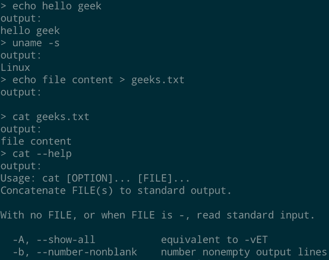
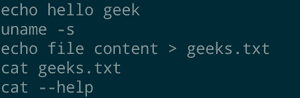

# 如何用 Python 在远程机器上执行 Shell 命令？

> 原文:[https://www . geesforgeks . org/如何在 python 中执行远程机器外壳命令/](https://www.geeksforgeeks.org/how-to-execute-shell-commands-in-a-remote-machine-in-python/)

**在远程机器上运行 shell 命令****不过是在另一台机器上以另一个用户的身份通过计算机网络执行 shell 命令。将有一个可以发送命令的主机和一个或多个执行接收到的命令的从机。**

## **入门指南**

**我们将使用 [Websocket](https://www.geeksforgeeks.org/what-is-web-socket-and-how-it-is-different-from-the-http/) 协议向从机发送 shell 命令并接收命令的输出。Websocket 通过单个 TCP 连接实时提供全双工通信。Python 提供了一个[子进程](https://www.geeksforgeeks.org/python-execute-and-parse-linux-commands/)库一个内置的库，允许一个新的进程启动并连接到它们的输入、输出和错误管道。子进程库中的 getoutput 方法执行命令并返回输出，如果出现错误，它也会返回错误。**

**您将很容易理解它的工作方式和实现。让我们开始吧。**

****进场:****

*   **创建 Mater 机器脚本。**
*   **创建一个套接字连接，并监听从机套接字。**
*   **一旦发出连接请求，就接受连接。**
*   **使用输入法从用户处获取命令并对其进行编码。**
*   **然后使用套接字连接发送 shell 命令。**
*   **然后接收命令的输出。**
*   **创建从属机器脚本。**
*   **创建一个套接字，并将其连接到主机套接字。**
*   **从主机接收命令。**
*   **从子流程模块中使用 get output 方法执行命令。**
*   **getoutput 方法返回已执行命令的输出。**
*   **对输出进行编码，并将其发送给主机。**

****主机脚本:****

## **蟒蛇 3**

```
import socket

# Create socket with socket class.
master = socket.socket()

# Host is the IP address of master
# machine.
host = "0.0.0.0"

# This will be the port that the
# socket is bind.
port = 8080

# binding the host and port to the
# socket we created.
master.bind((host, port))

# listen method listens on the socket
# to accept socket connection.
master.listen(1)

# This method accept socket connection
# from the slave machine
slave, address = master.accept()

# When the slave is accepted, we can send
# and receive data in real time
while True:
    # input the command from the user
    print(">", end=" ")
    command = input()

    # encode the command and send it to the
    # slave machine then slave machine can
    # executes the command
    slave.send(command.encode())

    # If the command is exit, close the connection
    if command == "exit":
        break

    # Receive the output of command, sent by the
    # slave machine.recv method accepts integer as
    # argument and it denotes no.of bytes to be
    # received from the sender.
    output = slave.recv(5000)
    print(output.decode())

# close method closes the socket connection between
# master and slave.
master.close()
```

****输出:****

****

****从机脚本:****

## **蟒蛇 3**

```
import socket
import subprocess

# Create socket with socket class.
master = socket.socket()

# Host is the IP address of master machine.
host = "192.168.43.160"

# This will be the port that master
# machine listens.
port = 8080

# connect to the master machine with connect
# command.
slave.connect((host, port))

while True:
    # receive the command from the master machine.
    # recv 1024 bytes from the master machine.
    command = slave.recv(1024).decode()
    print(command)

    # If the command is exit, close the connection.
    if command == "exit":
        break

    output  = "output:\n"

    # getoutput method executes the command and
    # returns the output.
    output += subprocess.getoutput(command)

    # Encode and send the output of the command to
    # the master machine.
    slave.send(output.encode())

# close method closes the connection.
slave.close()
```

****输出:****

****