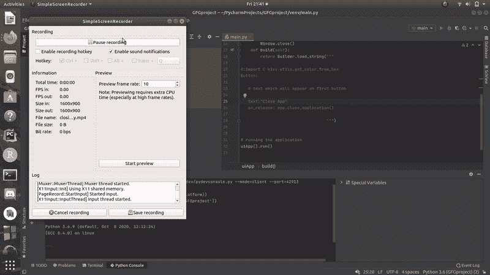

# 如何使用按钮退出 Kivy 应用？

> 原文:[https://www . geeksforgeeks . org/how-exit-a-kivy-application-use-a-button/](https://www.geeksforgeeks.org/how-to-exit-a-kivy-application-using-a-button/)

[**Kivy**](https://www.geeksforgeeks.org/kivy-tutorial/) 是一个图形用户界面开源 Python 库，可以在 Windows、macOS、Android、iOS、Linux 和树莓-Pi 上开发多平台应用。除了常规的鼠标和键盘输入，它还支持**多点触摸**事件。使用 Kivy 制作的应用程序在所有平台上都是相似的，但这也意味着应用程序的感觉或外观将不同于任何本机应用程序。

在本文中，我们将使用 python 的 kivy 框架开发一个 GUI 窗口，我们将在该窗口上添加一个按钮，点击该按钮将关闭 kivy 应用程序

### **进场:**

*   导入描述按钮
*   导入鄙视应用
*   Import deska
*   创建应用程序类
*   返回生成器字符串
*   运行类的实例

下面是实现。

## 蟒蛇 3

```
# importing button widget from kivy framework
from kivy.uix.button import Button
from kivy.app import App
from kivy.core.window import Window

# importing builder from kivy
from kivy.lang import Builder

# this is the main class which 
# will render the whole application
class uiApp(App):

    # method which will render our application
    def close_application(self):
        # closing application
        App.get_running_app().stop()
        # removing window
        Window.close()

    def build(self):
        return Builder.load_string("""

#:import C kivy.utils.get_color_from_hex
Button:

   # text which will appear on first button

   text:"Close App"
   on_release: app.close_application()

                                   """)

# running the application
uiApp().run()
```

**输出:**

