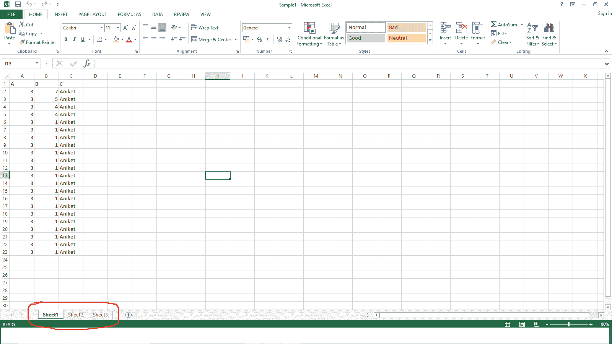
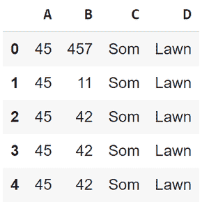

# 如何在 Python 中从常用文件格式中提取数据？

> 原文:[https://www . geeksforgeeks . org/如何从 python 通用文件格式中提取数据/](https://www.geeksforgeeks.org/how-to-extract-data-from-common-file-formats-in-python/)

有时处理一些数据集必须主要处理**。仅限 csv(逗号分隔值)**文件。它们确实是应用数据科学技术和算法的一个很好的起点。但我们中的许多人迟早会进入数据科学公司或从事数据科学领域的实际项目。不幸的是，在现实世界的项目中，数据不会以简洁的方式提供给我们。csv 文件。在那里，我们必须从不同的来源提取数据，如图像、pdf 文件、文档文件、图像文件等。在本文中，我们将看到解决这些情况的完美开始。

**下面我们就来看看如何从多个这样的来源中提取相关信息。**

### 1.多个工作表 Excel 文件

请注意，如果 Excel 文件只有一张表，那么读取 CSV 文件( **pd.read_csv('File.xlsx')** )的相同方法可能会起作用。但是在如下图所示的有 3 张纸(第 1 张、第 2 张、第 3 张)的多张纸文件的情况下就不会了。在这种情况下，它将只返回第一页。

所用 Excel 表格: [**点击此处**](https://docs.google.com/spreadsheets/d/13z1zYoZbaz5lWgdiMMGSJDWkQ7oIuBWfIF9OUPiUL4o/edit?usp=sharing) **。**



**示例:我们将看到如何读取这个 excel 文件。**

## 蟒蛇 3

```py
# import Pandas library
import pandas as pd

# Read our file. Here sheet_name=1
# means we are reading the 2nd sheet or Sheet2
df = pd.read_excel('Sample1.xlsx', sheet_name = 1)
df.head()
```

**输出:**



**现在让我们阅读同一张表的一个选定列:**

## 蟒蛇 3

```py
# Read only column A, B, C of all
# the four columns A,B,C,D in Sheet2
df=pd.read_excel('Sample1.xlsx',
                 sheet_name = 1, usecols = 'A : C')
df.head()
```