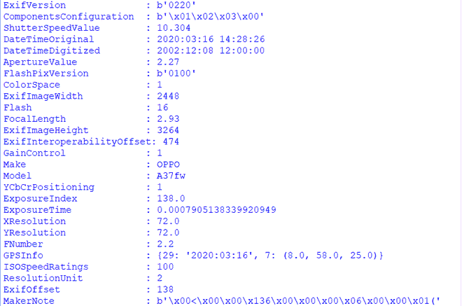

# 如何在 Python 中提取图像元数据？

> 原文:[https://www . geesforgeks . org/如何提取 python 中的图像元数据/](https://www.geeksforgeeks.org/how-to-extract-image-metadata-in-python/)

**先决条件:**T2】PIL

元数据代表关于数据的数据。就图像而言，元数据意味着关于图像及其制作的细节。一些元数据由捕获设备自动生成。

图像元数据包含的一些细节如下:

*   高度
*   宽度
*   日期和时间
*   模型等。

Python 有 PIL 库，通过使用几行代码，从图像中提取元数据的任务也变得非常简单。

### **进场:**

*   导入*枕*模块。
*   加载图像
*   获取元数据。如此获得的元数据
*   将其转换为人类可读的形式

有许多类型的元数据，但是在这里我们只关注 Exif 元数据

**Exif**

这些元数据通常由相机和其他捕获设备创建，包括关于图像及其捕获方法的技术信息，例如曝光设置、捕获时间、全球定位系统位置信息和相机型号。

为此，我使用了这张图片(下面是这个的链接),确保你正在使用的任何图片都应该有一些 exif 类型的元数据，并且大多数捕获设备都有 EXIF 数据

[https://drive . Google . com/file/d/1z2 rarv ZC 8 CD 8 oxd 8 pzju 2u 0 RPR 8 tbwv/view](https://drive.google.com/file/d/1z2RaRvzC8Cd8oxD8pZJu2U0rpRr8tbwV/view)

**注**:-请避免通过 whatsapp 分享图片。 **Whatsapp 从任何图像中剥离所有元数据**

**实施:**

步骤 1:导入模块。

步骤 2:加载图像并提取 exif 数据。

第三步:将 exif 标记 id(在代码中由标记 id 表示)转换为人类可读的形式，在代码中由标记名表示，并获取其各自的值。

**用枕头从图像中提取元数据的应用程序**:下面的脚本实现了上述方法

## 蟒蛇 3

```
from PIL import Image
from PIL.ExifTags import TAGS

# open the image
image = Image.open("img.jpg")

# extracting the exif metadata
exifdata = image.getexif()

# looping through all the tags present in exifdata
for tagid in exifdata:

    # getting the tag name instead of tag id
    tagname = TAGS.get(tagid, tagid)

    # passing the tagid to get its respective value
    value = exifdata.get(tagid)

    # printing the final result
    print(f"{tagname:25}: {value}")
```

**输出:**

