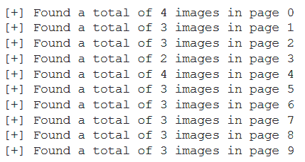

# 如何用 Python 从 PDF 中提取图像？

> 原文:[https://www . geesforgeks . org/如何从 python pdf 中提取图像/](https://www.geeksforgeeks.org/how-to-extract-images-from-pdf-in-python/)

在本文中，任务是用 Python 从 PDF 中提取图像。我们将从 PDF 文件中提取图像，并使用 PyMuPDF 库保存它们。首先，我们必须使用枕头安装 PyMuPDF 库。

```py
pip install PyMuPDF Pillow
```

PyMuPDF 用于访问 PDF 文件。要从 PDF 文件中提取图像，我们需要遵循下面提到的步骤-

*   导入必要的库
*   指定要从中提取图像并将其打开的文件的路径
*   遍历 PDF 的所有页面，获取每一页上的所有图像对象
*   使用 **getImageList()** 方法获取所有图像对象作为元组列表
*   要获取以字节为单位的图像以及关于图像的附加信息，请使用**提取图像()**

**注意:**下载 PDF 文件[点击这里](http://zsi.tech.us.edu.pl/~nowak/bien/BIEN_introduction.pdf)。

下面是实现。

## 蟒蛇 3

```py
# STEP 1
# import libraries
import fitz
import io
from PIL import Image

# STEP 2
# file path you want to extract images from
file = "/content/pdf_file.pdf"

# open the file
pdf_file = fitz.open(file)

# STEP 3
# iterate over PDF pages
for page_index in range(len(pdf_file)):

    # get the page itself
    page = pdf_file[page_index]
    image_list = page.getImageList()

    # printing number of images found in this page
    if image_list:
        print(f"[+] Found a total of {len(image_list)} images in page {page_index}")
    else:
        print("[!] No images found on page", page_index)
    for image_index, img in enumerate(page.getImageList(), start=1):

        # get the XREF of the image
        xref = img[0]

        # extract the image bytes
        base_image = pdf_file.extractImage(xref)
        image_bytes = base_image["image"]

        # get the image extension
        image_ext = base_image["ext"]
```

**输出:**

