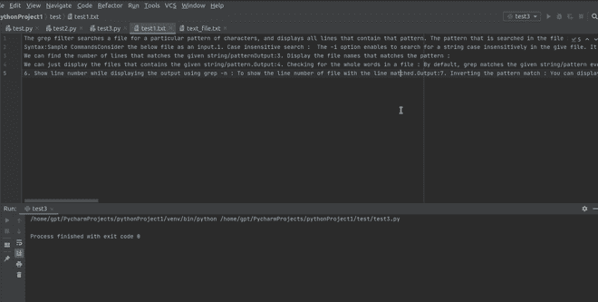

# 如何从网站中提取段落并保存为文本文件？

> 原文:[https://www . geesforgeks . org/如何从网站中提取段落并将其保存为文本文件/](https://www.geeksforgeeks.org/how-to-extract-paragraph-from-a-website-and-save-it-as-a-text-file/)

**额外津贴:**

*   [靓汤](https://www.geeksforgeeks.org/implementing-web-scraping-python-beautiful-soup/)
*   [Urllib](https://www.geeksforgeeks.org/python-urllib-module/)

抓取是一项重要的技术，它帮助我们从 URL 或 html 文件中检索有用的数据，这些数据可以以另一种方式使用。给定的文章展示了如何从网址中提取段落并将其保存为文本文件。

### **所需模块**

**bs4:** 美人汤(bs4)是一个 Python 库，用于从 HTML 和 XML 文件中获取数据。它可以按如下方式安装:

```
pip install bs4
```

**urllib:** urllib 是一个包，它收集了几个用于处理 URL 的模块。它也可以用同样的方式安装，它大部分内置在环境本身。

```
pip install urllib
```

**进场:**

*   创建文本文件。
*   现在对于程序，导入所需的模块，并传递网址和**。txt 文件路径。这将在您的本地计算机中复制该 URL 的 html 代码。
*   创建请求实例并传入网址
*   以读取模式打开文件，并传递所需参数**。**
*   将请求传递到一个美丽的输出()函数。
*   创建另一个文件(或者您也可以在现有文件中写入/追加)。
*   然后我们可以迭代，找到所有的“p”标签，并打印文本文件中的每个段落。

实现如下:

**示例:**

## 蟒蛇 3

```
import urllib.request
from bs4 import BeautifulSoup

# here we have to pass url and path
# (where you want to save ur text file)
urllib.request.urlretrieve("https://www.geeksforgeeks.org/grep-command-in-unixlinux/?ref=leftbar-rightbar",
                           "/home/gpt/PycharmProjects/pythonProject1/test/text_file.txt")

file = open("text_file.txt", "r")
contents = file.read()
soup = BeautifulSoup(contents, 'html.parser')

f = open("test1.txt", "w")

# traverse paragraphs from soup
for data in soup.find_all("p"):
    sum = data.get_text()
    f.writelines(sum)

f.close()
```

**输出:**

