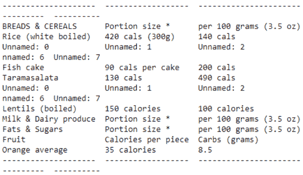
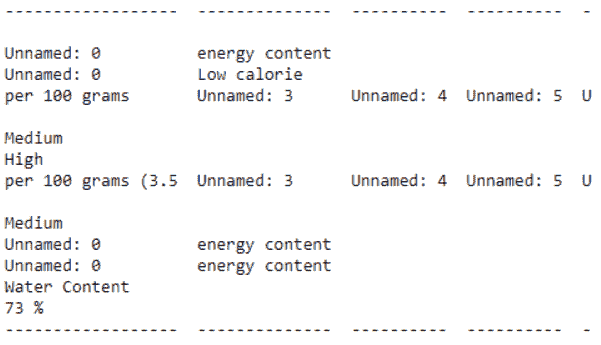
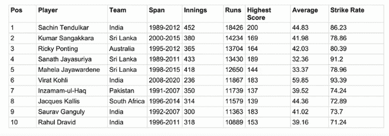

# 如何在 Python 中提取 PDF 表格？

> 原文:[https://www . geesforgeks . org/how-extract-pdf-tables-in-python/](https://www.geeksforgeeks.org/how-to-extract-pdf-tables-in-python/)

本主题是关于从 PDF 中提取表格的方法，请输入 Python。首先我们来讨论一下什么是 PDF 文件？

PDF(可移植文档格式)可能是一种文件格式，它将打印文档的所有天气情况捕获为位图，您只需查看、导航、打印或转发给其他人。PDF 文件是使用 Adobe Acrobat 创建的，

**示例:**

假设一个 PDF 文件包含一个表格

<figure class="table">

| 用户标识 | 名字 | 职业 |
| one | 大卫 | 产品管理 |
| Two | 狮子星座 | 信息技术管理员 |
| three | 约翰 | 律师 |

</figure>

我们想把这张表读入我们的 Python 程序。这个问题可以用几种方法来解决。让我们逐一讨论。

**方法一:用白板**

tabula-py 是 tabula-java 的一个简单的 Python 包装器，可以读取 PDF 中的表格。您可以使用命令安装白板库。

```
pip install tabula-py
pip install tabulate
```

示例中使用的方法有:

> **read_pdf():** 从给定地址的 pdf 文件的表中读取数据
> 
> **制表():**以表格格式排列数据

这里使用的 PDF 文件是 [PDF](http://www.uncledavesenterprise.com/file/health/Food%20Calories%20List.pdf) 。

## 蟒蛇 3

```
from tabula import read_pdf
from tabulate import tabulate

#reads table from pdf file
df = read_pdf("abc.pdf",pages="all") #address of pdf file
print(tabulate(df))
```

**输出:**

 

**方法二:使用卡梅洛特**

Camelot 是一个 Python 库，有助于从 PDF 文件中提取表格。您可以使用命令安装 camelot-py 库

```
pip install camelot-py
```

示例中使用的方法有:

> **read_pdf():** 从给定地址的 pdf 文件的表中读取数据
> 
> **表格[索引]。df:** 指向给定索引的所需表

这里使用的 PDF 文件是 [PDF](https://drive.google.com/file/d/1q4JEtOD0vCNtH0U4kLUHZqDMfThUCu9i/view?usp=sharing) 。



## 蟒蛇 3

```
import camelot

# extract all the tables in the PDF file
abc = camelot.read_pdf("test.pdf")   #address of file location

# print the first table as Pandas DataFrame
print(abc[0].df)
```

**输出:**

