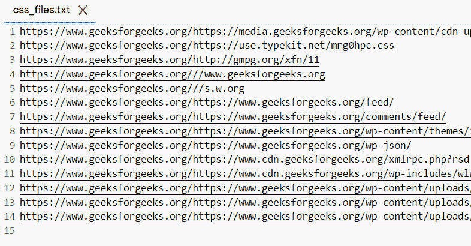
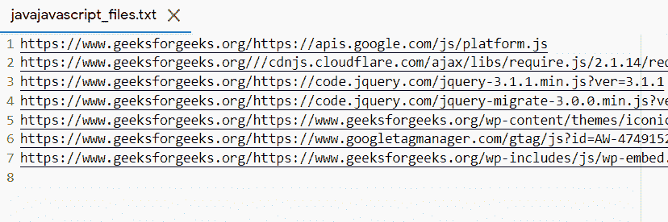

# 如何用 Python 从网页中提取脚本和 CSS 文件？

> 原文:[https://www . geesforgeks . org/如何从 python 网页中提取脚本和 css 文件/](https://www.geeksforgeeks.org/how-to-extract-script-and-css-files-from-web-pages-in-python/)

**先决条件:**

*   [**请求**](https://www.geeksforgeeks.org/python-requests-tutorial/)
*   [**【美丽的脉冲星】**](https://www.geeksforgeeks.org/implementing-web-scraping-python-beautiful-soup/)
*   [**Python 中的文件处理**](https://www.geeksforgeeks.org/file-handling-python/)

在本文中，我们将讨论如何使用 Python 从网页中提取脚本和 CSS 文件。

为此，我们将下载在其编码过程中附加到网站源代码的 CSS 和 JavaScript 文件。首先，确定需要抓取的网站的网址，并向其发送请求。检索网站内容后，会创建两种文件类型的两个文件夹，并将文件放入其中，然后我们可以根据需要对它们执行各种操作。

### **需要的模块**

*   **bs4:** 美人汤(bs4)是一个从 HTML 和 XML 文件中拉出数据的 Python 库。这个模块没有内置 Python。
*   **请求:**请求让你可以极其轻松地发送 HTTP/1.1 请求。该模块也没有内置 Python。

**例 1:**

这里，我们计算每个相应类型的提取链接数。

## 蟒蛇 3

```py
# Import Required Library
import requests
from bs4 import BeautifulSoup

# Web URL
web_url = "https://www.geeksforgeeks.org/"

# get HTML content
html = requests.get(web_url).content

# parse HTML Content
soup = BeautifulSoup(html, "html.parser")

js_files = []
cs_files = []

for script in soup.find_all("script"):
    if script.attrs.get("src"):

        # if the tag has the attribute 
        # 'src'
        url = script.attrs.get("src")
        js_files.append(web_url+url)

for css in soup.find_all("link"):
    if css.attrs.get("href"):

        # if the link tag has the 'href' 
        # attribute
        _url = css.attrs.get("href")
        cs_files.append(web_url+_url)

print(f"Total {len(js_files)} javascript files found")
print(f"Total {len(cs_files)} CSS files found")
```

**输出:**

> 总共找到 7 个 javascript 文件
> 
> 总共找到 14 个 CSS 文件

我们还可以使用文件处理将提取的链接导入文本文件。

**例 2:**

## 蟒蛇 3

```py
# Import Required Library
import requests
from bs4 import BeautifulSoup

# Web URL
web_url = "https://www.geeksforgeeks.org/"

# get HTML content
html = requests.get(web_url).content

# parse HTML Content
soup = BeautifulSoup(html, "html.parser")

js_files = []
cs_files = []

for script in soup.find_all("script"):
    if script.attrs.get("src"):

        # if the tag has the attribute 
        # 'src'
        url = script.attrs.get("src")
        js_files.append(web_url+url)

for css in soup.find_all("link"):
    if css.attrs.get("href"):

        # if the link tag has the 'href'
        # attribute
        _url = css.attrs.get("href")
        cs_files.append(web_url+_url)

# adding links to the txt files
with open("javajavascript_files.txt", "w") as f:
    for js_file in js_files:
        print(js_file, file=f)

with open("css_files.txt", "w") as f:
    for css_file in cs_files:
        print(css_file, file=f)
```

**输出:**

 