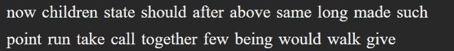

# 如何用 Python 从图像中提取文本？

> 原文:[https://www . geesforgeks . org/如何用 python 从图像中提取文本/](https://www.geeksforgeeks.org/how-to-extract-text-from-images-with-python/)

光学字符识别是将数字图像电子转换成机器编码文本的过程。其中数字图像通常是包含类似于语言字符的区域的图像。光学字符识别是模式识别、人工智能和计算机视觉的一个研究领域。这是因为新的光学字符识别是通过提供样本数据来训练的，样本数据是通过机器学习算法运行的。这种从图像中提取文本的技术通常在工作环境中执行，在工作环境中，图像肯定会包含文本数据。在本文中，我们将学习如何从图像中提取文本。为此，我们将使用 python 编程语言。

为了使我们的 python 程序具有字符识别功能，我们将使用**字符识别库。通过在操作系统的命令解释器中执行以下命令，可以将库安装到我们的 python 环境中**

```py
pip install pytesseract
```

**库(*如果在 Windows 操作系统*上使用)要求*tesseract.exe*二进制文件也存在，以便库的正确[安装](https://github.com/UB-Mannheim/tesseract/wiki)。在安装上述可执行文件的过程中，系统会提示我们为其指定一个路径。这条路径需要记住，因为它将在以后的代码中使用。对于大多数安装，路径是*C:\ \程序文件(x86)\ \宇宙魔方-光学字符识别\ \宇宙魔方. exe.***

****说明:****

**首先我们从 PIL 库导入图像模块(用于打开图像)，然后从 pytesserract 库导入 pytesserract 模块(用于文本提取)。然后，在我们定义了包含可执行二进制文件(*tesseract.exe*)的路径的*path _ to _ tesserract*变量之后，我们在先决条件中安装了可执行二进制文件(该路径取决于二进制文件的安装位置)。然后我们定义了包含图像文件路径的*图像路径*变量。这个路径被传递到 *open()* 函数，从我们的图像中创建一个图像对象。在此之后，我们将存储在*path _ to _ tesserract*变量中的路径分配给*pytesserract . tesserract _ cmd*变量(这将被库用来查找可执行文件并将其用于提取)。之后我们将图像对象( *img* )传递给 *image_to_string()* 函数。这个函数接受一个图像对象的参数，并返回其内部识别的文本。最后，我们使用文本[:-1]显示了在图像中找到的文本(由于默认情况下附加了一个附加字符(^L))。**

****例 1:****

****演示用图像:****

**

带有黑色背景的白色文本图像** 

****以下是完整实现:****

## **蟒蛇 3**

```py
from PIL import Image
from pytesseract import pytesseract

# Defining paths to tesseract.exe
# and the image we would be using
path_to_tesseract = r"C:\Program Files\Tesseract-OCR\tesseract.exe"
image_path = r"csv\sample_text.png"

# Opening the image & storing it in an image object
img = Image.open(image_path)

# Providing the tesseract executable
# location to pytesseract library
pytesseract.tesseract_cmd = path_to_tesseract

# Passing the image object to image_to_string() function
# This function will extract the text from the image
text = pytesseract.image_to_string(img)

# Displaying the extracted text
print(text[:-1])
```

****输出:****

> **现在的孩子状态应该是经过以上同样长时间的这样了**
> 
> **点跑带叫在一起很少有人会走着给**

****例 2:****

****演示用图像:****

****

****代码:****

## **蟒蛇 3**

```py
from PIL import Image
from pytesseract import pytesseract

# Defining paths to tesseract.exe 
# and the image we would be using
path_to_tesseract = r"C:\Program Files\Tesseract-OCR\tesseract.exe"
image_path = r"csv\d.jpg"

# Opening the image & storing it in an image object
img = Image.open(image_path)

# Providing the tesseract 
# executable location to pytesseract library
pytesseract.tesseract_cmd = path_to_tesseract

# Passing the image object to 
# image_to_string() function
# This function will
# extract the text from the image
text = pytesseract.image_to_string(img)

# Displaying the extracted text
print(text[:-1])
```

****输出:****

```py
Geeksforgeeks
```