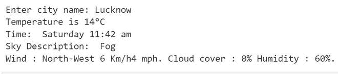

# 如何用 Python 从谷歌提取天气数据？

> 原文:[https://www . geeksforgeeks . org/如何从 python 中的 google 提取天气数据/](https://www.geeksforgeeks.org/how-to-extract-weather-data-from-google-in-python/)

在这篇文章中，我们将看到如何从谷歌提取天气数据。谷歌没有自己的天气应用编程接口，它从 weather.com 获取数据，并在你在谷歌上搜索时显示出来。所以，我们将从谷歌上收集数据。

**所需模块:**

**请求:** Requests 可以让你极其轻松地发送 HTTP/1.1 请求。该模块也没有内置 Python。要安装此软件，请在终端中键入以下命令。

```
pip install requests
```

**bs4:** 美人汤是一个库，方便从网页上刮取信息。无论是 HTML 还是 XML 页面，都可以在以后用于迭代、搜索和修改其中的数据。

**进场:**

*   导入模块
*   输入城市名称和网址

```
"https://www.google.com/search?q="+"weather"+{cityname}
```

*   创建请求实例并传递网址
*   获取原始数据。
*   从汤里提取所需的数据。
*   最后，打印所需数据。

**逐步实现代码:**

步骤 1:导入请求和 bs4 库

## 蟒蛇 3

```
# importing the library
import requests
from bs4 import BeautifulSoup
```

**第二步:**用输入的城市名称创建一个 URL，并将其传递给 get 函数。

## 蟒蛇 3

```
# enter city name
city = "lucknow"

# create url
url = "https://www.google.com/search?q="+"weather"+city

# requests instance
html = requests.get(url).content

# getting raw data
soup = BeautifulSoup(html, 'html.parser')
```

**第三步:**shoot 将返回一堆带有 HTML 标签的数据。因此，下面显示了一大块数据，在 find 函数的帮助下，通过传递标记名和类名，我们将从中获得所有必要的数据。

> 【IBP 4i ap7 wnd】>13c</div>>/div</div>

## 蟒蛇 3

```
# get the temperature
temp = soup.find('div', attrs={'class': 'BNeawe iBp4i AP7Wnd'}).text

# this contains time and sky description
str = soup.find('div', attrs={'class': 'BNeawe tAd8D AP7Wnd'}).text

# format the data
data = str.split('\n')
time = data[0]
sky = data[1]
```

**第 4 步:**这里列表 1 包含所有具有特定类名的 div 标签，该列表的索引 5 包含所有其他必需的数据。

## 蟒蛇 3

```
# list having all div tags having particular clas sname
listdiv = soup.findAll('div', attrs={'class': 'BNeawe s3v9rd AP7Wnd'})

# particular list with required data
strd = listdiv[5].text

# formatting the string
pos = strd.find('Wind')
other_data = strd[pos:]
```

**第五步:**打印所有数据

## 蟒蛇 3

```
# printing all the data
print("Temperature is", temp)
print("Time: ", time)
print("Sky Description: ", sky)
print(other_data)
```

**输出:**



**以下是完整实现:**

## 蟒蛇 3

```
# importing library
import requests
from bs4 import BeautifulSoup

# enter city name
city = "lucknow"

# creating url and requests instance
url = "https://www.google.com/search?q="+"weather"+city
html = requests.get(url).content

# getting raw data
soup = BeautifulSoup(html, 'html.parser')
temp = soup.find('div', attrs={'class': 'BNeawe iBp4i AP7Wnd'}).text
str = soup.find('div', attrs={'class': 'BNeawe tAd8D AP7Wnd'}).text

# formatting data
data = str.split('\n')
time = data[0]
sky = data[1]

# getting all div tag
listdiv = soup.findAll('div', attrs={'class': 'BNeawe s3v9rd AP7Wnd'})
strd = listdiv[5].text

# getting other required data
pos = strd.find('Wind')
other_data = strd[pos:]

# printing all data
print("Temperature is", temp)
print("Time: ", time)
print("Sky Description: ", sky)
print(other_data)
```

**输出:**

