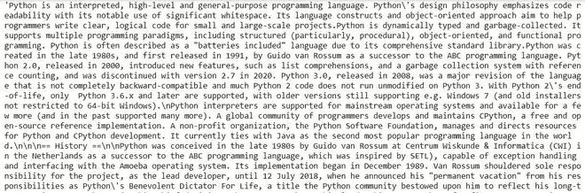
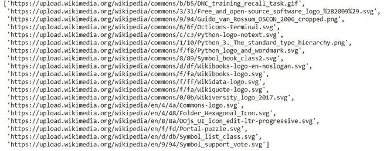

# 如何用 Python 提取维基百科数据？

> 原文:[https://www . geesforgeks . org/提取方法-维基百科-python 中的数据/](https://www.geeksforgeeks.org/how-to-extract-wikipedia-data-in-python/)

在本文中，我们将学习如何使用 Python 提取维基百科数据，这里我们使用两种方法提取数据。

### **方法一:使用**维基百科**模块**

在这个方法中，我们将使用[**【维基百科】**](https://www.geeksforgeeks.org/wikipedia-module-in-python/) 模块来提取数据。维基百科是一个多语言在线百科全书，由志愿者编辑社区使用基于维基的编辑系统创建和维护，是一个开放的合作项目。

**安装时，在您的终端上运行该命令。**

```
pip install wikipedia
```

维基百科数据，我们将在这里提取:-

*   摘要、标题
*   页面内容
*   获取图片来源和网页网址列表
*   不同的类别

**逐个提取数据:**

**1。提取摘要和页面**

> **语法:**维基百科.摘要(“输入查询”)
> 
> 维基百科页面(“输入查询”)。标题

## 蟒蛇 3

```
import wikipedia

wikipedia.summary("Python (programming language)")
```

**输出:**


**2。页面内容:**

为了提取文章的内容，我们将使用 **page()** 方法和 **content** 属性来获取实际数据。

> **语法:** wikipedia.page(“输入查询”)。内容

## 蟒蛇 3

```
wikipedia.page("Python (programming language)").content
```

**输出:**



**3。从维基百科提取图片。**

> **语法:** wikipedia.page(“输入查询”)。形象

## 蟒蛇 3

```
wikipedia.page("Python (programming language)").images
```

**输出:**



**4。提取当前页面网址:**

使用 **page()** 方法和 **url** 属性。

> **语法:** wikipedia.page(“输入查询”)。全球资源定位器(Uniform Resource Locator)

## 蟒蛇 3

```
wikipedia.page('"Hello, World!" program').url
```

**输出:**

```
'https://en.wikipedia.org/wiki/%22Hello,_World!%22_program'
```

**5。获取** **文章类别列表。**

使用**页面()**方法和**类别**属性。

> **语法:** wikipedia.page(“输入查询”)。种类

## 蟒蛇 3

```
wikipedia.page('"Hello, World!" program').categories
```