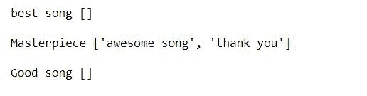
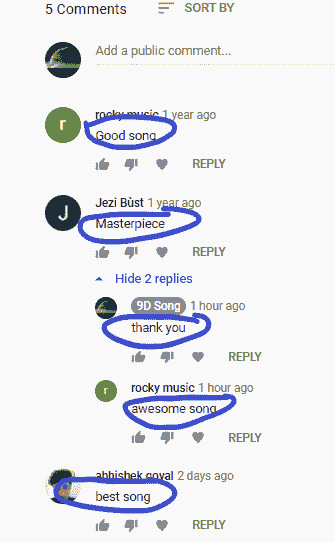

# 如何使用 YouTube API-Python 提取 YouTube 评论

> 原文:[https://www . geesforgeks . org/如何提取-YouTube-评论-使用-youtube-api-python/](https://www.geeksforgeeks.org/how-to-extract-youtube-comments-using-youtube-api-python/)

**先决条件:** [**YouTube API**](https://www.geeksforgeeks.org/youtube-data-api-set-1/)

谷歌提供了大量的应用编程接口供开发者选择。谷歌提供的每一项服务都有相关的应用编程接口。作为其中的一员，YouTube 数据应用编程接口使用起来非常简单，提供了以下功能

*   搜索视频
*   处理视频，如检索视频信息、插入视频、删除视频等。
*   处理订阅，如列出所有订阅，插入或删除订阅等。

在本文中，我们将讨论如何使用 Python 中的谷歌 YouTube API 提取 YouTube 评论并回复。

**了解分步实施:-**

*   检索 YouTube 视频结果
    *   这里我们将使用 **commentThreads，list，执行**方法，它将给出评论和回复的列表
    *   在**列表**方法中，在**部分**属性和**视频标识**属性中传递片段和回复，传递视频网址的视频标识

## 蟒蛇 3

```py
# creating youtube resource object
youtube = build('youtube','v3',
                developerKey="Enter API Key")

# retrieve youtube video results
video_response=youtube.commentThreads().list(
  part='snippet,replies',
  videoId="Enter Video ID"
).execute()
```

*   遍历每个视频回复，获取评论和回复
    *   数据采用字典格式，每个评论数据都有回复计数，如果回复计数为零，则表示该评论没有回复
    *   如果计数大于零，那么我们迭代每个回复并得到文本。
    *   **nextPageToken** 包含下一个数据，这里我们正在检查 nextPageToken 是否没有值，这意味着值为 None，循环结束，否则循环将继续。

**以下是完整实现:**

## 蟒蛇 3

```py
from googleapiclient.discovery import build

api_key = 'API KEY'

def video_comments(video_id):
    # empty list for storing reply
    replies = []

    # creating youtube resource object
    youtube = build('youtube', 'v3',
                    developerKey=api_key)

    # retrieve youtube video results
    video_response=youtube.commentThreads().list(
    part='snippet,replies',
    videoId=video_id
    ).execute()

    # iterate video response
    while video_response:

        # extracting required info
        # from each result object 
        for item in video_response['items']:

            # Extracting comments
            comment = item['snippet']['topLevelComment']['snippet']['textDisplay']

            # counting number of reply of comment
            replycount = item['snippet']['totalReplyCount']

            # if reply is there
            if replycount>0:

                # iterate through all reply
                for reply in item['replies']['comments']:

                    # Extract reply
                    reply = reply['snippet']['textDisplay']

                    # Store reply is list
                    replies.append(reply)

            # print comment with list of reply
            print(comment, replies, end = '\n\n')

            # empty reply list
            replies = []

        # Again repeat
        if 'nextPageToken' in video_response:
            video_response = youtube.commentThreads().list(
                    part = 'snippet,replies',
                    videoId = video_id
                ).execute()
        else:
            break

# Enter video id
video_id = "Enter Video ID"

# Call function
video_comments(video_id)
```

**输出:**



**我们来验证一下结果:**



**3 条评论 2 条回复**