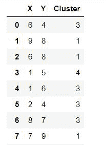
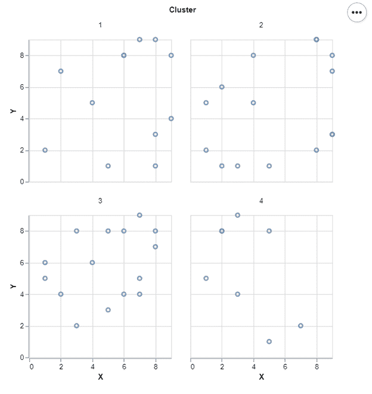

# 如何用牛郎星刻面散点图？

> 原文:[https://www . geesforgeks . org/how-facet-a-sport-plot-with-Altair/](https://www.geeksforgeeks.org/how-to-facet-a-scatter-plot-with-altair/)

在本文中，我们将学习如何用牛郎星刻面散点图。让我们回忆一些概念:

*   阿尔泰是 Python 中的一个统计可视化库。它本质上是声明性的，并且基于 Vega 和 Vega-Lite 可视化语法。它正迅速成为人们寻找快速有效的方法来可视化数据集的首选。如果你使用过像 matplotlib 这样的命令式可视化库，你将能够正确地理解阿尔泰的能力。
*   散点图(也称为散点图、散点图、散点图、散点图或散点图)是一种使用笛卡尔坐标来显示一组数据的典型两个变量的值的图或数学图。

在这里，我们使用牛郎星库制作散点图。为此，我们使用阿尔泰中的 Chart()函数加载数据，然后使用 mark_point()函数进行散点图。然后我们使用美学 x 轴和 y 轴来编码()函数。完成散点图后，我们将使用分组的列值(如簇)对其进行分面。

### 所需步骤

1.  导入库(阿尔泰)。
2.  创建/加载数据。
3.  使用图表()加载绘图数据。
4.  使用 mark_point()进行散点图。
5.  对 x 轴和 y 轴使用 encode()。
6.  (可选)使用属性()设置宽度和高度。
7.  在带有簇的散点图上使用 facet()。

### 例子

让我们借助一些例子来理解上述步骤:

**例 1:**

在这个例子中，我们用一些虚拟数据绘制了一个简单的小平面散点图。如下所示:



**下面是实现:**

## 蟒蛇 3

```py
# import libraries
import altair as alt
import pandas as pd
import numpy as np
np.random.seed(1)

# create data
df = pd.DataFrame({'X':np.random.randint(1, 10, 50),
                   'Y':np.random.randint(1, 10, 50),
                   'Cluster':np.random.randint(1, 5, 50)})

# Draw Facet Scatter Plot
alt.Chart(df).mark_point().encode(
    x=alt.X('X'),
    y=alt.Y('Y')
).properties(width = 200, height = 200).facet(
    'Cluster:N',
    columns = 2
)
```

**输出:**



**示例 2:(来自 Vega 数据集的虹膜数据)**

## 蟒蛇 3

```py
# import libraries
import altair as alt
from vega_datasets import data

# load data
iris = data.iris()

# Draw Facet Scatter Plot
alt.Chart(iris).mark_point().encode(
    x = alt.X('sepalLength'),
    y = alt.Y('sepalWidth'),
    color = 'species'
).properties(width = 250, height = 250).facet(
    'species:N',
    columns = 3
)
```

**输出:**


**示例 3:(来自 Vega 数据集的汽车数据)**

## 蟒蛇 3

```py
# import libraries
import altair as alt
from vega_datasets import data

# load data
cars = data.cars()

# Draw Facet Scatter Plot
alt.Chart(cars).mark_point().encode(
    x = alt.X('Displacement'),
    y = alt.Y('Acceleration'),
    size = alt.value(100),
    color = 'Cylinders'
).properties(width = 250, height = 250).facet(
    'Origin:N',
    columns = 3
)
```

**输出:**

