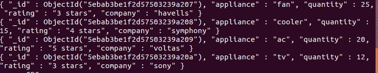
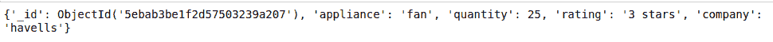
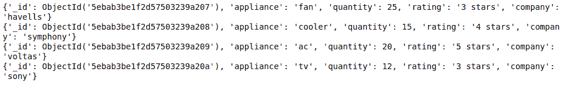
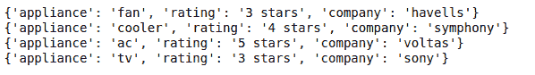

# 如何使用 Python 从 MongoDB 中获取数据？

> 原文:[https://www . geeksforgeeks . org/如何使用 python 从 mongodb 获取数据/](https://www.geeksforgeeks.org/how-to-fetch-data-from-mongodb-using-python/)

[**MongoDB**](https://www.geeksforgeeks.org/mongodb-and-python/)是一个跨平台、面向文档的数据库，致力于集合和文档的概念。MongoDB 提供了高速度、高可用性和高扩展性。

## 从 MongoDB 获取数据

Pymongo 提供了从 mongodb 获取数据的各种方法。让我们一个一个地看。

**1) Find One:** 此方法用于从 mongoDB 中的集合中获取数据。它返回第一个第一次出现。
T3】语法 T5:

```
find_one()
```

**示例:**

**样本数据库:**



## 蟒蛇 3

```
import pymongo

client = pymongo.MongoClient("mongodb://localhost:27017/")

# Database Name
db = client["database"]

# Collection Name
col = db["GeeksForGeeks"]

x = col.find_one()

print(x)
```

**输出**:



**2)全部查找:**对于选择中的所有事件，使用 Find()方法。它的工作原理类似于 SQL 的 Select *查询。
**句法**:

```
find()
```

**例**T2:

## 蟒蛇 3

```
import pymongo

client = pymongo.MongoClient("mongodb://localhost:27017/")

# Database Name
db = client["database"]

# Collection Name
col = db["GeeksForGeeks"]

x = col.find()

for data in x:
    print(data)
```

**输出:**



**3)仅提取特定字段:**如果您只想提取某些字段，那么在 find 方法中，对于您想要提取的字段，将第一个参数作为{}传递，将第二个参数作为 1 传递，对于您不想提取的字段，将第二个参数作为 0 传递。
**语法:**

```
find({},{field_data:bool})
```

**示例:**

## 蟒蛇 3

```
import pymongo

client = pymongo.MongoClient("mongodb://localhost:27017/")

# Database Name
db = client["database"]

# Collection Name
col = db["GeeksForGeeks"]

# Fields with values as 1 will
# only appear in the result
x = col.find({},{'_id': 0, 'appliance': 1,
                 'rating': 1, 'company': 1})

for data in x:
    print(data)
```

**输出:**

