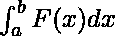
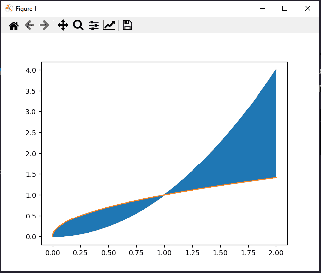

# 如何用 Python 求定积分？

> 原文:[https://www . geeksforgeeks . org/如何使用 python 查找定积分/](https://www.geeksforgeeks.org/how-to-find-definite-integral-using-python/)

定积分是不定积分之后的推广，定积分有极限[a，b]。它给出了曲线在给定界限之间的面积。



它表示曲线 F(x)在 a 和 b 之间的面积，其中 a 是下限，b 是上限。

在本文中，我们将讨论如何在 python 中求解定积分，并使用 matplotlib 可视化它们之间的区域。我们还将使用 NumPy 模块来定义我们正在积分的变量的范围。让我们从安装模块开始。

### 所需模块:

*   [**matplotlib**](https://www.geeksforgeeks.org/python-introduction-matplotlib/) :我们可以用这个来形象化我们在定积分形成的图形下的面积。
*   [**numpy**](https://www.geeksforgeeks.org/numpy-in-python-set-1-introduction/) **:定义定积分范围的**辅助库。
*   **症状:**库容易计算积分的数值解。

### 方法

**用于计算曲线下面积**

*   导入模块
*   声明函数
*   整合。

***语法:***

> *症状积分(表达式，参考变量)*

**用于标绘**

*   导入模块
*   定义函数
*   定义变量
*   画曲线
*   使用某种条件填充它下面的颜色。
*   显示图

下面给出了相同的实现。

**曲线和标准轴之间的区域**

**例 1** :

## 计算机编程语言

```py
import matplotlib.pyplot as plt
import numpy as np
import sympy as sy

def f(x):
    return x**2

x = sy.Symbol("x")
print(sy.integrate(f(x), (x, 0, 2)))
```

**输出:**

```py
8/3
```

**例 2:**

## 蟒蛇 3

```py
import matplotlib.pyplot as plt
import numpy as np

def f(x):
    return x**2

x = np.linspace(0, 2, 1000)
plt.plot(x, f(x))
plt.axhline(color="black")
plt.fill_between(x, f(x), where=[(x > 0) and (x < 2) for x in x])
plt.show()
```

**输出:**


**两条曲线之间的面积**

**例 1:**

## 蟒蛇 3

```py
import matplotlib.pyplot as plt
import numpy as np
import sympy as sy

def f(x):
    return x**2

def g(x):
    return x**(1/2)

x = sy.Symbol("x")
print(sy.integrate(f(x)-g(x), (x, 0, 2)))
```

**输出:**

```py
0.781048583502540
```

**例 2:**

## 蟒蛇 3

```py
import matplotlib.pyplot as plt
import numpy as np

def f(x):
    return x**2

def g(x):
    return x**(1/2)

x = np.linspace(0, 2, 1000)
plt.plot(x, f(x))
plt.plot(x, g(x))
plt.fill_between(x, f(x), g(x), where=[(x > 0) and (x < 2) for x in x])
plt.show()
```

**输出:**

