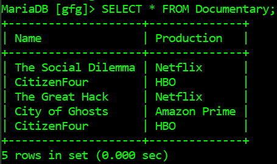
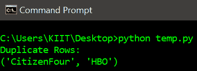
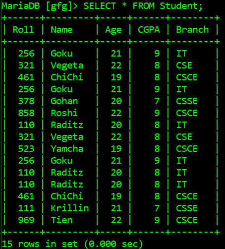
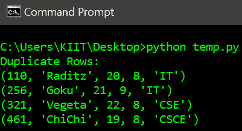

# 如何用 Python 在 SQL 表中查找重复值？

> 原文:[https://www . geeksforgeeks . org/如何使用 python 查找 sql 表中的重复值/](https://www.geeksforgeeks.org/how-to-find-duplicate-values-in-a-sql-table-using-python/)

MySQL 服务器是一个开源的关系数据库管理系统，是对基于 web 的应用程序的主要支持。数据库和相关表格是许多网站和应用程序的主要组成部分，因为数据是通过网络存储和交换的。为了从 web 服务器访问 MySQL 数据库，我们使用了 Python 中的各种模块，如 PyMySQL、mysql.connector 等。

在本文中，我们将在数据库中的特定 MySQL 表中找到重复的值。首先，我们将连接到一个包含 MySQL 表的数据库。将要使用的 SQL 查询是:

```py
SELECT * FROM table-name 
GROUP BY col_1, col_2,..., col_n 
HAVING COUNT(*) > 1;

```

如果表有主键，那么也可以使用下面的查询:

```py
SELECT * FROM table-name 
GROUP BY primar-key
HAVING COUNT(*) > 1;

```

上述查询将只在表中生成重复的行，然后这些行将显示为输出。

**下面是一些描述如何在数据库的特定 MySQL 表中找到重复值的程序:**

**例 1**

下面是数据库*极客*中的表格*纪录片*，它将被一个 Python 脚本访问:



下面是获取 MySQL 表中重复行的程序:

## 蟒蛇 3

```py
# import required module
import mysql.connector

# connect python with mysql with your hostname, 
# database, user and password
db = mysql.connector.connect(host='localhost',
                             database='gfg',
                             user='root',
                             password='')

# create cursor object
cursor = db.cursor()

# get the sum of rows of a column
cursor.execute("SELECT * FROM Documentary \
               GROUP BY Name, Production \
               HAVING COUNT(*) > 1;")

# fetch duplicate rows and display them
print('Duplicate Rows:')               
for row in cursor.fetchall(): print(row)

# terminate connection
db.close()
```

**输出:**



**例 2:**

下面是从给定数据库的表中查找重复行的另一个示例，下面是表方案和行:



我们可以看到 *Roll* 属性是*学生*表的主键，因此它只能与查询中的 *GROUP BY* 语句一起使用来生成重复行，下面是从表*学生*中获取行数的 python 脚本:

## 蟒蛇 3

```py
# import required module
import mysql.connector

# connect python with mysql with your hostname, 
# database, user and password
db = mysql.connector.connect(host='localhost',
                             database='gfg',
                             user='root',
                             password='')

# create cursor object
cursor = db.cursor()

# get the sum of rows of a column
cursor.execute("SELECT * FROM Student \
               GROUP BY Roll \
               HAVING COUNT(*) > 1;")

# fetch duplicate rows and display them
print('Duplicate Rows:')               
for row in cursor.fetchall(): print(row)

# terminate connection
db.close()
```

**输出:**

