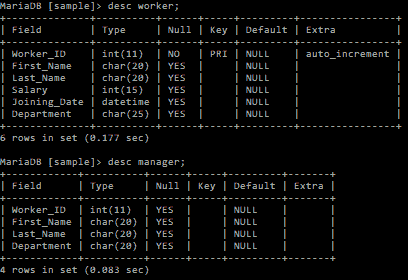
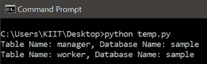
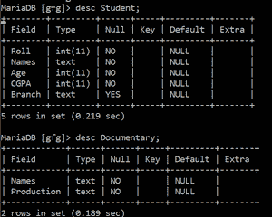
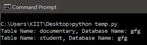

# 如何用 Python 在 SQL 中查找包含特定列的表？

> 原文:[https://www . geeksforgeeks . org/如何使用 python 查找包含特定 sql 列的表/](https://www.geeksforgeeks.org/how-to-find-tables-that-contain-a-specific-column-in-sql-using-python/)

MySQL 服务器是一个开源的关系数据库管理系统，是，是对基于网络的应用程序的主要支持。数据库和相关表格是许多网站和应用程序的主要组成部分，因为数据是通过网络存储和交换的。为了从网络服务器、访问 MySQL 数据库，我们使用了 Python 中的各种模块，如 PyMySQL、mysql.connector 等。

在本文中，我们将获得具有特定列的表，而不考虑数据库。首先，我们要连接到服务器。将要使用的 SQL 查询是:

```py
 select tab.table_schema as database_name,tab.table_name 
 from information_schema.tables as tab 
 inner join information_schema.columns as col
 on col.table_schema = tab.table_schema 
 and col.table_name = tab.table_name 
 and column_name = 'Specified_Column_Name' 
 where tab.table_type = 'BASE TABLE' 
 order by tab.table_schema, tab.table_name;

```

**下面是一些描述如何获取具有特定列的 MySQL 表的程序:**

**例 1**

以下是所有表的表描述，*示例*数据库包含以下将由 Python 脚本访问的表:



下面是获取具有特定列的 MySQL 表的详细信息的程序:

## 蟒蛇 3

```py
# Module Imports
import mysql.connector as mariadb
import sys

# Connect to MariaDB Platform
try:
    conn = mariadb.connect(
        user="root",
        password="",
        database="gfg"
    )

except mariadb.Error as e:
    print(f"Error connecting to MariaDB Platform: {e}")
    sys.exit(1)

# Get cursor object
cur = conn.cursor()

# Get the table and database details having a particular column
cur.execute("select tab.table_schema as database_name,tab.table_name \
             from information_schema.tables as tab \
             inner join information_schema.columns as col \
             on col.table_schema = tab.table_schema \
             and col.table_name = tab.table_name \
             and column_name = 'Worker_ID' \
             where tab.table_type = 'BASE TABLE' \
             order by tab.table_schema, tab.table_name;")

# Display the tables
for(database_name, tab) in cur:
    print(f"Table Name: {tab}Database Name: {database_name}")
```

**输出:**



**例 2**

下面是另一个获取表详细信息的例子，不考虑具有特定列的数据库，下面是所有表的描述:



下面是获取具有特定列*名称:*的表详细信息的 python 脚本

## 蟒蛇 3

```py
# Module Imports
import mysql.connector as mariadb
import sys

# Connect to MariaDB Platform
try:
    conn = mariadb.connect(
        user="root",
        password="",
        database="gfg"
    )

except mariadb.Error as e:
    print(f"Error connecting to MariaDB Platform: {e}")
    sys.exit(1)

# Get cursor object
cur = conn.cursor()

# Get the table and database details having a particular column
cur.execute("select tab.table_schema as database_name,tab.table_name \
             from information_schema.tables as tab \
             inner join information_schema.columns as col \
             on col.table_schema = tab.table_schema \
             and col.table_name = tab.table_name \
             and column_name = 'Names' \
             where tab.table_type = 'BASE TABLE' \
             order by tab.table_schema, tab.table_name;")

# Display the tables
for(database_name, tab) in cur:
    print(f"\n\nTable Name: {tab}\nDatabase Name: {database_name}")
```

**输出:**

