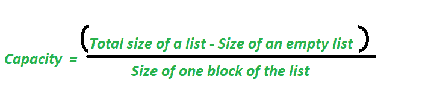
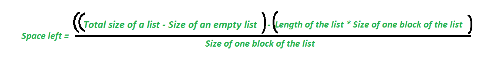

# 如何在 Python 中找到列表的当前容量

> 原文:[https://www . geeksforgeeks . org/如何找到当前的 python 列表容量/](https://www.geeksforgeeks.org/how-to-find-the-current-capacity-of-a-list-in-python/)

[Python 中的 List](https://www.geeksforgeeks.org/python-list/)主要是动态大小数组的实现(像 Java 中的 ArrayList 或者 C++中的 vector)。列表容量是指列表在特定时间可以存储的元素数量。当我们将一个元素添加到列表中时，如果元素的大小小于容量，它将存储该元素。如果当前容量超过，则列表会调整大小并为将来的插入分配额外的空间(详情请参见 Python 中的[列表工作原理](https://www.geeksforgeeks.org/internal-working-of-list-in-python/))
计算列表容量和列表剩余空间的公式:





这里，
**空列表的大小**是指分配给一个空列表的位数，它因系统而异。
**列表中一个区块的大小**也因系统而异。

**列表长度**是指已填充的空间块数

**例 1:**

```py
# program to find capacity of the list

import sys
l = []
size = sys.getsizeof(l)
print("size of an empty list :", size)

# append an element in the list
l.append(1)

# calculate total size of the list after appending one element
print("Now total size of a list :", sys.getsizeof(l))

# calculate capacity of the list after appending one element
# Considering block size as 8.
capacity = (sys.getsizeof(l)-size)//8
print("capacity of the list is:", capacity)
print("length of the list is :", len(l))

# calculate space left the list after appending one element
spaceleft = ((sys.getsizeof(l)-size)-len(l)*8)//8
print("space left in the list is:", spaceleft)
```

**输出**

```py
size of an empty list : 64
Now total size of a list : 96
capacity of the list is: 4
length of the list is: 1
space left in the list is: 3
```

**例 2:**

```py
# program to find capacity of the list
import sys
l = []
size = sys.getsizeof(l)
print("size of an empty list :", size)

# append four element in the list
l.append(1)
l.append(2)
l.append(3)
l.append(4)

# calculate total size of the list after appending four element
print("Now total size of a list :", sys.getsizeof(l))

# calculate capacity of the list after appending four element
c = (sys.getsizeof(l)-size)//8
print("capacity of the list is:", c)
print("length of the list is:", len(l))

# calculate space left the list after appending four element
spaceleft =((sys.getsizeof(l)-size)-len(l)*8)//8
print("space left in the list is:", spaceleft)
```

**输出**

```py
size of an empty list : 64
Now total size of a list : 96
capacity of the list is: 4
length of the list is: 4
space left in the list is: 0

```

**例 3:**

```py
# program to find capacity of the list
import sys
l = []
size = sys.getsizeof(l)
print("size of an empty list :", size)

# append five element in the list
l.append(1)
l.append(2)
l.append(3)
l.append(4)
l.append(5)

# calculate total size of the list after appending five element
print("Now total size of a list :", sys.getsizeof(l))

# calculate capacity of the list after appending five element
c = (sys.getsizeof(l)-size)//8
print("capacity of the list is:", c)
print("length of the list is:", len(l))

# calculate space left the list after appending five element
spaceleft =((sys.getsizeof(l)-size)-len(l)*8)//8
print("space left in the list is:", spaceleft)
```

**输出**

```py
size of an empty list : 64
Now total size of a list : 128
capacity of the list is: 8
length of the list is: 5
space left in the list is: 3

```