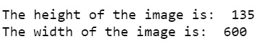
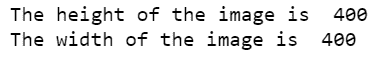

# 如何用 Python 找到图像的宽度和高度？

> 原文:[https://www . geeksforgeeks . org/如何使用 python 查找图像的宽度和高度/](https://www.geeksforgeeks.org/how-to-find-width-and-height-of-an-image-using-python/)

在本文中，我们将讨论如何获得特定图像的高度和宽度。

为了找到图像的高度和宽度，有两种方法。第一种方法是使用 **PIL(枕头)**库，第二种方法是使用 **Open-CV** 库。

**方法 1:**

*PIL* 是 Python 图像库的一个重要模块，用于图像处理。它支持多种格式的图像，如“jpeg”、“png”、“ppm”、“tiff”、“bmp”、“gif”。它提供了许多图像编辑功能。图像模块提供了一个同名的类，用于表示 *PIL* 图像。

***PIL。*** 用来打开图像然后**。宽度**和**。图像的高度**属性用于获取图像的高度和宽度。使用**可以得到同样的结果。尺寸**属性。

要使用**枕库**运行以下命令:

```
pip install pillow
```

**使用的图像:**


使用的图像

**代码:**

## 计算机编程语言

```
# import required module
from PIL import Image

# get image
filepath = "geeksforgeeks.png"
img = Image.open(filepath)

# get width and height
width = img.width
height = img.height

# display width and height
print("The height of the image is: ", height)
print("The width of the image is: ", width)
```

**输出:**



**备选方案:**

获得高度和宽度的另一种方法是使用**。尺寸**属性。

**示例:**

**使用的图像:**


使用的图像

**代码:**

## 计算机编程语言

```
# import required module
from PIL import Image

# get image
filepath = "geeksforgeeks.png"
img = Image.open(filepath)

# get width and height
width,height = img.size

# display width and height
print("The height of the image is: ", height)
print("The width of the image is: ", width)
```

**输出:**


**方法 2:**

python 中的 *OpenCV* 是一个用于计算机视觉、图像处理等的库。 **imread(文件路径)**功能用于从指定的文件路径加载图像。**。形状**存储每个像素的高度、宽度和通道数的元组。**。shape[:2]** 会得到图像的高度和宽度。

要安装 **OpenCV** ，运行以下命令:

```
pip install opencv-python
```

#### 使用的图像:


**代码:**

## 计算机编程语言

```
# import required module
import cv2

# get image
filepath = "geeksforgeeks.jpg"
image = cv2.imread(filepath)
#print(image.shape)

# get width and height
height, width = image.shape[:2]

# display width and height
print("The height of the image is: ", height)
print("The width of the image is: ", width)
```

**输出:**

