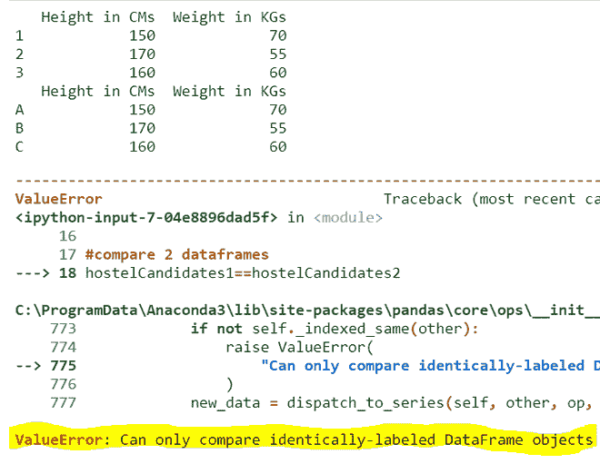
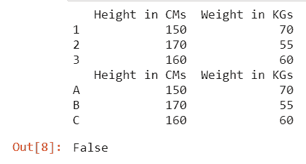
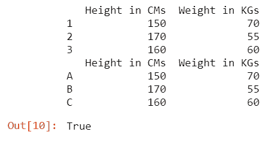
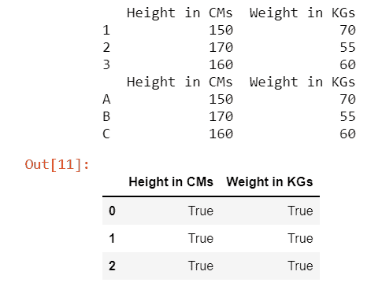

# 如何修复:只能比较标注相同的系列对象

> 原文:[https://www . geeksforgeeks . org/如何修复只能比较相同标记的系列对象/](https://www.geeksforgeeks.org/how-to-fix-can-only-compare-identically-labeled-series-objects/)

在本文中，我们将看到如何修复它:只能比较 Python 中相同标记的系列对象。

## 错误原因

只能比较标注相同的系列对象:是**值错误**，发生在我们**比较 2 个不同的数据帧**(熊猫二维数据结构)的时候。如果我们比较具有不同标签或索引的数据帧，则可能会抛出此错误。

### 如何重现错误

## 蟒蛇 3

```
# import necessary packages
import pandas as pd

# create 2 dataframes with different indexes
hostelCandidates1 = pd.DataFrame({'Height in CMs': [150, 170, 160],
                                  'Weight in KGs': [70, 55, 60]},
                                 index=[1, 2, 3])

hostelCandidates2 = pd.DataFrame({'Height in CMs': [150, 170, 160],
                                  'Weight in KGs': [70, 55, 60]},
                                 index=['A', 'B', 'C'])

# displaying 2 dataframes
print(hostelCandidates1)
print(hostelCandidates2)

# compare 2 dataframes
hostelCandidates1 == hostelCandidates2
```

**输出:**



即使两个数据帧中的数据相同，但它们的索引不同。因此，为了比较两个数据帧的数据是否相同，我们需要遵循以下方法/解决方案

## 方法 1:考虑索引

在这里，我们比较数据帧之间的数据和索引标签，以指定它们是否相同。所以**代替“==”使用 equals 方法**同时进行比较。

## 蟒蛇 3

```
# import necessary packages
import pandas as pd

# create 2 dataframes with different indexes
hostelCandidates1 = pd.DataFrame({'Height in CMs':
                                  [150, 170, 160],
                                  'Weight in KGs':
                                  [70, 55, 60]},
                                 index=[1, 2, 3])

hostelCandidates2 = pd.DataFrame({'Height in CMs':
                                  [150, 170, 160],
                                  'Weight in KGs':
                                  [70, 55, 60]},
                                 index=['A', 'B', 'C'])

# displaying 2 dataframes
print(hostelCandidates1)
print(hostelCandidates2)

# compare 2 dataframes
hostelCandidates1.equals(hostelCandidates2)
```

**输出:**



由于数据相同，但这两个数据帧的索引标签不同，因此它返回 false 而不是错误。

## 方法 2:不考虑索引

**要删除数据框的索引**，请使用**重置 _ 索引方法。**通过删除索引，使得解释器只检查数据而不考虑索引值成为一项简单的任务。

> **语法:**数据帧名称。重置 _ 索引(丢弃=真)

**比较数据有 2 种方式:**

*   整个数据帧
*   逐行

**示例 1:** 整个数据帧比较

## 蟒蛇 3

```
# import necessary packages
import pandas as pd

# create 2 dataframes with different indexes
hostelCandidates1 = pd.DataFrame({'Height in CMs':
                                  [150, 170, 160],
                                  'Weight in KGs':
                                  [70, 55, 60]},
                                 index=[1, 2, 3])

hostelCandidates2 = pd.DataFrame({'Height in CMs':
                                  [150, 170, 160],
                                  'Weight in KGs':
                                  [70, 55, 60]},
                                 index=['A', 'B', 'C'])

# displaying 2 dataframes
print(hostelCandidates1)
print(hostelCandidates2)

# compare 2 dataframes
hostelCandidates1.reset_index(drop=True).equals(
    hostelCandidates2.reset_index(drop=True))
```

**输出:**



在这里，数据是相同的，即使索引不同，我们也通过消除索引标签来比较数据帧，以便它返回真。

**示例 2:** 逐行比较

## 蟒蛇 3

```
# import necessary packages
import pandas as pd

# create 2 dataframes with different indexes
hostelCandidates1 = pd.DataFrame({'Height in CMs':
                                  [150, 170, 160],
                                  'Weight in KGs':
                                  [70, 55, 60]},
                                 index=[1, 2, 3])

hostelCandidates2 = pd.DataFrame({'Height in CMs':
                                  [150, 170, 160],
                                  'Weight in KGs':
                                  [70, 55, 60]},
                                 index=['A', 'B', 'C'])

# displaying 2 dataframes
print(hostelCandidates1)
print(hostelCandidates2)

# compare 2 dataframes
hostelCandidates1.reset_index(
    drop=True) == hostelCandidates2.reset_index(drop=True)
```

**输出:**



这种方法有助于我们识别两个数据帧之间的差异，并且不比较其索引标签，因为在比较时会丢弃它们的索引标签。