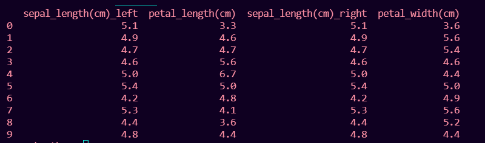

# 如何修复:列重叠但没有指定后缀

> 原文:[https://www . geesforgeks . org/how-fix-columns-重叠但无后缀-specified/](https://www.geeksforgeeks.org/how-to-fix-columns-overlap-but-no-suffix-specified/)

在本文中，我们将修复这个错误:列重叠，但没有在 Python 中指定后缀。

当我们连接两个具有一个或多个相同列但没有指定后缀来区分它们的 pandas 数据帧时，会出现此错误。

**错误:**

> 值错误:列重叠，但未指定后缀

### 此错误发生的情况举例如下:

## 蟒蛇 3

```
# importing pandas
import pandas as pd
# importing numpy
import numpy as np

sepal_length = [5.1, 4.9, 4.7, 4.6, 5.0,
                5.4, 4.2, 5.3, 4.4, 4.8]
petal_length = [3.3, 4.6, 4.7, 5.6, 6.7, 
                5.0, 4.8, 4.1, 3.6, 4.4]

# numpy array of length 7
petal_width = [3.6, 5.6, 5.4, 4.6, 4.4, 
               5.0, 4.9, 5.6, 5.2, 4.4]

# DataFrame with 2 columns of length 10
df1 = pd.DataFrame({'sepal_length(cm)': sepal_length,
                    'petal_length(cm)': petal_length})

df2 = pd.DataFrame({'sepal_length(cm)': sepal_length,
                    'petal_width(cm)': petal_width})

print(df1.join(df2))
```

**输出:**

> 值错误:列重叠但未指定后缀:索引(['sepal_length(cm)']，dtype='object ')

### **错误原因:**

数据帧 df1 和 df2 具有公共列 sepal_length(cm)，即两个数据帧的交集不为空。要检查是否有交叉列:

```
print(df1.columns.intersection(df2.columns))
```

**输出:**

```
Index(['sepal_length(cm)'], dtype='object')
```

sepal_length(cm)是这里的交集列。

### 修复错误:

可以通过对两个数据帧使用 join()或 merge()方法来修复此错误。

## **方法 1:使用 join()** 方法

应该在使用 join 方法时给出后缀，以避免此错误。默认情况下，它在两个表上进行内部连接。这可以通过在 join()函数中提到参数来改变。

**语法**:

```
df1.join(df2, lsuffix='suffix_name', rsuffix='suffix_name')
```

在哪里

*   df1 是第一个数据帧
*   df2 是第二个数据帧

**例**:

## 蟒蛇 3

```
# importing pandas
import pandas as pd
# importing numpy
import numpy as np

sepal_length = [5.1, 4.9, 4.7, 4.6, 5.0, 5.4,
                4.2, 5.3, 4.4, 4.8]
petal_length = [3.3, 4.6, 4.7, 5.6, 6.7, 5.0,
                4.8, 4.1, 3.6, 4.4]

# numpy array of length 7
petal_width = [3.6, 5.6, 5.4, 4.6, 4.4, 5.0,
               4.9, 5.6, 5.2, 4.4]

# DataFrame with 2 columns of length 10
df1 = pd.DataFrame({'sepal_length(cm)': sepal_length,
                    'petal_length(cm)': petal_length})

df2 = pd.DataFrame({'sepal_length(cm)': sepal_length,
                    'petal_width(cm)': petal_width})

print(df1.join(df2, lsuffix='_left', rsuffix='_right'))
```

**输出:**



## **方法二:**使用 [**合并()**](https://www.geeksforgeeks.org/python-pandas-merging-joining-and-concatenating/) 方法

此 merge()方法考虑两个数据帧中的公共列，并删除其中一个数据帧中的公共列。

**语法**:

```
pd.merge(df1,df2, how='join_type', on=None, left_on= None, 
right_on = None, left_index =boolean, 
right_index=boolean, sort=boolean)
```

哪里，

*   df1 是第一个数据帧
*   df2 是第二个数据帧

联接的类型以及左右数据框公共列的名称也可以作为 merge()函数中的参数。

**示例:**

## 蟒蛇 3

```
# importing pandas
import pandas as pd
# importing numpy
import numpy as np

sepal_length = [5.1, 4.9, 4.7, 4.6, 5.0, 5.4,
                4.2, 5.3, 4.4, 4.8]
petal_length = [3.3, 4.6, 4.7, 5.6, 6.7, 5.0, 
                4.8, 4.1, 3.6, 4.4]

# numpy array of length 7
petal_width = [3.6, 5.6, 5.4, 4.6, 4.4, 5.0, 
               4.9, 5.6, 5.2, 4.4]

# DataFrame with 2 columns of length 10
df1 = pd.DataFrame({'sepal_length(cm)': sepal_length,
                    'petal_length(cm)': petal_length})

df2 = pd.DataFrame({'sepal_length(cm)': sepal_length,
                    'petal_width(cm)': petal_width})

print(pd.merge(df1, df2))
```

**输出:**

