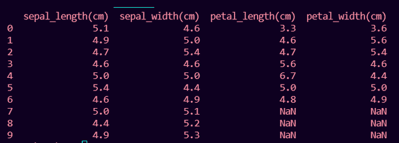

# 如何修复:数值长度与索引长度不匹配

> 原文:[https://www . geesforgeks . org/如何修复值长度与索引长度不匹配/](https://www.geeksforgeeks.org/how-to-fix-length-of-values-does-not-match-length-of-index/)

在本文中，我们将修复这个错误:值的长度与 Python 中索引的长度不匹配。

### **出现此错误的情况:**

## 蟒蛇 3

```
# importing pandas
import pandas as pd

sepal_length = [5.1, 4.9, 4.7, 4.6, 5.0, 5.4, 
                4.6, 5.0, 4.4, 4.9]
sepal_width = [4.6, 5.0, 5.4, 4.6, 5.0, 4.4, 
               4.9, 5.1, 5.2, 5.3]
petal_length = [3.3, 4.6, 4.7, 5.6, 6.7, 5.0, 4.8]
petal_width = [3.6, 5.6, 5.4, 4.6, 4.4, 5.0, 4.9]

# DataFrame with 2 columns
df = pd.DataFrame({'sepal_length(cm)': sepal_length,
                   'sepal_width(cm)': sepal_width})

df['petal_length(cm)'] = petal_length
df['petal_width(cm)'] = petal_width

print(df)
```

**输出:**

```
ValueError: Length of values (7) does not match length of index (10)
```

## **错误原因:**

熊猫数据帧的索引长度(即当前数据帧的列长度)在这种情况下为 10，不等于新列表或 NumPy 数组的长度(在这种情况下为 7)。

```
pd.Index.size!=len(petal_width)
```

## 修复错误:

可以通过使用 pandas Series()函数预处理将要成为数据框一列的新列表或 NumPy 数组来修复此错误，该函数实际上将列表或 NumPy 数组转换为数据框列长度的大小，如果列表或 NumPy 数组的长度较小，则添加 NaN 否则，如果列表或 NumPy 数组的长度较大，则使用 pandas 数据框列长度的列表或 NumPy 数组。

**列表语法:**

将列表 1 视为 python 列表

```
df['new_column'] = pd.Series(list1)
```

【NumPy 数组语法:

将 numarr 视为 numpy 数组

```
df['new_column'] = pd.Series(numarr)
```

## 蟒蛇 3

```
# importing pandas
import pandas as pd

# importing numpy
import numpy as np
sepal_length = [5.1, 4.9, 4.7, 4.6, 5.0, 5.4,
                4.6, 5.0, 4.4, 4.9]
sepal_width = [4.6, 5.0, 5.4, 4.6, 5.0, 4.4,
               4.9, 5.1, 5.2, 5.3]
petal_length = [3.3, 4.6, 4.7, 5.6, 6.7, 5.0, 4.8]

# numpy array of length 7
petal_width = np.array([3.6, 5.6, 5.4, 4.6, 4.4, 
                        5.0, 4.9])

# DataFrame with 2 columns of length 10
df = pd.DataFrame({'sepal_length(cm)': sepal_length,
                   'sepal_width(cm)': sepal_width})

# Adding list to pandas DataFrame
df['petal_length(cm)'] = pd.Series(petal_length)

# Adding numpy array to pandas DataFrame
df['petal_width(cm)'] = pd.Series(petal_width)

print(df)
```

**输出:**

