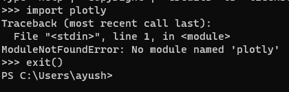
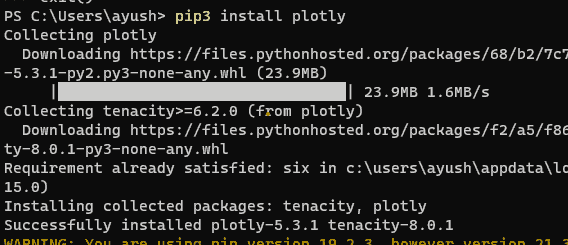

# 如何修复:没有命名为

的模块

> 原文:[https://www . geesforgeks . org/how-fix-no-module-name-plotly/](https://www.geeksforgeeks.org/how-to-fix-no-module-named-plotly/)

在本文中，我们将看到如何修复 plotly 的无模块错误。当我们的 Python 环境中没有安装特定的模块时，就会出现这种类型的错误。在本教程中，我们将尝试重现错误并使用截图来解决它。

**示例:**



### **解决方案:**

可以用 pip 命令来完成， [pip](https://www.geeksforgeeks.org/python-pip/) 用于在 Python 中安装一个外部包。

**命令:**

```py
pip install plotly
```

根据您的网络速度，安装可能需要一些时间。



现在我们可以成功导入 Plotly 了。


检查安装是否完成