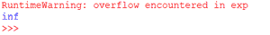
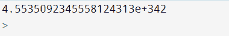
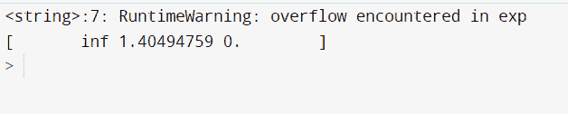
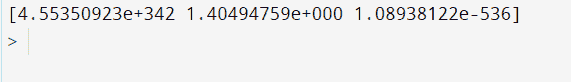

# 如何修复:运行时警告:exp

中遇到溢出

> 原文:[https://www . geesforgeks . org/how-fix-runtimewarning-overflow-inter-in-exp/](https://www.geeksforgeeks.org/how-to-fix-runtimewarning-overflow-encountered-in-exp/)

在本文中，我们将讨论如何修复 Python 中 exp 中遇到的 RuntimeWarning:溢出。

当在过大的值上使用 [NumPy](https://www.geeksforgeeks.org/python-numpy/) 库的 [**exp()**](https://www.geeksforgeeks.org/numpy-exp-python/) 功能时，会出现此**警告。该函数用于计算输入数组或一个元素(NumPy 的 0-D 数组)中所有元素的指数。**

**示例**:描述警告的代码

## 蟒蛇 3

```py
import numpy as np

print(np.exp(789))
```

**输出:**



输出是无穷大，因为 e^789 值非常大

出现此警告是因为 NumPy 中可以使用的最大数据大小是 float64，其最大范围是 1.79766233157 取对数后，它的值变成 709.782。对于大于此值的任何值，都会生成警告。

让我们讨论解决这个问题的方法。

## 方法 1:使用 float128

数据类型 float64 可以更改为 float128。

**示例:**修复警告的程序

## 蟒蛇 3

```py
import numpy as np

x = 789
x = np.float128(x)
print(np.exp(x))
```

**输出:**



使用 float128

对于 n 数组，可以使用数组方法的 dtype 参数。

**示例:**在不使用数据类型的情况下产生输出的程序

## 蟒蛇 3

```py
import numpy as np

cc = np.array([789, 0.34, -1234.1])
print(np.exp(cc))
```

**输出:**



不使用 dtype

**示例:**使用数据类型修复警告

## 蟒蛇 3

```py
import numpy as np

cc = np.array([789, 0.34, -1234.1], dtype=np.float128)
print(np.exp(cc))
```

**输出:**



使用数据类型

## **方法 2:使用 filterwarnings()**

警告消息通常在警告用户程序中的某些条件是有用的情况下发出，其中该条件(通常)不保证引发异常并终止程序。为了处理警告，有一个名为**警告的内置模块。**要了解更多关于 python 警告的信息，您可以查看这篇[文章](https://www.geeksforgeeks.org/warnings-in-python/)。

filterwarnings()函数可用于控制程序中警告的行为。警告过滤器控制警告是被忽略、显示还是变成错误(引发异常)。这可以使用不同的操作来完成:

*   “忽略”表示从不打印匹配的警告
*   将匹配的警告转化为异常的“错误”
*   “一次”仅打印匹配警告的第一次出现，不考虑位置

**语法:**

> warnings.filterwarnings(操作，消息=，类别= Warning，模块=，行号=0，追加=False)

**示例:**使用过滤器警告修复警告()

## 蟒蛇 3

```py
import numpy as np
import warnings

# suppress warnings
warnings.filterwarnings('ignore')

x = 789
x = np.float128(x)
print(np.exp(x))
```

**输出:**


使用 filterwarnings()