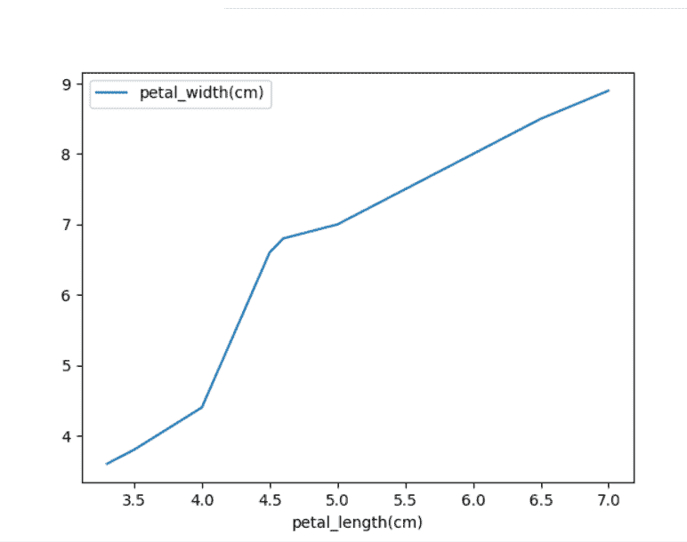

# 如何修复:类型错误:没有数字数据可绘制

> 原文:[https://www . geesforgeks . org/如何修复类型错误-无数字数据到绘图/](https://www.geeksforgeeks.org/how-to-fix-typeerror-no-numeric-data-to-plot/)

在本文中，我们将修复错误:类型错误:没有要绘制的数字数据

### **此错误发生的情况:**

## 蟒蛇 3

```
# importing pandas
import pandas as pd
# importing numpy
import numpy as np
import matplotlib.pyplot as plt

petal_length = ['3.3', '3.5', '4.0', '4.5',
                '4.6', '5.0', '5.5', '6.0', 
                '6.5', '7.0']
petal_width = ['3.6', '3.8', '4.4', '6.6',
               '6.8', '7.0', '7.5', '8.0', 
               '8.5', '8.9']

df = pd.DataFrame({'petal_length(cm)': petal_length,
                   'petal_width(cm)': petal_width})
df.plot(x='petal_length(cm)', y='petal_width(cm)')
plt.show()
```

**输出:**

```
TypeError: no numeric data to plot
```

### **错误原因:**

当我们绘制的数据类型不同于此错误引发的数字数据时，只能对数字数据进行绘制。要知道数据类型是否是数字，我们可以使用函数 [dtypes()](https://www.geeksforgeeks.org/python-pandas-dataframe-dtypes/) 来知道。

```
print(df.dtypes)
```

我们用来绘图的数据必须是数字。

### 修复错误:

可以通过将要绘制的数据转换为数字数据来修复此错误。要将数据转换为数字数据，我们可以使用函数 astype()或 to_numeric()。

## **方法一:使用** [**作为**](https://www.geeksforgeeks.org/python-pandas-dataframe-astype/) **功能**

**语法:**

```
df['column_name']= df['column_name'].astype(data_type)
```

其中，df 是输入数据帧

**示例:**

## 蟒蛇 3

```
# importing pandas
import pandas as pd
# importing numpy
import numpy as np
# importing matplotlib.pyplot
import matplotlib.pyplot as plt

petal_length = ['3.3', '3.5', '4.0', '4.5',
                '4.6', '5.0', '5.5', '6.0', 
                '6.5', '7.0']
petal_width = ['3.6', '3.8', '4.4', '6.6',
               '6.8', '7.0', '7.5', '8.0',
               '8.5', '8.9']

df = pd.DataFrame({'petal_length(cm)': petal_length,
                   'petal_width(cm)': petal_width})
df['petal_length(cm)'] = df['petal_length(cm)'].astype(float)
df['petal_width(cm)'] = df['petal_width(cm)'].astype(float)

df.plot(x='petal_length(cm)', y='petal_width(cm)')
plt.show()
```

**输出**:



## **方法二:使用** [**至 _numeric()**](https://www.geeksforgeeks.org/python-pandas-to_numeric-method/) **功能**

**语法:**

```
df['column_name'] = pd.to_numeric(df['column_name'])
```

其中 df 是输入数据帧

**例**:

## 蟒蛇 3

```
# importing pandas
import pandas as pd
# importing numpy
import numpy as np
# importing matplotlib.pyplot
import matplotlib.pyplot as plt

petal_length = ['3.3', '3.5', '4.0', '4.5',
                '4.6', '5.0', '5.5', '6.0',
                '6.5', '7.0']
petal_width = ['3.6', '3.8', '4.4', '6.6',
               '6.8', '7.0', '7.5', '8.0', 
               '8.5', '8.9']

df = pd.DataFrame({'petal_length(cm)': petal_length,
                   'petal_width(cm)': petal_width})
# Using to_numeric() function
df['petal_length(cm)'] = pd.to_numeric(df['petal_length(cm)'])
df['petal_width(cm)'] = pd.to_numeric(df['petal_width(cm)'])

df.plot(x='petal_length(cm)', y='petal_width(cm)')
plt.show()
```

**输出:**

