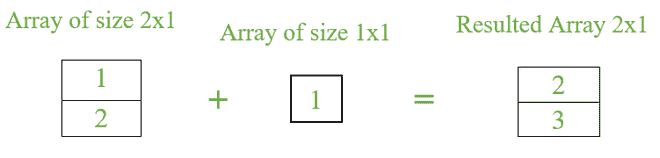
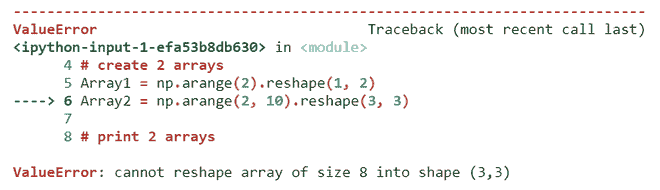
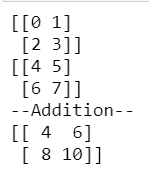
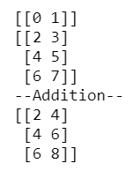
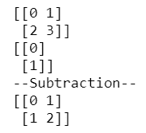
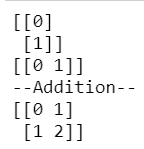
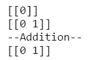

# 如何修复:值错误:操作数无法与形状一起广播？

> 原文:[https://www . geesforgeks . org/如何修复值错误-操作数-无法与形状一起广播/](https://www.geeksforgeeks.org/how-to-fix-valueerror-operands-could-not-be-broadcast-together-with-shapes/)

**广播**是指 NumPy **在算术运算时处理不同形状数组的能力。**其实在数组中，算术运算可以在数组的对应元素上进行。

*   如果两个数组的形状相同，那么两个数组之间的算术运算可以顺利完成。
*   如果 **2 个阵列具有不同的形状**，则**元素到元素的操作是不可能的**。但是 **NumPy** **使得使用**概念 ***广播成为可能。*** 较小的数组被广播到较大数组的大小，以便对其执行算术运算。

**示例:**



这里，大小为 1×1 的较小数组被广播到大小为 2×1 的较大数组，其中第 2 <sup>和第</sup>行也包含第 1 <sup>行的相同元素，即 1。所以第一排= > 1+1=2 &第二排= > 2+1=3。</sup>

如果我们试图在两个不同形状或不同维度**的数组之间执行****算术运算，有时 NumPy Broadcasting 会失败**。它抛出一个错误，像*操作数不能与形状一起广播。*有一些场景可以发生广播，也有一些场景失败。所以**如果失败了我们需要转换数组的形状。******

****示例:**显示广播失败的位置**

## **蟒蛇 3**

```
# import necessary packages
import numpy as np

# create 2 arrays
Array1 = np.arange(2).reshape(1, 2)
Array2 = np.arange(2, 10).reshape(3, 3)

# print 2 arrays
print(Array1)
print(Array2)

print(Array1+Array2)
```

****输出:****

**

抛出错误** 

**为了在内部执行广播，请遵循一些规则，将小尺寸数组转换为大数组的形状。因此，每当出现错误时，请检查下面提到的规则，以修改数组的大小，从而成功广播。**

## **广播规则**

### **规则 1:**

**如果两个数组具有相同的形状或尺寸，那么解释器不会抛出错误。算术运算可以在相应的元素上执行。**

****示例:**描述规则 1**

## **蟒蛇 3**

```
# import necessary packages
import numpy as np

# create 2 arrays
Array1 = np.arange(4).reshape(2, 2)
Array2 = np.arange(4, 8).reshape(2, 2)

# print 2 arrays
print(Array1)
print(Array2)

# addition between 2 arrays
print('--Addition--')
print(Array1+Array2)
```

****输出:****

****

#### **说明**

> **数组 1 数组 2 结果**
> 
> **[[0   1]      +       [[4    5]    =      [[0+4      1+5]       =       [[4     6]**
> 
> ** [2   3 ]]              [6    7]]             [2+6      3+7]]                [8    10]]**

### **规则 2:**

**如果一个数组的一维为 1，则需要将相邻的维与另一个数组进行比较。如果它们相同，它会广播并在它们之间执行算术运算。**

****示例:**描述规则 2**

## **蟒蛇 3**

```
# import necessary packages
import numpy as np

# create 2 arrays
Array1 = np.arange(2).reshape(1, 2)
Array2 = np.arange(2, 8).reshape(3, 2)

# print 2 arrays
print(Array1)
print(Array2)

# addition between 2 arrays
print('--Addition--')
print(Array1+Array2)
```

****输出:****

****

**这里 Array1 有一维作为值 1，所以我们需要比较第二维，两个数组的值是否相同。如果相同，则广播发生，否则失败。我们需要按照规则转换数组的大小。在本例中，这些值是相同的，因此加法操作顺利进行。**

**这里，数组 1 被转换成一个 3×2 形状的数组，该数组被添加到数组 2 中以给出结果。**

> **[[0   1]**
> 
> ** [0   1]**
> 
> ** [0   1]]**

****示例:**描述规则 2**

## **蟒蛇 3**

```
# import necessary packages
import numpy as np

# create 2 arrays
Array1 = np.arange(4).reshape(2, 2)
Array2 = np.arange(2).reshape(2, 1)

# print 2 arrays
print(Array1)
print(Array2)

# subtraction between 2 arrays
print('--Subtraction--')
print(Array1-Array2)
```

****输出:****

****

### **规则 3:**

**如果**阵列**处于**m**T6 xT8】n 和**n**T12 xT14】m 的**形状**中。在这种情况下，**两个数组广播为 m***x*T20】m if m>n else nT22】xT24】n if n>m**

****示例:**描绘规则 3**

## **蟒蛇 3**

```
# import necessary packages
import numpy as np

# create 2 arrays
Array1 = np.arange(2).reshape(2, 1)
Array2 = np.arange(2).reshape(1, 2)

# print 2 arrays
print(Array1)
print(Array2)

# addition between 2 arrays
print('--Addition--')
print(Array1+Array2)
```

****输出:****

****

#### **说明**

> **Array1 形状- 2×1**
> 
> **阵列 2 形状- 1×2 so 2 阵列被广播成形状 2×2。**
> 
> **数组的广义定义如下**
> 
> **数组 1 +数组 2 结果**
> 
> **[[0   0]     +   [[0   1]       [[0+0   0+1]**
> 
>  **[1   1]]          [0   1]]       [1+0   1+1]]**

### **规则 4:**

**如果任何一个阵的**有它的形状 **1** *x* **1** ，那么不管其他阵的形状**如何，它都只是将形状 1** *x* **1 的阵广播给另一个阵的形状。******

****示例:**描绘规则 4**

## **蟒蛇 3**

```
# import necessary packages
import numpy as np

# create 2 arrays
Array1 = np.arange(1).reshape(1, 1)
Array2 = np.arange(2).reshape(1, 2)

# print 2 arrays
print(Array1)
print(Array2)

# addition between 2 arrays
print('--Addition--')
print(Array1+Array2)
```

****输出****

****

****数组 1 的形状是 1***×1***1**，所以广播到*数组 2 的形状是**1**x**2**×11】。***

> **数组 1 +数组 2 =结果**
> 
> **[[0  0]]    +    [[0   1]]   =    [[0   1]]**

**广播失败的上述示例的解决方案是基于场景-2 **简单地将**数组 1 的形状转换为 1** *x* **3** ***或*** **数组 2 的形状转换为 3** *x* **2** 。****