# 如何跟随 Python Scrapy 的链接？

> 原文:[https://www . geesforgeks . org/how-follow-link-with-python-scrapy/](https://www.geeksforgeeks.org/how-to-follow-links-with-python-scrapy/)

在本文中，我们将使用 Scrapy 来抓取数据、在链接的网页上呈现以及收集数据。我们将从网站“https://quotes.toscrape.com/”上收集数据。

## **创建报废项目**

Scrapy 附带了一个高效的命令行工具，也称为“Scrapy 工具”。命令用于不同的目的，接受不同的参数集和选项。为了编写 Spider 代码，我们从创建一个 Scrapy 项目开始，在终端执行以下命令:

```
scrapy startproject gfg_spiderfollowlink
```

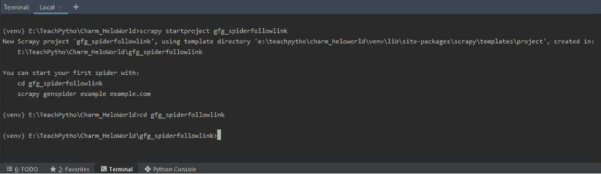

使用“开始项目”命令创建一个剪贴簿项目

这将在当前目录中创建一个“gfg_spiderfollowlink”文件夹。它包含一个项目的配置文件“scrapy.cfg”。文件夹结构如下所示

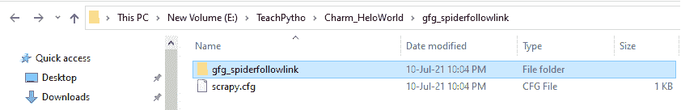

“gfg_spiderfollowlink”文件夹的文件夹结构

该文件夹包含 items.py、middlerwares.py 和其他设置文件，以及“蜘蛛”文件夹。


“gfg_spiderfollowlink”文件夹的文件夹结构

保持配置文件的内容不变。

## **从一个网页中提取数据**

网页抓取的代码写在蜘蛛代码文件中。为了创建蜘蛛文件，我们将使用“genspider”命令。请注意，该命令是在存在 scrapy.cfg 文件的同一级别执行的。

我们正在“http://quotes.toscrape.com/”上搜索所有报价。因此，我们将运行以下命令:

```
scrapy genspider gfg_spilink "quotes.toscrape.com"
```

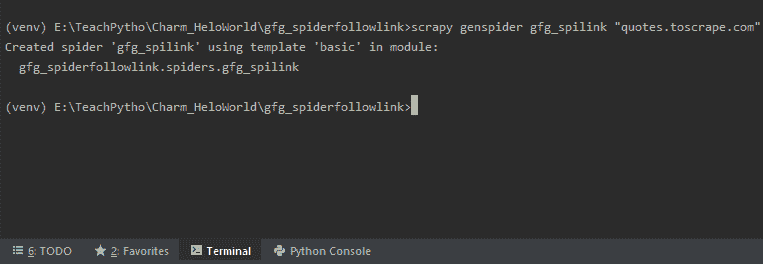

执行“genspider”命令创建蜘蛛文件

上面的命令将在“蜘蛛”文件夹中创建一个蜘蛛文件“gfg_spilink.py”。相同的默认代码如下:

## 蟒蛇 3

```
# Import the required libraries
import scrapy

# Spider class name

class GfgSpilinkSpider(scrapy.Spider):
    # Name of the spider
    name = 'gfg_spilink'

    # The domain to be scraped
    allowed_domains = ['quotes.toscrape.com']

    # The URLs to be scraped from the domain
    start_urls = ['http://quotes.toscrape.com/']

    # Default callback method
    def parse(self, response):
        pass
```

我们将从网站“报价”中抓取所有报价标题、作者和标签。网站登录页面如下所示:

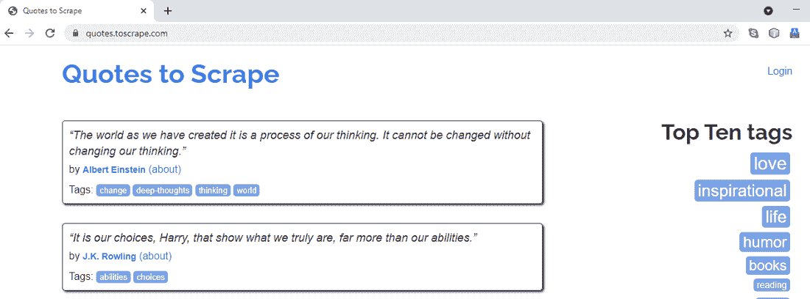

“quotes.toscrape.com”的登陆页面

Scrapy 为我们提供了选择器，可以根据需要“选择”网页的某些部分。选择器是 CSS 或 XPath 表达式，用于从 HTML 文档中提取数据。在本教程中，我们将使用 XPath 表达式来选择我们需要的细节。

**让我们了解在蜘蛛代码中编写选择器语法的步骤:**

*   首先，我们将在 parse()方法中编写代码。这是 spider 类中的默认回调方法，负责处理收到的响应。使用选择器的数据提取代码将写在这里。
*   为了编写 XPath 表达式，我们将在网页上选择元素，说右键单击，并选择检查选项。这将允许我们查看它的 CSS 属性。
*   当我们右键单击第一个报价并选择检查时，我们可以看到它具有 CSS“类”属性“报价”。同样，网页上的所有其他引号都具有相同的 CSS“类”属性。从下面可以看出:

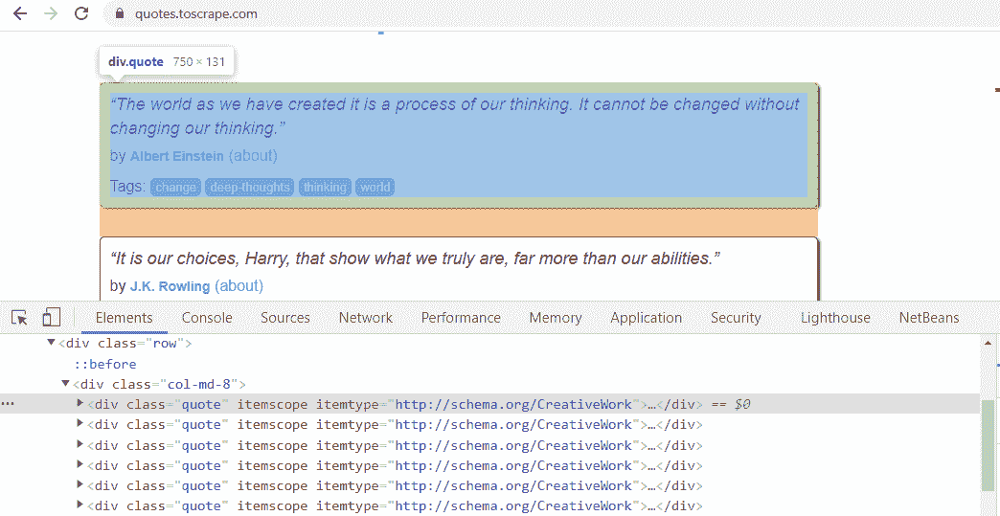

右键单击第一个引用并检查其 CSS“类”属性

因此，XPath 表达式也可以写成–quotes = response . XPath('//*[@ class = " quote "]')。该语法将获取所有元素，以“引号”作为 CSS“类”属性。其他页面上的报价具有相同的 CSS 属性。例如，网站第 3 页上的报价属于“类”属性，如下所示

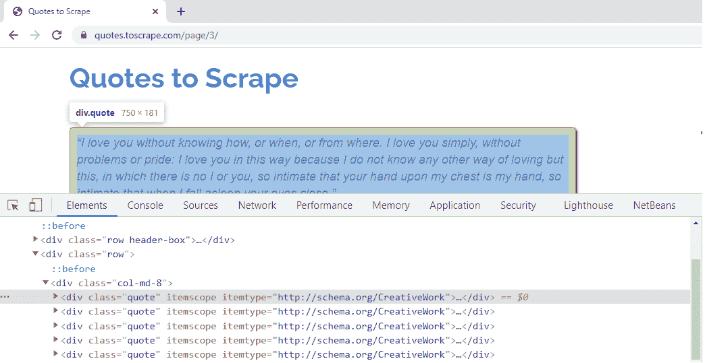

网站其他页面上的引号属于相同的 CSS 类属性

我们需要获取所有报价的报价标题、作者和标签。因此，我们将编写 XPath 表达式来循环提取它们。

*   引用标题的 CSS“类”属性是“文本”。因此，同样的 XPath 表达式应该是–quote . XPath('。//*[@class="text"]/text()')。extract_first()。text()方法将提取报价标题的文本。extract_first()方法将给出第一个匹配值，带有 CSS 属性“text”。点运算符“.”开始时，表示从单引号中提取数据。
*   对于作者元素，CSS 属性“类”和“itemprop”是“作者”。我们可以在 XPath 表达式中使用其中的任何一个。语法应该是–quote . XPath('。//*[@itemprop="author"]/text()')。提取()。这将提取作者姓名，其中 CSS“itempur”属性是“作者”。
*   标签元素的 CSS 属性“类”和“itemprop”是“关键字”。我们可以在 XPath 表达式中使用其中的任何一个。因为有许多标签，所以对于任何报价来说，遍历它们都是乏味的。因此，我们将从每个引用中提取 CSS 属性“内容”。相同的 XPath 表达式是–quote . XPath('。//*[@itemprop= "关键字"]/@content ")。提取()。这将从“内容”属性中提取报价的所有标签值。
*   我们使用“yield”语法来获取数据。我们可以通过使用“yield”来收集数据，并将数据转换为 CSV、JSON 和其他文件格式。

如果我们观察代码直到这里，它将抓取和提取一个网页的数据。代码如下–

## 蟒蛇 3

```
# Import the required libraries
import scrapy

# Spider class name

class GfgSpilinkSpider(scrapy.Spider):

    # Name of the spider
    name = 'gfg_spilink'

    # The domain to be scraped
    allowed_domains = ['quotes.toscrape.com']

    # The URLs to be scraped from the domain
    start_urls = ['http://quotes.toscrape.com/']

    # Default callback method
    def parse(self, response):

        # All quotes have CSS 'class 'attribute as 'quote'
        quotes = response.xpath('//*[@class="quote"]')

        # Loop through the quotes
        # selectors to fetch data for every quote
        for quote in quotes:

            # XPath expression to fetch
            # text of the Quote title
            # note the 'dot' operator since
            # we are extracting from single 'quote' element
            title = quote.xpath(
                './/*[@class="text"]/text()').extract_first()

            # XPath expression to fetch author of the Quote
            authors = quote.xpath('.//*[@itemprop="author"]/text()').extract()

            # XPath expression to fetch tags of the Quote
            tags = quote.xpath('.//*[@itemprop="keywords"]/@content').extract()

            # Yield the data desired
            yield {"Quote Text ": title, "Authors ": authors, "Tags ": tags}
```

## **以下链接**

到目前为止，我们已经看到了从单个网页中提取数据的代码。我们的最终目标是从所有网页中获取报价的相关数据。为此，我们需要让我们的蜘蛛跟随链接，这样它就可以导航到后续页面。超链接通常通过编写

*   要遍历到下一页，请检查“下一页”超链接的 CSS 属性。

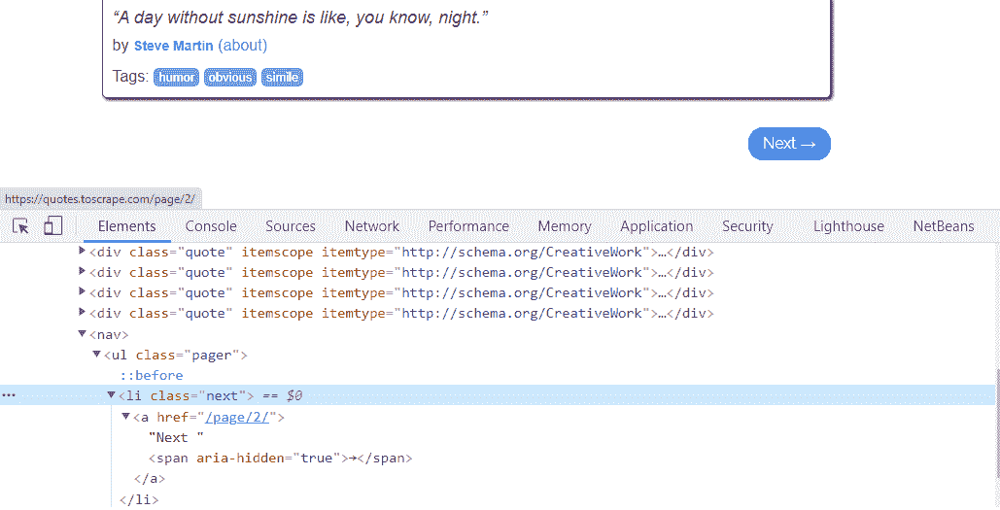

“下一个->超链接”的 CSS 类属性是“下一个”

我们需要提取 HTML 的

如果你点击，观察第二个网页的“下一个”链接，它有一个 CSS 属性为“下一个”。对于这个页面，

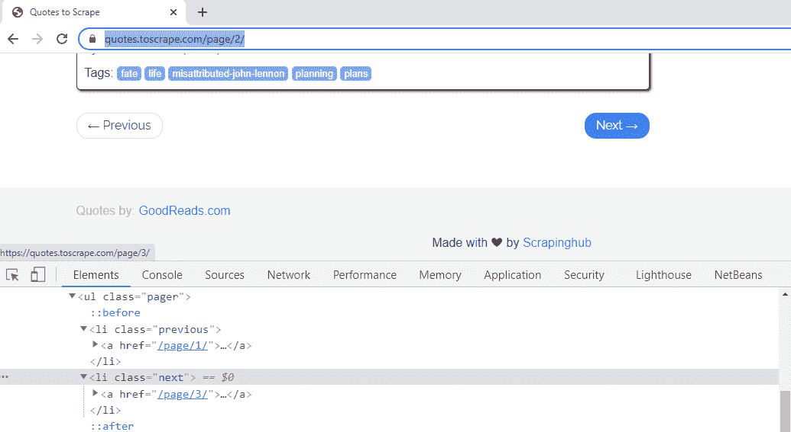

第 2 页“下一页”链接的“href”属性，链接到第 3 个网页

因此，下一页链接的 XPath 表达式可以通过将表达式写成–future _ page _ URL = response . XPath('//*[@ class = " next "]/a/@ href ')来获取。extract_first()。这将为我们提供“@href”的值，即第一页的“/page/2”。

上面的网址不足以让蜘蛛爬上下一页。我们需要通过将响应对象的网址与上面的相对网址合并来形成一个绝对网址。为此，我们将使用 urljoin()方法。

响应对象的网址是“https://quotes.toscrape.com/”。要旅行，到下一页，我们需要加入它，用相对网址“/page/2”。同样的语法是–complete _ URL _ next _ page = response . URL join(进一步 _page_url)。这个语法，会给我们，完整的路径为，“https://quotes . toscrape . com/page/2/”。同样，对于第二页，它会根据网页编号修改为“https://quotes . toscrape . com/page/3/”等等。

解析方法现在将使用这个“complete _ URL _ next _ page”URL 发出一个新请求。

因此，我们最终的请求对象，导航到第二个页面，并爬取它，将是——产生碎片。请求(完成 _ url _ 下一页)。蜘蛛的完整代码如下:

## 蟒蛇 3

```
# Import the required libraries
import scrapy

# Spider class name
class GfgSpilinkSpider(scrapy.Spider):

    # Name of the spider
    name = 'gfg_spilink'

    # The domain to be scraped
    allowed_domains = ['quotes.toscrape.com']

    # The URLs to be scraped from the domain
    start_urls = ['http://quotes.toscrape.com/']

    # Default callback method
    def parse(self, response):
        quotes = response.xpath('//*[@class="quote"]')
        for quote in quotes:

            # XPath expression to fetch
            # text of the Quote title
            title = quote.xpath('.//*[@class="text"]/text()').extract_first()

            # XPath expression to fetch
            # author of the Quote
            authors = quote.xpath('.//*[@itemprop="author"]/text()').extract()
            tags = quote.xpath('.//*[@itemprop="keywords"]/@content').extract()
            yield {"Quote Text ": title, "Authors ": authors, "Tags ": tags}

        # Check CSS attribute of the "Next"
        # hyperlink and extract its "href" value
        further_page_url = response.xpath(
            '//*[@class="next"]/a/@href').extract_first()

        # Append the "href" value, to the current page,
        # to form a complete URL, of next page
        complete_url_next_page = response.urljoin(further_page_url)

        # Make the spider crawl, to the next page,
        # and extract the same data
        # A new Request with the URL is made
        yield scrapy.Request(complete_url_next_page)
```

通过使用命令“爬网”，在终端执行蜘蛛。语法如下–杂乱的爬行蜘蛛名称。因此，我们可以将我们的蜘蛛作为 scrapy crawl gfg _ spilink 运行。它将通过跟踪链接来抓取整个网站，并产生报价数据。输出如下所示–

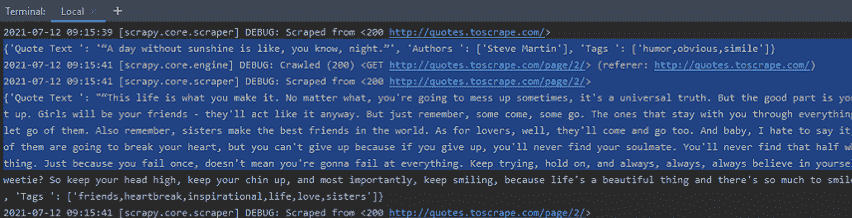

蜘蛛从网页 1、2 和其余部分输出报价

如果我们检查蜘蛛的输出统计数据，我们可以看到蜘蛛已经爬行了十多个网页，通过跟随链接。此外，报价数量接近 100。

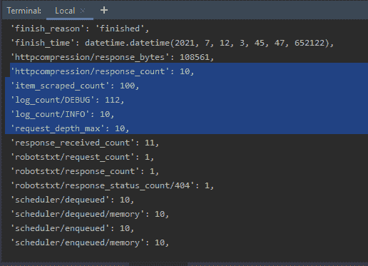

终端上的 Spider 统计信息，指示已爬网的页数

我们可以收集任何文件格式的数据，用于存储或分析。为了收集相同的内容，在一个 JSON 文件中，我们可以在“爬网”中提到文件名，语法如下:

```
scrapy crawl gfg_spilink -o spiderlinks.json
```

上面的命令将收集整个抓取的报价数据，保存在一个 JSON 文件“spiderlinks.json”中。文件内容如下所示:

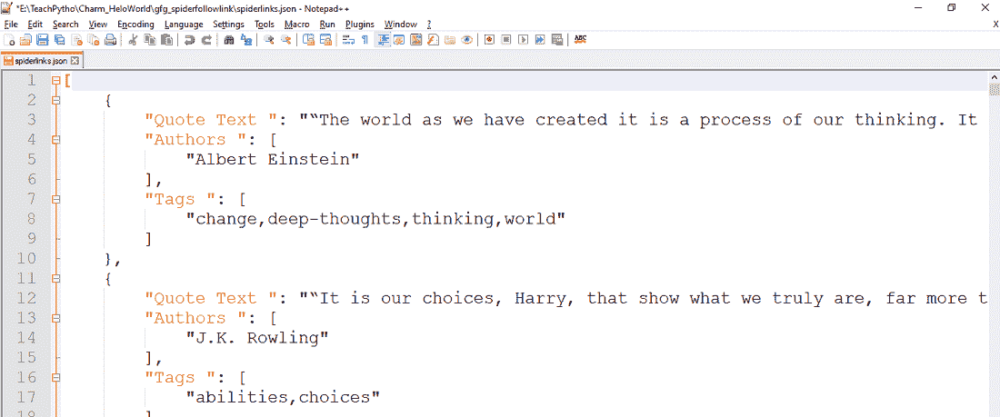

所有报价都收集在 JSON 文件中